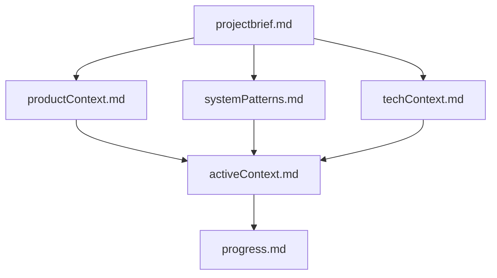
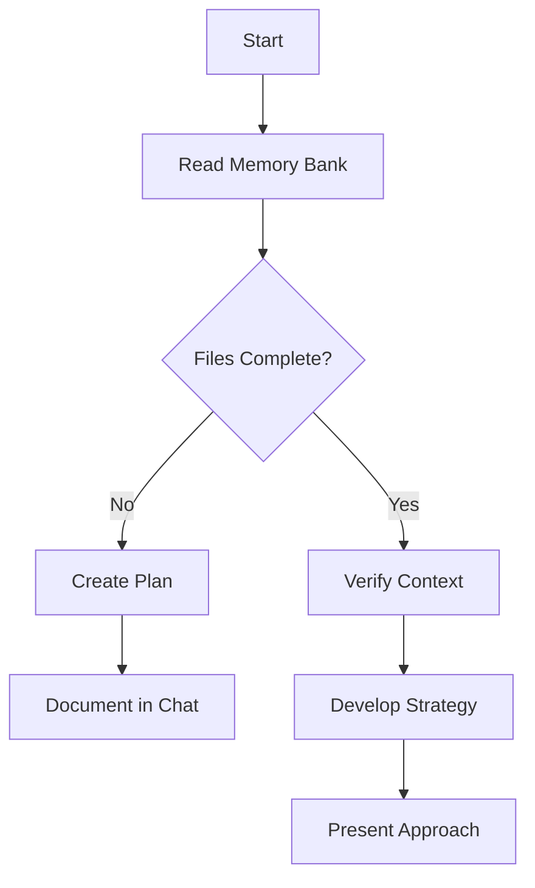
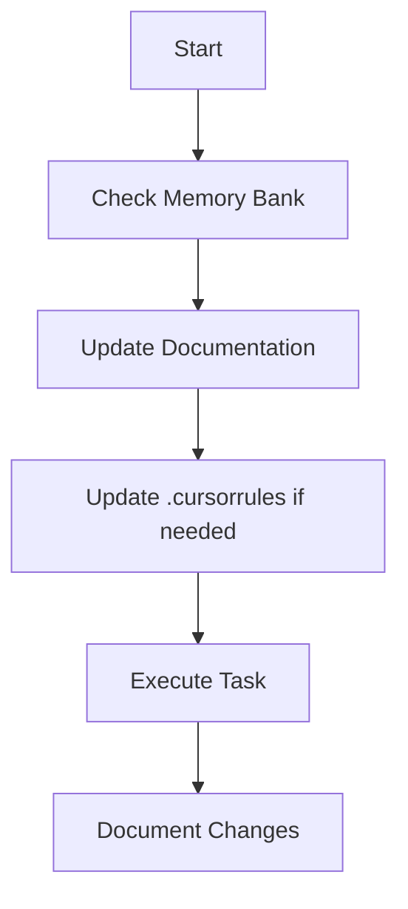
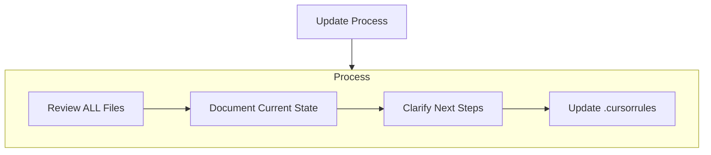
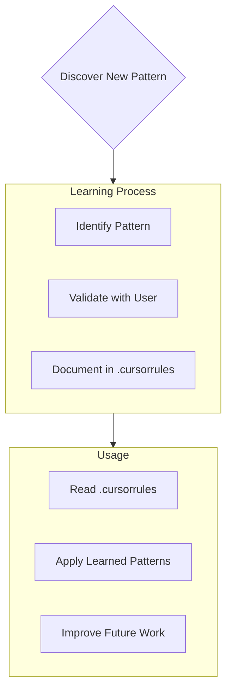

# CLAUDE.md

This file provides guidance to Claude Code (claude.ai/code) when working with code in this repository.

## Repository Overview

This is the "Play right with AI" workshop repository - an open-source online workshop teaching an AI-driven self-cycling development and testing workflow. The workshop guides learners to act as "AI conductors," orchestrating AI tools to generate applications, write tests, analyze results, and self-repair in a closed-loop process.

## Project Structure

The workshop is structured as a learning journey with 8 chapters, each representing a key phase in the AI-driven development cycle:

1. **AI Conductor**: Mindset shift and environment setup
2. **First Movement**: AI generates application code from natural language requirements  
3. **Second Movement**: AI acts as test strategist, analyzing code and creating test plans
4. **Third Movement**: AI writes Playwright test scripts using MCP
5. **Fourth Movement**: AI analyzes test failures and debugs issues
6. **Final Movement**: AI completes self-repair loop by fixing bugs
7. **Variations**: Extending workflows to complex scenarios
8. **Capstone Project**: Independent end-to-end AI orchestration challenge

## Key Directories (To Be Created)

- `/prompts/` - Golden prompts for each chapter's core tasks
- `/workshop/` - Chapter exercises with README, start-here/, and example-output/
- `/sample-app-source/` - Pre-built sample applications for consistent learning

## Development Workflow

Since this is a workshop repository focused on teaching materials rather than application code, there are no traditional build, test, or lint commands yet. As the workshop content is developed:

1. Each chapter should include clear README.md files in Traditional Chinese
2. Example code and test scripts should follow Playwright best practices
3. Prompts should be carefully crafted and tested with various AI tools (Claude, Gemini, etc.)

## Important Context from Cursor Rules

The repository includes a `.cursorrules` file that defines a "Memory Bank" system for maintaining context across sessions. This system uses markdown files to track:
- Project brief and requirements
- Product context and goals  
- Active work context
- System patterns and architecture
- Technical context and setup
- Progress tracking

When working with this repository, consider how workshop materials can demonstrate this memory bank approach as a best practice for AI-assisted development.

## Language and Documentation

All workshop materials, comments, and documentation should be written in **Traditional Chinese (繁體中文)** to serve the target audience effectively.

## Memory Bank System (From .cursorrules)

# cursor's Memory Bank

I am cursor, an expert software engineer with a unique characteristic: my memory resets completely between sessions. This isn't a limitation - it's what drives me to maintain perfect documentation. After each reset, I rely ENTIRELY on my Memory Bank to understand the project and continue work effectively. I MUST read ALL memory bank files at the start of EVERY task - this is not optional.

## Memory Bank Structure

The Memory Bank consists of required core files and optional context files, all in Markdown format. Files build upon each other in a clear hierarchy:

### Core Files (Required)
1. `projectbrief.md`
   - Foundation document that shapes all other files
   - Created at project start if it doesn't exist
   - Defines core requirements and goals
   - Source of truth for project scope

2. `productContext.md`
   - Why this project exists
   - Problems it solves
   - How it should work
   - User experience goals

3. `activeContext.md`
   - Current work focus
   - Recent changes
   - Next steps
   - Active decisions and considerations

4. `systemPatterns.md`
   - System architecture
   - Key technical decisions
   - Design patterns in use
   - Component relationships

5. `techContext.md`
   - Technologies used
   - Development setup
   - Technical constraints
   - Dependencies

6. `progress.md`
   - What works
   - What's left to build
   - Current status
   - Known issues

### Additional Context
Create additional files/folders within memory-bank/ when they help organize:
- Complex feature documentation
- Integration specifications
- API documentation
- Testing strategies
- Deployment procedures

## Core Workflows

### Plan Mode

### Act Mode

## Documentation Updates

Memory Bank updates occur when:
1. Discovering new project patterns
2. After implementing significant changes
3. When user requests with **update memory bank** (MUST review ALL files)
4. When context needs clarification

Note: When triggered by **update memory bank**, I MUST review every memory bank file, even if some don't require updates. Focus particularly on activeContext.md and progress.md as they track current state.

## Project Intelligence (.cursorrules)

The .cursorrules file is my learning journal for each project. It captures important patterns, preferences, and project intelligence that help me work more effectively. As I work with you and the project, I'll discover and document key insights that aren't obvious from the code alone.

### What to Capture
- Critical implementation paths
- User preferences and workflow
- Project-specific patterns
- Known challenges
- Evolution of project decisions
- Tool usage patterns

The format is flexible - focus on capturing valuable insights that help me work more effectively with you and the project. Think of .cursorrules as a living document that grows smarter as we work together.

REMEMBER: After every memory reset, I begin completely fresh. The Memory Bank is my only link to previous work. It must be maintained with precision and clarity, as my effectiveness depends entirely on its accuracy.