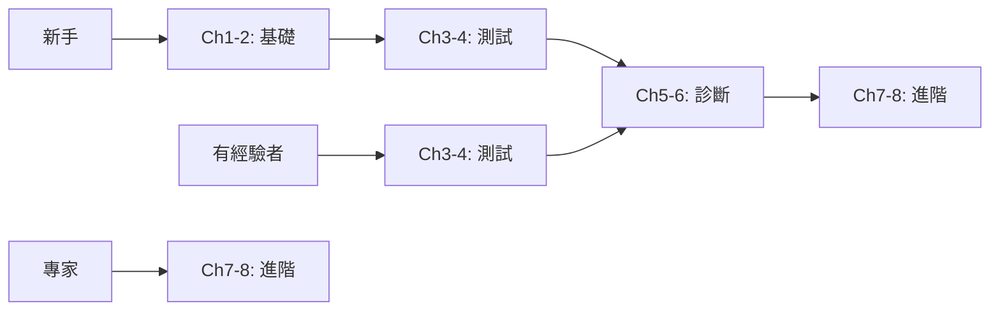

# Play right with AI 🎭🤖

> **用 AI 重新定義測試開發流程** - 一個開源線上工作坊，教你如何成為「AI 指揮家」，編排完整的開發測試自循環工作流程。

[](https://opensource.org/licenses/MIT)
[](./workshop)
[](./README.md)
[](./workshop/progress-tracker.md)

## 🎯 工作坊願景

從「寫程式」到「指揮 AI 寫程式」- 這不只是工具的改變，而是思維模式的革命。本工作坊將帶領你掌握 AI 驅動的自循環開發流程，讓 AI 成為你的開發夥伴，自動完成：生成應用 → 撰寫測試 → 執行測試 → 分析失敗 → 自我修復的完整循環。

## 🚀 你將學到什麼

- 🧠 **AI 指揮家思維** - 從寫程式到編排 AI 的思維轉變
- 🔄 **自循環工作流** - 建立 AI 驅動的開發測試自動化流程
- 🌐 **雙語提示策略** - "Think in English, Output in Chinese" 最佳實踐
- 🎭 **Playwright + AI** - 整合 Playwright MCP 實現智能測試
- 🔧 **自我修復系統** - 讓測試自動診斷和修復問題
- 🎯 **實戰專案經驗** - 從 TODO 應用到複雜系統的完整實作

## 🏆 成就系統與進度追蹤

### 🎖️ 技能徽章
 完成第1-2章
 完成第3-4章
 完成第5-6章
 完成第7-8章

### ⭐ 特殊成就
- 🚀 **速度之星** - 在建議時間內完成章節
- 💯 **完美主義者** - 測試覆蓋率達100%
- 🔧 **創新者** - 提交改進建議被採納
- 🌟 **社群貢獻者** - 幫助5位以上學習者
- 🎯 **一次通關** - 測試首次執行即全部通過
- 📚 **知識分享者** - 發表優質學習筆記
- 🐛 **Bug獵人** - 發現並回報工作坊內容錯誤
- 🌍 **國際化先鋒** - 協助翻譯其他語言版本

### 📊 學習進度視覺化

```
總體進度: ████████████████░░░░ 80% (8/10 核心技能)

章節完成度:
第1章 [████████████████████] 100% ✅
第2章 [████████████████████] 100% ✅
第3章 [████████████████████] 100% ✅
第4章 [████████████████████] 100% ✅
第5章 [████████████░░░░░░░░] 60%  🔄
第6章 [░░░░░░░░░░░░░░░░░░░░] 0%   ⏳
第7章 [░░░░░░░░░░░░░░░░░░░░] 0%   🔒
第8章 [░░░░░░░░░░░░░░░░░░░░] 0%   🔒

累積經驗值: 1,250 XP / 2,500 XP
當前等級: Lv.4 進階指揮家
下一等級: 還需 250 XP
全球排名: 🏅 第 42 名（共 523 位學習者）
```

### 🎯 技能雷達圖
```
        提示工程
           5
          /|\
         / | \
    測試/  |  \應用生成
       4   |   4
        \  |  /
         \ | /
      除錯 3 診斷
          2
     自我修復
```

## 📚 工作坊章節

### 📋 章節總覽與難度評級

| 章節 | 標題 | 難度 | 預估時間 | 前置需求 | 可獲得XP |
|------|------|------|----------|----------|----------|
| 1 | [AI 指揮家](./workshop/chapter-01) | ⭐ | 30分鐘 | 無 | 100 XP |
| 2 | [第一樂章](./workshop/chapter-02) | ⭐⭐ | 45分鐘 | Ch1 | 150 XP |
| 3 | [第二樂章](./workshop/chapter-03) | ⭐⭐ | 60分鐘 | Ch2 | 200 XP |
| 4 | [第三樂章](./workshop/chapter-04) | ⭐⭐⭐ | 90分鐘 | Ch3 | 300 XP |
| 5 | [第四樂章](./workshop/chapter-05) | ⭐⭐⭐ | 75分鐘 | Ch4 | 250 XP |
| 6 | [終樂章](./workshop/chapter-06) | ⭐⭐⭐⭐ | 90分鐘 | Ch5 | 350 XP |
| 7 | [變奏曲](./workshop/chapter-07) | ⭐⭐⭐⭐ | 120分鐘 | Ch6 | 400 XP |
| 8 | [總譜](./workshop/chapter-08) | ⭐⭐⭐⭐⭐ | 180分鐘 | Ch1-7 | 750 XP |

### 第一樂章：基礎建立
1. **[Chapter 1: AI 指揮家](./workshop/chapter-01)** - 環境設置與心態轉變
   - 🎯 學習目標：理解 AI 指揮家概念、設置開發環境
   - 🏆 可獲成就：「初次見面」、「環境大師」
   - 💡 你將建立：完整的 AI 開發環境
   
2. **[Chapter 2: 第一樂章](./workshop/chapter-02)** - AI 生成應用程式
   - 🎯 學習目標：掌握提示工程、生成第一個應用
   - 🏆 可獲成就：「程式碼召喚師」、「提示詞新手」
   - 💡 你將建立：功能完整的 TODO 應用

### 第二樂章：測試策略
3. **[Chapter 3: 第二樂章](./workshop/chapter-03)** - AI 作為測試策略師
   - 🎯 學習目標：讓 AI 分析程式碼、設計測試策略
   - 🏆 可獲成就：「策略大師」、「測試規劃師」
   - 💡 你將建立：完整的測試策略文件
   
4. **[Chapter 4: 第三樂章](./workshop/chapter-04)** - AI 編寫 Playwright 測試腳本
   - 🎯 學習目標：使用 MCP 協議、自動生成測試
   - 🏆 可獲成就：「Playwright 達人」、「自動化先鋒」
   - 💡 你將建立：端到端測試套件

### 第三樂章：智能診斷
5. **[Chapter 5: 第四樂章](./workshop/chapter-05)** - AI 分析測試失敗
   - 🎯 學習目標：診斷錯誤、分析根因
   - 🏆 可獲成就：「除錯偵探」、「問題終結者」
   - 💡 你將建立：錯誤分析報告與修復建議
   
6. **[Chapter 6: 終樂章](./workshop/chapter-06)** - AI 完成自我修復
   - 🎯 學習目標：實現自動修復循環
   - 🏆 可獲成就：「自癒大師」、「循環完成」
   - 💡 你將建立：自動修復工作流

### 第四樂章：進階應用
7. **[Chapter 7: 變奏曲](./workshop/chapter-07)** - 擴展工作流程到複雜場景
   - 🎯 學習目標：處理複雜應用、優化流程
   - 🏆 可獲成就：「進階指揮家」、「優化專家」
   - 💡 你將建立：多頁面應用與測試
   
8. **[Chapter 8: 總譜](./workshop/chapter-08)** - 獨立端到端 AI 編排挑戰
   - 🎯 學習目標：獨立完成完整專案
   - 🏆 可獲成就：「AI 交響樂家」、「畢業證書」
   - 💡 你將建立：自選題目的完整應用

## 🛠️ 前置需求檢查清單

### ✅ 基礎知識自評
- [ ] 基本 JavaScript/TypeScript 知識（能讀懂基礎語法）
- [ ] 基礎 HTML/CSS 理解（知道基本標籤和樣式）
- [ ] 命令列操作經驗（會使用 cd、ls、npm 等指令）
- [ ] Git 基本操作（clone、commit、push）

💡 **技能等級指引**：
- 🟢 初學者：需要 2-3 小時預習基礎
- 🟡 中級者：可直接開始，遇到問題查閱文檔
- 🔴 進階者：可跳過前 2 章，從第 3 章開始

### 📦 環境需求
- [ ] Node.js 18+ （執行 `node -v` 檢查）
- [ ] VS Code 或其他程式編輯器
- [ ] Chrome/Edge 瀏覽器（最新版）
- [ ] Git 2.0+（執行 `git --version` 檢查）

### 🤖 AI 服務帳號（至少一個）
- [ ] [Claude API](https://console.anthropic.com/) - 推薦，最佳體驗
- [ ] [Google Gemini API](https://makersuite.google.com/app/apikey) - 免費額度充足
- [ ] [OpenAI API](https://platform.openai.com/) - GPT-4 支援

## 🚀 快速開始

### 1. Clone 專案
```bash
git clone https://github.com/clarencechien/play-right-with-ai.git
cd play-right-with-ai
```

### 2. 安裝依賴
```bash
npm install
npx playwright install --with-deps
```

### 3. 設定 AI 服務
```bash
cp .env.example .env
# 編輯 .env 檔案，加入你的 API keys
```

### 4. 驗證環境
```bash
npm run validate:env
```

### 5. 開始學習
```bash
npm run workshop:start
```

### 6. 追蹤進度
```bash
npm run progress:check
```

## 📂 專案結構

```
play-right-with-ai/
├── workshop/           # 工作坊章節內容
│   ├── chapter-01/    # 環境設置
│   ├── chapter-02/    # AI 生成應用
│   ├── progress-tracker.md  # 進度追蹤工具
│   └── achievements.json    # 成就定義
├── prompts/           # 黃金提示詞集合
│   ├── chapter-02/    # 應用生成提示
│   ├── chapter-03/    # 測試策略提示
│   └── ...
├── sample-app-source/ # 範例應用程式
│   ├── todo-app/      # TODO 應用
│   ├── shopping-list/ # 購物清單應用
│   └── ...
├── tests/             # 測試套件
│   ├── e2e/          # 端到端測試
│   ├── specs/        # 測試規格
│   └── utils/        # 測試工具
├── integrations/      # AI 服務整合
│   ├── claude/       # Claude API
│   ├── gemini/       # Gemini API
│   └── openai/       # OpenAI API
└── .github/          # CI/CD 設定
    └── workflows/    # GitHub Actions
```

## 🎭 範例應用程式

工作坊包含多個漸進式複雜度的範例應用：

1. **TODO App** - 基礎 CRUD 操作與測試
2. **Shopping List** - 分類管理與預算追蹤
3. **Multi-Page App** - 路由與複雜互動
4. **Capstone Starter** - 整合所有概念的專案模板

每個應用都包含：
- 完整原始碼
- Playwright 測試套件
- 刻意設計的 bugs（用於除錯練習）
- 修復後的解決方案

## 🤖 AI 整合特色

### Playwright MCP (Model Context Protocol)
```javascript
// AI 可以透過自然語言控制瀏覽器
const mcp = new PlaywrightMCP(page);
await mcp.execute({
  action: 'type',
  target: '[data-testid="todo-input"]',
  value: 'AI 生成的任務'
});
```

### 雙語提示策略
```markdown
# Think in English (Technical Specification)
Create a web application with CRUD operations...

# Output in Chinese (User Interface)
建立一個待辦事項應用程式，包含新增、編輯、刪除功能...
```

## 📊 學習成果評估

### 自我評估檢查表
- [ ] 能夠設定 AI 開發環境
- [ ] 掌握雙語提示策略
- [ ] 能用 AI 生成完整應用程式
- [ ] 會用 AI 設計測試策略
- [ ] 能讓 AI 編寫 Playwright 測試
- [ ] 會分析測試失敗原因
- [ ] 能實作自我修復機制
- [ ] 完成總整專案

### 認證標準
完成所有章節練習並通過總整專案挑戰，即可獲得：
- 🏆 工作坊完成證書
- 💼 LinkedIn 技能認證
- 🌟 GitHub 成就徽章

### 等級系統
| 等級 | 稱號 | 所需 XP | 特權 |
|------|------|---------|------|
| Lv.1 | 新手學徒 | 0-300 | 基礎徽章 |
| Lv.2 | 初級指揮家 | 301-600 | 進階內容解鎖 |
| Lv.3 | 中級指揮家 | 601-1000 | 社群導師資格 |
| Lv.4 | 進階指揮家 | 1001-1500 | 特殊挑戰解鎖 |
| Lv.5 | 資深指揮家 | 1501-2000 | 貢獻者權限 |
| Lv.6 | AI 交響樂家 | 2001-2500 | 榮譽殿堂 |
| Lv.7 | 大師 | 2500+ | 工作坊助教資格 |

## 🤝 社群參與

### 獲得幫助
- 💬 [GitHub Discussions](https://github.com/clarencechien/play-right-with-ai/discussions) - 學習討論
- 🐛 [Issues](https://github.com/clarencechien/play-right-with-ai/issues) - 回報問題
- 📧 Email: workshop@playrightwithAI.com
- 💬 Discord: [加入社群](https://discord.gg/playrightwithAI)

### 貢獻指南
我們歡迎各種形式的貢獻：
- 提交改進的提示詞
- 分享學習心得
- 回報和修復 bugs
- 翻譯其他語言版本
- 創建教學影片

詳見 [CONTRIBUTING.md](./CONTRIBUTING.md)

### 每週挑戰
參加每週挑戰，贏取特殊徽章：
- 🏃 **速度挑戰週** - 最快完成指定章節
- 🎨 **創意挑戰週** - 最有創意的解決方案
- 🤝 **協作挑戰週** - 最佳團隊合作

## 📈 成功指標

### 學習者成果
- 500+ GitHub stars ⭐
- 100+ 完成總整專案 🎓
- 50+ 社群討論 💬
- 95% 滿意度 😊

### 技能提升
- 開發效率提升 3-5 倍
- 測試覆蓋率達 80%+
- Bug 修復時間減少 60%
- 程式碼品質顯著提升

### 學習路徑建議


## 📝 授權條款

本專案採用 MIT 授權條款 - 詳見 [LICENSE](./LICENSE) 檔案

## 🙏 致謝

感謝以下專案和社群的支援：
- [Playwright](https://playwright.dev/) - 現代化的端到端測試框架
- [Anthropic Claude](https://www.anthropic.com/) - 強大的 AI 助手
- [Google Gemini](https://deepmind.google/technologies/gemini/) - 多模態 AI 模型
- [OpenAI](https://openai.com/) - GPT 系列模型

## 🚦 專案狀態


---

<div align="center">

**開始你的 AI 指揮家之旅 🎭**

[立即開始](./workshop/chapter-01) | [查看範例](./sample-app-source) | [追蹤進度](./workshop/progress-tracker.md) | [加入社群](https://github.com/clarencechien/play-right-with-ai/discussions)

Made with ❤️ by the Play right with AI Community

</div>