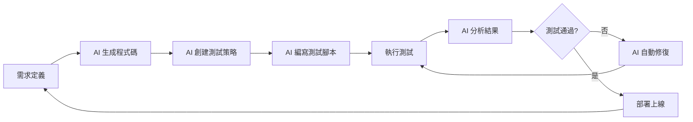

---
# Front Matter
chapter: "01"
title: "AI 指揮家 - 思維轉變與環境搭建"
objectives:
  - "理解從『編碼者』到『AI 指揮家』的思維轉變"
  - "完成完整的開發環境設置（VS Code、Node.js、Playwright）"
  - "設置並測試 AI 服務（Claude、Gemini、GPT）"
  - "掌握『Think in English, Output in Chinese』的雙語提示策略"
  - "執行第一個 AI 驅動的開發任務"
prerequisites:
  - "基本的命令列操作知識"
  - "可以連接網際網路的電腦"
  - "至少一個 AI 服務的存取權限（Claude、Gemini 或 GPT）"
duration: "2 hours"
difficulty: "beginner"
tags: ["setup", "mindset", "environment", "bilingual-strategy"]
---

# 第一章：AI 指揮家 - 思維轉變與環境搭建

## 章節概述

歡迎來到「與 AI 正確協作」工作坊！在這個數位轉型的時代，AI 不再只是輔助工具，而是成為開發流程中的核心夥伴。本章將引導您完成最重要的第一步：從傳統的「編碼者」思維轉變為「AI 指揮家」思維。

就像交響樂團的指揮不需要親自演奏每個樂器，AI 指揮家也不需要編寫每一行程式碼。您的角色是設計藍圖、制定策略、協調各個 AI 工具協同工作，創造出高品質的軟體作品。

本章將幫助您建立這種全新的工作模式，並完成所有必要的環境設置，為接下來的學習旅程打下堅實基礎。

## 學習目標

完成本章後，您將能夠：

- ✅ 理解從「編碼者」到「AI 指揮家」的思維轉變
- ✅ 完成完整的開發環境設置（VS Code、Node.js、Playwright）
- ✅ 設置並測試 AI 服務（Claude、Gemini、GPT）
- ✅ 掌握「Think in English, Output in Chinese」的雙語提示策略
- ✅ 執行第一個 AI 驅動的開發任務

## 前置需求

在開始本章之前，請確保您已經：

- 📚 具備基本的命令列操作知識
- 💻 準備一台可以連接網際網路的電腦
- 🔑 擁有至少一個 AI 服務的存取權限（Claude、Gemini 或 GPT）
- 📖 願意接受新的開發思維模式

## 核心概念

### 概念一：AI 指揮家的角色定位

#### 什麼是 AI 指揮家？

AI 指揮家是一種全新的開發者角色，專注於：
- **需求設計**：清晰定義要解決的問題和期望的結果
- **流程協調**：安排不同 AI 工具在適當的時機執行適當的任務
- **品質把關**：評估和優化 AI 產出的成果
- **持續改進**：透過迭代優化提示詞和工作流程

#### 傳統開發者 vs AI 指揮家

| 面向 | 傳統開發者 | AI 指揮家 |
|------|-----------|----------|
| **主要工作** | 親手編寫每一行程式碼 | 設計高層次需求和架構 |
| **關注焦點** | 語法和實作細節 | 業務邏輯和流程 |
| **除錯方式** | 逐行檢查程式碼 | 引導 AI 分析和修復問題 |
| **測試方法** | 手動撰寫測試案例 | 協調 AI 生成完整測試策略 |
| **工作流程** | 線性、序列式 | 循環、迭代式 |
| **技能重點** | 程式語言精通 | 溝通表達和系統思維 |

### 概念二：自循環工作流程

自循環工作流程是 AI 驅動開發的核心模式，包含以下階段：



每個階段都由 AI 主導執行，而您作為指揮家的角色是：
1. 提供清晰的指令（提示詞）
2. 評估輸出品質
3. 引導改進方向
4. 決定何時進入下一階段

### 概念三：雙語提示策略

#### 為什麼要用雙語策略？

研究和實踐顯示，使用英文思考、中文輸出的策略能顯著提升 AI 的程式碼生成品質：

- **英文思考**：利用 AI 模型在英文技術文件上的訓練優勢
- **中文輸出**：確保最終結果符合本地化需求
- **最佳效果**：結合兩種語言的優勢，獲得最佳輸出

#### 策略實作範例

##### 純中文提示（較不理想）
```markdown
幫我寫一個待辦事項應用程式，要有新增、刪除、標記完成的功能。
```

##### 雙語策略提示（推薦）
```markdown
[English Planning]
Create a TODO application with the following features:
- Add new tasks with title and description
- Delete tasks with confirmation dialog
- Mark tasks as complete/incomplete with visual feedback
- Local storage persistence for data
- Responsive design with mobile support
- Keyboard shortcuts for common actions

Technical requirements:
- Use semantic HTML5 elements
- Implement ARIA labels for accessibility
- Follow BEM naming convention for CSS
- Use ES6+ JavaScript features
- Add smooth transitions for UI interactions

[Chinese Delivery]
請用繁體中文生成程式碼註解和使用者介面文字。
應用程式名稱：待辦事項管理系統
所有按鈕、標籤、提示訊息都要使用繁體中文。
錯誤訊息要友善且具體，幫助使用者理解問題。
```

## 環境設置

### VS Code 安裝與設定

Visual Studio Code 是我們的主要開發環境，它提供了優秀的 AI 整合能力。

#### Windows 安裝步驟
```bash
# 1. 訪問 https://code.visualstudio.com/
# 2. 下載 Windows 版本
# 3. 執行安裝程式，勾選以下選項：
#    - Add to PATH（重要！）
#    - Register Code as an editor for supported file types
#    - Add "Open with Code" action to Windows Explorer
```

#### macOS 安裝步驟
```bash
# 使用 Homebrew
brew install --cask visual-studio-code

# 或從官網下載 DMG 檔案
# https://code.visualstudio.com/download
```

#### Linux 安裝步驟
```bash
# Ubuntu/Debian
sudo snap install code --classic

# 或使用 apt
wget -qO- https://packages.microsoft.com/keys/microsoft.asc | gpg --dearmor > packages.microsoft.gpg
sudo install -o root -g root -m 644 packages.microsoft.gpg /etc/apt/trusted.gpg.d/
sudo sh -c 'echo "deb [arch=amd64,arm64,armhf signed-by=/etc/apt/trusted.gpg.d/packages.microsoft.gpg] https://packages.microsoft.com/repos/code stable main" > /etc/apt/sources.list.d/vscode.list'
sudo apt update
sudo apt install code
```

#### 必要的 VS Code 擴充套件

安裝以下擴充套件以獲得最佳開發體驗：

```json
{
  "recommendations": [
    "ms-playwright.playwright",      // Playwright 測試支援
    "esbenp.prettier-vscode",        // 程式碼格式化
    "dbaeumer.vscode-eslint",        // JavaScript linting
    "streetsidesoftware.code-spell-checker",  // 拼字檢查
    "GitHub.copilot",                // GitHub Copilot（選用）
    "Continue.continue",              // AI 程式碼助手（選用）
    "Anthropic.claude-vscode"         // Claude 整合（選用）
  ]
}
```

### Node.js 與 npm

Node.js 是執行 JavaScript 的環境，npm 是套件管理工具。

#### 安裝 Node.js（推薦使用 LTS 版本）

```bash
# 檢查是否已安裝
node --version
npm --version

# Windows - 使用 Chocolatey
choco install nodejs-lts

# macOS - 使用 Homebrew
brew install node@20

# Linux - 使用 NodeSource
curl -fsSL https://deb.nodesource.com/setup_lts.x | sudo -E bash -
sudo apt-get install -y nodejs
```

#### 驗證安裝
```bash
# 應該顯示 v20.x.x 或更新版本
node --version

# 應該顯示 10.x.x 或更新版本
npm --version
```

### Playwright 安裝

Playwright 是我們用來進行瀏覽器自動化測試的主要工具。

```bash
# 創建專案目錄
mkdir play-right-with-ai-workspace
cd play-right-with-ai-workspace

# 初始化 npm 專案
npm init -y

# 安裝 Playwright
npm install --save-dev @playwright/test

# 安裝瀏覽器
npx playwright install

# 驗證安裝
npx playwright test --version
```

### AI 服務設置

選擇至少一個 AI 服務進行設置。建議優先選擇 Claude 或 GPT。

#### Claude (Anthropic) - 推薦
1. 訪問 https://claude.ai 或 https://console.anthropic.com
2. 註冊帳號並獲取 API 金鑰
3. 設定環境變數：
```bash
# Windows (PowerShell)
$env:ANTHROPIC_API_KEY="your-api-key-here"

# macOS/Linux
export ANTHROPIC_API_KEY="your-api-key-here"

# 永久設定（加入 ~/.bashrc 或 ~/.zshrc）
echo 'export ANTHROPIC_API_KEY="your-api-key-here"' >> ~/.bashrc
source ~/.bashrc
```

#### Gemini (Google)
1. 訪問 https://makersuite.google.com/app/apikey
2. 創建 API 金鑰
3. 設定環境變數：
```bash
export GOOGLE_API_KEY="your-api-key-here"
```

#### GPT (OpenAI)
1. 訪問 https://platform.openai.com/api-keys
2. 創建 API 金鑰
3. 設定環境變數：
```bash
export OPENAI_API_KEY="your-api-key-here"
```

## 心態轉變：從編碼者到指揮家

### 核心思維轉變

#### 1. 從「How」到「What」
- **傳統思維**：我要如何實作這個功能？使用什麼語法？
- **AI 指揮家思維**：我要實現什麼功能？期望什麼結果？

#### 2. 從「完美主義」到「迭代優化」
- **傳統思維**：程式碼必須一次寫對，完美無瑕
- **AI 指揮家思維**：先有可運作的版本，再透過迭代達到完美

#### 3. 從「單打獨鬥」到「協同合作」
- **傳統思維**：我必須掌握所有技術細節
- **AI 指揮家思維**：我協調 AI 團隊，各司其職

#### 4. 從「程式碼中心」到「需求中心」
- **傳統思維**：專注於程式碼品質和技術實現
- **AI 指揮家思維**：專注於業務價值和使用者體驗

### 實踐心態轉變的具體方法

1. **練習自然語言描述**
   - 用說故事的方式描述需求
   - 避免過早陷入技術細節
   - 關注「為什麼」而非「怎麼做」

2. **接受不完美**
   - AI 的第一次輸出通常需要改進
   - 把每次迭代視為進步的機會
   - 專注於快速獲得可用版本

3. **培養系統思維**
   - 思考整體架構而非單一功能
   - 考慮組件之間的關係
   - 預先規劃測試和部署策略

## 雙語提示策略深入探討

### 雙語提示的最佳實踐

#### 1. 技術規格用英文
```markdown
[Technical Specs]
- Frontend: React 18 with TypeScript
- State Management: Redux Toolkit
- UI Components: Material-UI v5
- Backend: Node.js with Express
- Database: PostgreSQL with Prisma ORM
- Authentication: JWT with refresh tokens
- Testing: Jest + React Testing Library
```

#### 2. 業務邏輯用清晰的結構
```markdown
[Business Logic]
1. User Registration Flow:
   - Email validation required
   - Password minimum 8 characters
   - Email confirmation within 24 hours
   
2. Task Management Rules:
   - Tasks have three priority levels: High, Medium, Low
   - Due dates cannot be in the past
   - Completed tasks move to archive after 30 days
   
3. Notification System:
   - Email reminders 24 hours before due date
   - Push notifications for high priority tasks
   - Weekly summary email on Mondays
```

#### 3. 本地化需求用中文
```markdown
[本地化需求]
介面語言：繁體中文
- 日期格式：YYYY年MM月DD日
- 時間顯示：24小時制（14:30）
- 星期顯示：星期一、星期二...（不用週一、週二）
- 貨幣顯示：NT$ 1,234.00

錯誤訊息範例：
- 網路錯誤：「連線失敗，請檢查網路設定後重試」
- 驗證錯誤：「請輸入有效的電子郵件地址」
- 權限錯誤：「您沒有權限執行此操作」

成功訊息範例：
- 儲存成功：「資料已成功儲存」
- 刪除確認：「確定要刪除此項目嗎？此操作無法復原」
```

### 進階技巧：多輪對話策略

當處理複雜需求時，使用多輪對話比一次性長提示更有效：

#### 第一輪：建立架構
```markdown
[Round 1: Architecture]
Design the overall architecture for a task management system.
Focus on:
- Component structure
- Data flow
- State management strategy
```

#### 第二輪：實作核心功能
```markdown
[Round 2: Core Implementation]
Based on the architecture, implement:
- Task CRUD operations
- User authentication
- Data persistence layer
```

#### 第三輪：加入細節和優化
```markdown
[Round 3: Polish and Optimize]
Add:
- Error handling
- Loading states
- Performance optimizations
- Accessibility features
```

## 實作練習

### 練習 1：環境驗證

創建一個簡單的腳本來驗證所有環境設置是否正確。

**檔案**：`check-environment.js`

```javascript
// 環境檢查腳本
const { exec } = require('child_process');
const { promisify } = require('util');
const execAsync = promisify(exec);

async function checkEnvironment() {
  console.log('🔍 正在檢查開發環境...\n');
  
  const checks = [
    {
      name: 'Node.js',
      command: 'node --version',
      minVersion: '18.0.0'
    },
    {
      name: 'npm',
      command: 'npm --version',
      minVersion: '8.0.0'
    },
    {
      name: 'VS Code',
      command: 'code --version',
      optional: true
    }
  ];
  
  for (const check of checks) {
    try {
      const { stdout } = await execAsync(check.command);
      console.log(`✅ ${check.name}: ${stdout.trim()}`);
    } catch (error) {
      if (check.optional) {
        console.log(`⚠️  ${check.name}: 未安裝（選用）`);
      } else {
        console.log(`❌ ${check.name}: 未安裝或無法存取`);
      }
    }
  }
  
  // 檢查 AI API 金鑰
  console.log('\n🔑 檢查 AI 服務設定：');
  const aiServices = [
    { name: 'Claude', env: 'ANTHROPIC_API_KEY' },
    { name: 'Gemini', env: 'GOOGLE_API_KEY' },
    { name: 'GPT', env: 'OPENAI_API_KEY' }
  ];
  
  let hasAnyAI = false;
  for (const service of aiServices) {
    if (process.env[service.env]) {
      console.log(`✅ ${service.name}: 已設定`);
      hasAnyAI = true;
    } else {
      console.log(`⚠️  ${service.name}: 未設定`);
    }
  }
  
  if (!hasAnyAI) {
    console.log('\n❌ 錯誤：至少需要設定一個 AI 服務');
  } else {
    console.log('\n✅ 環境設置完成！可以開始學習了！');
  }
}

checkEnvironment().catch(console.error);
```

執行檢查：
```bash
node check-environment.js
```

### 練習 2：第一個 AI 提示

使用雙語策略讓 AI 生成一個簡單的計算機應用。

**提示詞範例**：
```markdown
[English Planning]
Create a calculator web application with:
- Basic operations: addition, subtraction, multiplication, division
- Clear button to reset
- Decimal point support
- Keyboard input support
- Error handling for division by zero
- Responsive design for mobile devices

Use:
- Pure HTML5, CSS3, and JavaScript
- No external libraries
- CSS Grid for button layout
- Event delegation for button clicks

[Chinese Delivery]
應用程式名稱：智慧計算機
所有按鈕文字使用中文：
- 清除 (C)
- 等於 (=)
- 小數點 (.)
錯誤訊息：
- 除零錯誤：「錯誤：不能除以零」
- 無效輸入：「請輸入有效的數字」
```

### 練習 3：雙語策略比較實驗

進行一個實驗，比較純中文提示和雙語提示的效果差異。

#### 任務：生成一個倒數計時器

**純中文版本**：
```markdown
請幫我寫一個倒數計時器網頁應用，功能包括：
- 可以設定分鐘和秒數
- 開始、暫停、重置按鈕
- 時間到了要有提示音
- 顯示剩餘時間的進度條
```

**雙語策略版本**：
```markdown
[English Planning]
Create a countdown timer web application:

Features:
- Input fields for minutes and seconds
- Start, Pause, Reset controls
- Visual progress bar showing remaining time
- Audio notification when timer reaches zero
- Prevent negative time values
- Save last used time in localStorage

Technical requirements:
- Use requestAnimationFrame for smooth updates
- Implement proper state management
- Add CSS animations for visual feedback
- Use Web Audio API for notification sound

[Chinese Delivery]
應用程式名稱：倒數計時器
介面文字：
- 輸入欄位標籤：「分鐘」、「秒」
- 按鈕：「開始」、「暫停」、「重置」
- 提示文字：「時間到！」
使用台灣慣用的時間顯示格式（00:00）
```

比較兩個版本的輸出，觀察：
- 程式碼結構的差異
- 功能完整性
- 錯誤處理
- 程式碼品質

## 範例輸出

### 環境檢查成功輸出
```
🔍 正在檢查開發環境...

✅ Node.js: v20.11.0
✅ npm: 10.2.4
✅ VS Code: 1.85.2

🔑 檢查 AI 服務設定：
✅ Claude: 已設定
⚠️ Gemini: 未設定
⚠️ GPT: 未設定

✅ 環境設置完成！可以開始學習了！
```

### 雙語提示的預期輸出特徵

良好的雙語提示輸出應該具備：
1. **清晰的程式碼結構**：模組化、易讀、遵循最佳實踐
2. **完整的中文註解**：每個函數和關鍵邏輯都有說明
3. **友善的使用者介面**：所有文字都是自然的繁體中文
4. **健壯的錯誤處理**：預防和處理各種異常情況
5. **良好的使用者體驗**：流暢的互動和視覺回饋

## 思考與挑戰

### 深度思考題

1. **思維模式轉變**
   - 您認為從編碼者轉變為 AI 指揮家，最大的挑戰是什麼？
   - 這種轉變對軟體開發產業會有什麼長期影響？
   - 傳統的程式設計技能在 AI 時代還重要嗎？

2. **雙語策略的價值**
   - 為什麼英文思考能產生更好的程式碼結構？
   - 除了程式碼生成，雙語策略還能應用在哪些場景？
   - 如何為不同的 AI 模型調整雙語策略？

3. **AI 協作模式**
   - 如何判斷何時該自己編碼，何時該讓 AI 生成？
   - 怎樣的提示詞能最大化 AI 的能力？
   - 如何建立有效的 AI 協作工作流程？

### 延伸挑戰

#### 挑戰 1：環境自動化（難度：⭐⭐⭐）

創建一個全自動的環境設置腳本：

```javascript
// setup-wizard.js
// 你的任務：
// 1. 檢測作業系統
// 2. 自動安裝缺少的軟體
// 3. 配置環境變數
// 4. 創建專案模板
// 5. 生成設置報告
```

要求：
- 支援 Windows、macOS、Linux
- 提供互動式選單
- 包含錯誤恢復機制
- 生成詳細的設置日誌

#### 挑戰 2：提示詞模板系統（難度：⭐⭐⭐⭐）

設計一套標準化的提示詞模板系統：

```javascript
// prompt-template.js
class PromptTemplate {
  constructor(type) {
    // 實作不同類型的模板
    // types: 'generation', 'analysis', 'debugging', 'optimization'
  }
  
  build(requirements) {
    // 根據需求生成結構化提示詞
  }
  
  validate(prompt) {
    // 驗證提示詞品質
  }
}
```

要求：
- 支援多種提示類型
- 包含變數替換機制
- 提供品質評分功能
- 生成使用統計

#### 挑戰 3：多 AI 協作平台（難度：⭐⭐⭐⭐⭐）

建立一個協調多個 AI 服務的平台：

```javascript
// ai-orchestrator.js
class AIOrchestrator {
  constructor(services) {
    // 初始化多個 AI 服務
  }
  
  async collaborate(task) {
    // 分配任務給不同的 AI
    // 整合和優化結果
    // 返回最佳解決方案
  }
}
```

要求：
- 同時使用 Claude、Gemini、GPT
- 實作任務分配策略
- 比較和合併不同 AI 的輸出
- 提供效能和品質報告

## 最佳實踐

### AI 指揮家的日常實踐

1. **每日提示詞優化**
   - 記錄成功的提示詞模式
   - 分析失敗案例的原因
   - 持續改進提示詞庫

2. **建立個人知識庫**
   - 整理常用的程式碼片段
   - 記錄 AI 的能力邊界
   - 分享學習心得

3. **保持技術敏銳度**
   - 關注 AI 技術發展
   - 嘗試新的 AI 工具
   - 參與社群討論

### 環境維護建議

- **定期更新**：每月檢查並更新開發工具
- **備份設定**：保存環境配置檔案
- **版本控制**：使用 Git 管理專案
- **文件記錄**：詳細記錄特殊配置

## 常見問題

### Q1: 一定要使用所有提到的 AI 服務嗎？
**A:** 不需要。至少有一個 AI 服務即可開始學習。建議從 Claude 或 GPT 開始，它們對程式碼生成的支援較好。

### Q2: 為什麼選擇 Playwright 而不是 Selenium？
**A:** Playwright 提供：
- 更現代的 API 設計
- 更好的效能和穩定性
- 內建的等待機制
- 優秀的除錯工具
- 支援多瀏覽器並行測試

### Q3: 雙語提示是否適用於所有 AI 模型？
**A:** 大部分現代 AI 模型都支援雙語提示。效果可能因模型而異：
- Claude：雙語效果最佳
- GPT-4：英文略優於中文
- Gemini：兩種語言都不錯
建議實際測試找出最適合的方式。

### Q4: 如果環境設置遇到問題怎麼辦？
**A:** 請按照以下步驟排查：
1. 執行環境檢查腳本診斷問題
2. 查看錯誤訊息中的關鍵字
3. 搜尋 GitHub Issues 中的類似問題
4. 在課程討論區尋求協助

### Q5: AI 生成的程式碼安全嗎？
**A:** AI 生成的程式碼需要注意：
- 總是要審查和理解程式碼
- 注意潛在的安全漏洞
- 不要包含敏感資訊在提示詞中
- 使用靜態分析工具檢查

## 章節總結

### 關鍵要點回顧

- 🔑 **思維轉變**：從編碼者到 AI 指揮家是角色的根本改變
- 🔑 **環境準備**：完整的開發環境是成功的基礎
- 🔑 **雙語策略**：英文思考 + 中文輸出 = 最佳效果
- 🔑 **迭代思維**：接受不完美，透過迭代達到卓越

### 學習成果檢核

請確認您已經：
- [ ] 理解 AI 指揮家的角色定位
- [ ] 完成所有環境設置
- [ ] 設定至少一個 AI 服務
- [ ] 掌握雙語提示策略
- [ ] 完成所有練習
- [ ] 思考深度問題

## 下一步

恭喜您完成第一章！您已經：
- ✅ 建立了 AI 指揮家的思維模式
- ✅ 準備好完整的開發環境
- ✅ 掌握了雙語提示策略的精髓
- ✅ 成功執行了第一個 AI 驅動的任務

在下一章中，我們將深入探討如何引導 AI 生成完整的應用程式。您將學習如何：
- 將業務需求轉換為清晰的技術規格
- 設計模組化的應用架構
- 引導 AI 生成高品質的程式碼
- 評估和優化 AI 的輸出

準備好進入[第二章：第一樂章 - AI 生成應用程式](../02-first-movement/)了嗎？

---

*💡 提醒：學習過程中遇到任何問題，歡迎在 GitHub Issues 中提出，我們會盡快協助您。*

*📚 本章資源連結：*
- [練習檔案下載](./exercises/)
- [提示詞範例集](./prompts/)
- [範例程式碼](./examples/)

*🏆 完成本章後，別忘了在學習追蹤表上標記您的進度！*