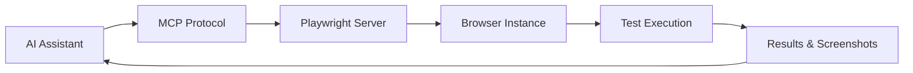

# 第三樂章：AI 執行測試腳本編寫

## 章節概述

有了測試策略後，現在要將策略轉化為可執行的測試腳本。本章將深入探討如何使用 Playwright MCP (Model Context Protocol) 整合，讓 AI 不僅能編寫測試腳本，還能直接執行並驗證測試結果。這是自循環工作流程中的關鍵環節。

## 學習目標

完成本章節後，你將能夠：

- 理解 Playwright MCP 的架構和優勢
- 指導 AI 編寫高品質的 Playwright 測試腳本
- 實現瀏覽器自動化測試流程
- 掌握測試腳本的最佳實踐
- 整合測試執行與結果分析

## 前置需求

- 完成 Chapter 3，擁有完整的測試策略
- Playwright 環境已配置完成
- 了解基本的瀏覽器自動化概念
- 熟悉 async/await 語法

## 核心概念

### 1. Playwright MCP 整合架構



### 2. Playwright 的核心優勢

- **跨瀏覽器支援**：Chromium、Firefox、WebKit
- **自動等待機制**：智慧等待元素就緒
- **強大的選擇器**：支援 CSS、XPath、文字內容
- **並行執行**：提升測試效率
- **內建斷言**：豐富的驗證方法
- **追蹤和除錯**：完整的執行記錄

### 3. 測試腳本的結構化設計

```javascript
// 測試套件結構
describe('功能模組', () => {
  beforeEach('測試前準備', async () => {
    // 初始化設定
  });
  
  test('測試案例', async () => {
    // Arrange: 準備
    // Act: 執行
    // Assert: 驗證
  });
  
  afterEach('測試後清理', async () => {
    // 清理資源
  });
});
```

## 實作練習：編寫 TODO 應用測試腳本

### 步驟 1：設定 Playwright 專案

```markdown
Help me set up a Playwright project for testing the TODO application:

[Project Structure]
/tests
  /e2e           - End-to-end tests
  /integration   - Integration tests
  /fixtures      - Test fixtures and helpers
  /data          - Test data files
playwright.config.ts - Configuration file

[Configuration Requirements]
1. Support multiple browsers (Chrome, Firefox, Safari)
2. Enable screenshot on failure
3. Set up test retries
4. Configure base URL
5. Set reasonable timeouts

請提供完整的配置檔案，並用繁體中文註釋重要設定。
```

### 步驟 2：編寫基礎測試腳本

```markdown
Create Playwright test scripts for basic TODO operations:

[Test Scenarios]
1. Add a new TODO item
2. Mark TODO as complete
3. Delete a TODO item
4. Filter TODOs by status
5. Edit existing TODO

[Test Requirements]
- Use Page Object Model pattern
- Include proper assertions
- Add meaningful test descriptions
- Handle async operations correctly
- Include error scenarios

For each test, follow the AAA pattern:
- Arrange: Set up test conditions
- Act: Perform the action
- Assert: Verify the result

請使用 TypeScript 編寫，並包含繁體中文註釋。
```

### 步驟 3：實現 Page Object Model

```markdown
Implement Page Object Model for the TODO application:

[Page Objects Needed]
1. TodoPage - Main page object
2. TodoItem - Individual item component
3. FilterBar - Filter controls
4. TodoForm - Add/Edit form

[Methods to Include]
- Navigation methods
- Action methods (click, type, select)
- Assertion methods (verify state)
- Utility methods (wait, scroll)

Example structure:
```typescript
class TodoPage {
  constructor(private page: Page) {}
  
  // 定位器
  private get addButton() {
    return this.page.locator('[data-testid="add-todo"]');
  }
  
  // 動作方法
  async addTodo(title: string, description?: string) {
    // 實作新增 TODO 的邏輯
  }
  
  // 驗證方法
  async verifyTodoExists(title: string) {
    // 驗證 TODO 是否存在
  }
}
```

提供完整的 Page Object 實作，包含所有必要的方法。
```

### 步驟 4：進階測試場景

```markdown
Write advanced test scenarios using Playwright:

[Advanced Scenarios]
1. Drag and drop reordering
2. Keyboard navigation
3. Accessibility testing
4. Performance testing
5. Visual regression testing

[Code Example Request]
For each scenario:
- Explain the testing approach
- Provide complete test code
- Include assertions
- Add error handling
- Document edge cases

使用 Playwright 的進階功能，如：
- page.dragAndDrop()
- page.keyboard
- page.accessibility.snapshot()
- page.metrics()
- page.screenshot() for visual comparison
```

## Playwright MCP 整合實戰

### 1. 設定 MCP 連接

```markdown
Set up Playwright MCP integration:

[MCP Configuration]
```typescript
import { PlaywrightMCP } from '@anthropic/playwright-mcp';

const mcp = new PlaywrightMCP({
  // MCP 伺服器設定
  serverUrl: 'http://localhost:3000',
  apiKey: process.env.MCP_API_KEY,
  
  // Playwright 選項
  playwright: {
    headless: false,
    slowMo: 100,
    video: 'on',
    trace: 'on-first-retry'
  }
});
```

[Integration Points]
1. Test execution triggers
2. Result collection
3. Screenshot capture
4. Error reporting
5. Performance metrics

提供完整的 MCP 整合程式碼和使用說明。
```

### 2. AI 驅動的測試生成

```markdown
Create an AI-driven test generation system:

[System Components]
1. Test Specification Parser
   - Parse natural language requirements
   - Convert to test scenarios

2. Test Code Generator
   - Generate Playwright test code
   - Include assertions and validations

3. Test Executor
   - Run generated tests
   - Collect results

4. Feedback Loop
   - Analyze failures
   - Suggest improvements

[Example Workflow]
Input: "測試使用者可以新增包含中文字元的 TODO"
Output: Complete Playwright test with:
- Unicode handling
- Input validation
- Display verification
```

### 3. 智慧等待策略

```markdown
Implement intelligent wait strategies:

[Wait Strategies]
1. Element Visibility
```typescript
await page.waitForSelector('.todo-item', {
  state: 'visible',
  timeout: 5000
});
```

2. Network Idle
```typescript
await page.waitForLoadState('networkidle');
```

3. Custom Conditions
```typescript
await page.waitForFunction(
  () => document.querySelectorAll('.todo-item').length > 0
);
```

4. Animation Complete
```typescript
await page.waitForTimeout(500); // 等待動畫完成
```

為不同場景選擇適當的等待策略，並說明原因。
```

## 測試資料管理

### 1. 測試資料工廠

```markdown
Create test data factories:

```typescript
class TodoFactory {
  static createTodo(overrides = {}) {
    return {
      title: faker.lorem.sentence(),
      description: faker.lorem.paragraph(),
      priority: faker.helpers.arrayElement(['high', 'medium', 'low']),
      dueDate: faker.date.future(),
      ...overrides
    };
  }
  
  static createBulkTodos(count: number) {
    return Array.from({ length: count }, () => this.createTodo());
  }
  
  static createTodoWithTags(tags: string[]) {
    return {
      ...this.createTodo(),
      tags
    };
  }
}
```

設計完整的測試資料管理系統，支援各種測試場景。
```

### 2. 測試環境狀態管理

```markdown
Implement test environment state management:

[State Management Strategies]
1. Database Seeding
```typescript
beforeEach(async () => {
  await db.seed('todos', initialData);
});
```

2. LocalStorage Management
```typescript
await page.evaluate(() => {
  localStorage.setItem('todos', JSON.stringify(testData));
});
```

3. API Mocking
```typescript
await page.route('**/api/todos', route => {
  route.fulfill({
    status: 200,
    body: JSON.stringify(mockTodos)
  });
});
```

4. State Reset
```typescript
afterEach(async () => {
  await page.evaluate(() => localStorage.clear());
});
```
```

## 測試報告與分析

### 1. 自訂報告器

```markdown
Create custom test reporters:

```typescript
class CustomReporter {
  onTestBegin(test) {
    console.log(`開始測試: ${test.title}`);
  }
  
  onTestEnd(test, result) {
    if (result.status === 'failed') {
      // 擷取螢幕截圖
      // 收集錯誤資訊
      // 生成詳細報告
    }
  }
  
  async generateHTMLReport(results) {
    // 生成 HTML 格式的測試報告
    // 包含統計圖表
    // 失敗案例分析
  }
}
```

實作完整的自訂報告系統。
```

### 2. 測試指標收集

```markdown
Collect and analyze test metrics:

[Metrics to Track]
1. Execution Time
2. Pass/Fail Rate
3. Flaky Test Detection
4. Coverage Metrics
5. Performance Benchmarks

[Implementation]
```typescript
class TestMetrics {
  private metrics = {
    totalTests: 0,
    passedTests: 0,
    failedTests: 0,
    averageTime: 0,
    flakyTests: new Set(),
    performanceData: []
  };
  
  collectMetrics(testResult) {
    // 收集測試指標
  }
  
  analyzeFlakiness(testHistory) {
    // 分析測試穩定性
  }
  
  generateReport() {
    // 生成指標報告
  }
}
```
```

## 最佳實踐與模式

### 1. 測試腳本組織原則

```
/tests
  /e2e
    /features        # 按功能組織
      /todo-crud    # CRUD 操作
      /todo-filter  # 過濾功能
      /todo-search  # 搜尋功能
  /page-objects     # Page Objects
  /fixtures         # 測試固件
  /helpers          # 輔助函數
  /data            # 測試資料
```

### 2. 選擇器策略

```markdown
Selector Best Practices:

1. Priority Order:
   - data-testid (最推薦)
   - role attributes
   - text content
   - CSS classes (最不推薦)

2. Examples:
```typescript
// 好的做法
await page.locator('[data-testid="submit-button"]').click();
await page.getByRole('button', { name: '提交' }).click();

// 避免的做法
await page.locator('.btn-primary').click();
await page.locator('#submit').click();
```

3. Dynamic Selectors:
```typescript
const getTodoItem = (index: number) => 
  page.locator(`[data-testid="todo-item-${index}"]`);
```
```

### 3. 斷言策略

```markdown
Assertion Strategies:

1. Multiple Assertions:
```typescript
await expect(page).toHaveTitle(/TODO App/);
await expect(todoItem).toBeVisible();
await expect(todoItem).toHaveText('完成任務');
await expect(todoItem).toHaveClass(/completed/);
```

2. Soft Assertions:
```typescript
await expect.soft(element).toBeVisible();
// 繼續執行其他測試
```

3. Custom Matchers:
```typescript
expect.extend({
  async toHaveTodoCount(page, count) {
    const todos = await page.locator('.todo-item').count();
    return {
      pass: todos === count,
      message: () => `Expected ${count} todos, found ${todos}`
    };
  }
});
```
```

## 常見問題與解決方案

### Q1: 測試執行不穩定（Flaky Tests）

**解決方案**：
```typescript
// 1. 使用明確等待
await page.waitForSelector('.todo-item');

// 2. 重試機制
test('flaky test', async ({ page }) => {
  // 測試邏輯
}).retry(3);

// 3. 增加超時時間
test.setTimeout(30000);

// 4. 等待網路請求完成
await page.waitForResponse(response => 
  response.url().includes('/api/todos') && response.status() === 200
);
```

### Q2: 並行測試互相干擾

**解決方案**：
```typescript
// 1. 使用獨立的測試資料
const testId = generateUniqueId();
const testData = createTestData(testId);

// 2. 隔離測試環境
test.describe.serial('Sequential tests', () => {
  // 串行執行的測試
});

// 3. 使用不同的使用者帳號
const testUser = await createTestUser();
```

### Q3: 測試執行速度慢

**解決方案**：
```typescript
// 1. 並行執行
// playwright.config.ts
export default {
  workers: 4,
  fullyParallel: true
};

// 2. 重用認證狀態
const authFile = 'auth.json';
await page.context().storageState({ path: authFile });

// 3. 減少不必要的等待
// 避免 page.waitForTimeout()
// 使用具體的等待條件
```

## 思考與挑戰

### 深度思考題

1. **測試維護性**：如何設計測試使其易於維護？
2. **測試效能**：如何平衡測試覆蓋率和執行時間？
3. **AI 生成的限制**：哪些測試場景不適合 AI 生成？
4. **團隊採用**：如何說服團隊採用 AI 驅動的測試？

### 進階挑戰

1. **跨裝置測試**：實現響應式設計的自動化測試
2. **無障礙測試**：整合 WCAG 標準的自動化檢查
3. **效能測試**：實現頁面載入和互動效能測試
4. **安全測試**：自動化常見的安全漏洞檢測

## 實作專案：完整測試套件

### 專案需求

為 TODO 應用建立完整的測試套件：

1. **基礎功能測試** (10 個測試案例)
2. **進階功能測試** (5 個測試案例)
3. **邊界條件測試** (5 個測試案例)
4. **效能測試** (3 個測試案例)
5. **無障礙測試** (3 個測試案例)

### 提交要求

- 完整的測試程式碼（使用 TypeScript）
- Page Object Model 實作
- 測試資料管理方案
- 執行報告（HTML 格式）
- AI 互動記錄

## 下一步

恭喜你完成了第三樂章！你已經掌握了使用 AI 編寫 Playwright 測試腳本的技能。在下一章「第四樂章：AI 進行測試分析與除錯」中，我們將學習如何讓 AI 分析測試失敗的原因，並智慧地進行除錯。

記住，好的測試腳本不僅能發現問題，還能清楚地指出問題所在。透過 Playwright 和 AI 的結合，我們可以創建強大而智慧的測試自動化系統。

## 資源連結

- [Playwright 官方文檔](https://playwright.dev/docs/intro)
- [Playwright 最佳實踐](https://playwright.dev/docs/best-practices)
- [Page Object Model 模式](https://playwright.dev/docs/pom)
- [測試自動化模式](https://testautomationpatterns.org/)
- [MCP Protocol 規範](https://modelcontextprotocol.io/)

---

*「自動化測試的價值不在於找到 bug，而在於防止 bug 再次出現。」*