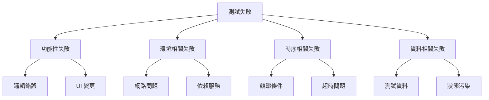
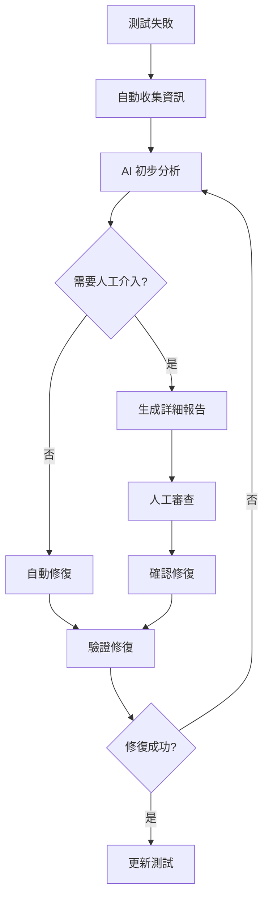

# 第四樂章：AI 進行測試分析與除錯

## 章節概述

測試失敗是開發過程中的常態，關鍵在於如何快速找出問題根源並修復。本章將探討如何利用 AI 的分析能力，解讀測試失敗、分析追蹤檔案、定位問題根源，並提供修復建議。這是實現自循環工作流程的關鍵能力。

## 學習目標

完成本章節後，你將能夠：

- 指導 AI 分析測試失敗報告
- 利用 Playwright 追蹤檔案進行深度分析
- 實施根本原因分析（RCA）方法
- 建立智慧除錯工作流程
- 預測和預防潛在問題

## 前置需求

- 完成 Chapter 4，擁有運行的測試套件
- 了解基本的除錯概念
- 熟悉瀏覽器開發者工具
- 具備日誌分析基礎

## 核心概念

### 1. AI 除錯的優勢

傳統除錯 vs AI 輔助除錯：

| 傳統方式 | AI 輔助方式 |
|---------|------------|
| 手動檢查錯誤訊息 | 自動解析錯誤模式 |
| 逐行追蹤程式碼 | 智慧定位問題範圍 |
| 憑經驗猜測原因 | 基於數據分析原因 |
| 單一角度分析 | 多維度綜合分析 |
| 重複性工作多 | 自動化分析流程 |

### 2. 測試失敗的類型分析



### 3. Playwright 追蹤分析架構

```typescript
// 追蹤檔案包含的資訊
interface TraceData {
  screenshots: Screenshot[];      // 截圖時間線
  network: NetworkRequest[];      // 網路請求
  console: ConsoleMessage[];      // 控制台輸出
  sources: SourceCode[];          // 源代碼
  actions: UserAction[];          // 使用者動作
  errors: ErrorInfo[];            // 錯誤資訊
  timeline: TimelineEvent[];      // 時間線事件
}
```

## 實作練習：智慧測試分析

### 步驟 1：故意引入錯誤

```markdown
Introduce intentional bugs in the TODO application for testing:

[Bug Categories to Introduce]
1. Logic Errors
   - Incorrect data validation
   - Wrong calculation in statistics
   - Faulty filter logic

2. UI Issues
   - Missing elements
   - Incorrect styling
   - Broken responsive layout

3. Async Problems
   - Race conditions
   - Timeout issues
   - Promise rejection

4. Data Issues
   - localStorage corruption
   - Invalid data format
   - Missing required fields

[Implementation]
For each bug:
- Describe the bug clearly
- Show the buggy code
- Explain expected vs actual behavior
- Provide reproduction steps

請建立一個包含多種類型錯誤的測試版本，用於練習除錯。
```

### 步驟 2：收集失敗資訊

```markdown
Create a comprehensive failure collection system:

```typescript
class FailureCollector {
  async collectFailureData(testInfo: TestInfo) {
    const data = {
      // 基本資訊
      testName: testInfo.title,
      testFile: testInfo.file,
      timestamp: new Date().toISOString(),
      
      // 錯誤詳情
      error: {
        message: testInfo.error?.message,
        stack: testInfo.error?.stack,
        type: this.classifyError(testInfo.error)
      },
      
      // 環境資訊
      environment: {
        browser: testInfo.project.name,
        viewport: testInfo.viewport,
        userAgent: await page.evaluate(() => navigator.userAgent)
      },
      
      // 執行上下文
      context: {
        screenshot: await page.screenshot(),
        html: await page.content(),
        url: page.url(),
        cookies: await page.context().cookies(),
        localStorage: await page.evaluate(() => ({ ...localStorage }))
      },
      
      // 追蹤資料
      trace: {
        file: testInfo.attachments.find(a => a.name === 'trace')?.path,
        video: testInfo.attachments.find(a => a.name === 'video')?.path
      }
    };
    
    return data;
  }
  
  private classifyError(error: Error): string {
    // 錯誤分類邏輯
    if (error.message.includes('TimeoutError')) return 'timeout';
    if (error.message.includes('not found')) return 'element-missing';
    if (error.message.includes('Network')) return 'network';
    // ... 更多分類
    return 'unknown';
  }
}
```

實作完整的失敗資訊收集系統。
```

### 步驟 3：AI 分析提示詞設計

```markdown
Analyze test failure using AI:

[Analysis Prompt Template]
```
You are an expert QA engineer analyzing a test failure. Please perform comprehensive root cause analysis.

## Test Failure Information
- Test Name: {testName}
- Error Message: {errorMessage}
- Error Stack: {errorStack}
- Browser: {browser}
- URL: {url}

## Available Data
1. Screenshot at failure point
2. HTML content
3. Console logs
4. Network requests
5. Trace file

## Analysis Tasks
1. Identify the root cause
2. Classify the failure type
3. Suggest fix approaches
4. Predict similar issues
5. Recommend prevention strategies

## Output Format
Provide analysis in Traditional Chinese with:
- 問題摘要 (Problem Summary)
- 根本原因 (Root Cause)
- 影響範圍 (Impact Scope)
- 修復建議 (Fix Recommendations)
- 預防措施 (Prevention Measures)

請提供詳細的分析報告。
```

建立標準化的 AI 分析流程。
```

### 步驟 4：追蹤檔案深度分析

```markdown
Implement trace file analysis:

```typescript
class TraceAnalyzer {
  async analyzeTrace(tracePath: string) {
    const trace = await parseTrace(tracePath);
    
    return {
      // 時間線分析
      timeline: this.analyzeTimeline(trace.events),
      
      // 效能分析
      performance: this.analyzePerformance(trace.metrics),
      
      // 網路分析
      network: this.analyzeNetwork(trace.network),
      
      // 錯誤分析
      errors: this.analyzeErrors(trace.errors),
      
      // 關鍵路徑分析
      criticalPath: this.findCriticalPath(trace.events)
    };
  }
  
  private analyzeTimeline(events: TimelineEvent[]) {
    return {
      totalDuration: events[events.length - 1].timestamp - events[0].timestamp,
      slowestAction: this.findSlowestAction(events),
      bottlenecks: this.identifyBottlenecks(events),
      unusualPatterns: this.detectAnomalies(events)
    };
  }
  
  private analyzePerformance(metrics: PerformanceMetrics) {
    return {
      renderTime: metrics.firstContentfulPaint,
      interactionTime: metrics.timeToInteractive,
      memoryUsage: metrics.jsHeapUsedSize,
      recommendations: this.generatePerformanceRecommendations(metrics)
    };
  }
  
  private analyzeNetwork(requests: NetworkRequest[]) {
    return {
      failedRequests: requests.filter(r => r.status >= 400),
      slowRequests: requests.filter(r => r.duration > 1000),
      totalDataTransferred: requests.reduce((sum, r) => sum + r.size, 0),
      suggestions: this.generateNetworkOptimizations(requests)
    };
  }
}
```

實作完整的追蹤檔案分析系統。
```

## 進階除錯技術

### 1. 智慧斷點設定

```markdown
Implement intelligent breakpoint system:

```typescript
class SmartDebugger {
  async setIntelligentBreakpoints(page: Page, errorInfo: ErrorInfo) {
    // 基於錯誤類型設定斷點
    const breakpoints = await this.analyzeErrorForBreakpoints(errorInfo);
    
    for (const bp of breakpoints) {
      await page.evaluateOnNewDocument((bp) => {
        // 在瀏覽器中設定條件斷點
        if (bp.condition) {
          Object.defineProperty(window, bp.variable, {
            get() {
              if (eval(bp.condition)) {
                debugger;
              }
              return this._value;
            },
            set(value) {
              this._value = value;
            }
          });
        }
      }, bp);
    }
  }
  
  private async analyzeErrorForBreakpoints(errorInfo: ErrorInfo) {
    // 使用 AI 分析錯誤並建議斷點位置
    const prompt = `
      Based on this error: ${errorInfo.message}
      Stack trace: ${errorInfo.stack}
      
      Suggest strategic breakpoint locations:
      1. Variable watch points
      2. Function entry/exit points
      3. Conditional breakpoints
      4. Event listeners
    `;
    
    // AI 回應處理
    return this.parseAIBreakpointSuggestions(await askAI(prompt));
  }
}
```

建立智慧斷點系統，自動在關鍵位置設定斷點。
```

### 2. 錯誤模式識別

```markdown
Create error pattern recognition system:

```typescript
class ErrorPatternRecognizer {
  private patterns = new Map<string, ErrorPattern>();
  
  async recognizePattern(error: Error, context: TestContext) {
    const features = this.extractFeatures(error, context);
    const matchedPattern = this.findMatchingPattern(features);
    
    if (matchedPattern) {
      return {
        pattern: matchedPattern,
        confidence: this.calculateConfidence(features, matchedPattern),
        previousOccurrences: this.getPatternHistory(matchedPattern.id),
        suggestedFix: matchedPattern.commonFixes
      };
    }
    
    // 如果沒有匹配，創建新模式
    return this.createNewPattern(features);
  }
  
  private extractFeatures(error: Error, context: TestContext) {
    return {
      errorType: error.constructor.name,
      messageKeywords: this.extractKeywords(error.message),
      stackPattern: this.analyzeStackTrace(error.stack),
      contextualInfo: {
        browser: context.browser,
        testType: context.testType,
        lastAction: context.lastAction
      }
    };
  }
  
  private findMatchingPattern(features: ErrorFeatures): ErrorPattern | null {
    // 使用機器學習或規則引擎匹配模式
    for (const [id, pattern] of this.patterns) {
      if (this.matchesPattern(features, pattern)) {
        return pattern;
      }
    }
    return null;
  }
}
```

實作錯誤模式識別系統，學習並記住常見錯誤模式。
```

### 3. 自動修復建議

```markdown
Generate automatic fix suggestions:

```typescript
class AutoFixSuggester {
  async suggestFixes(analysis: FailureAnalysis) {
    const fixes = [];
    
    // 基於錯誤類型提供修復建議
    switch (analysis.errorType) {
      case 'element-not-found':
        fixes.push(await this.suggestSelectorFix(analysis));
        break;
      
      case 'timeout':
        fixes.push(await this.suggestTimingFix(analysis));
        break;
      
      case 'assertion-failed':
        fixes.push(await this.suggestAssertionFix(analysis));
        break;
      
      case 'network-error':
        fixes.push(await this.suggestNetworkFix(analysis));
        break;
    }
    
    // 使用 AI 生成額外建議
    const aiSuggestions = await this.getAISuggestions(analysis);
    fixes.push(...aiSuggestions);
    
    return this.rankFixesByLikelihood(fixes);
  }
  
  private async suggestSelectorFix(analysis: FailureAnalysis) {
    return {
      type: 'selector-update',
      description: '更新元素選擇器',
      oldSelector: analysis.failedSelector,
      suggestedSelectors: [
        `[data-testid="${analysis.elementId}"]`,
        `text="${analysis.elementText}"`,
        `css="${this.generateRobustSelector(analysis.html)}"`
      ],
      confidence: 0.85,
      implementation: `
        // 將選擇器從
        await page.locator('${analysis.failedSelector}')
        // 改為
        await page.locator('[data-testid="${analysis.elementId}"]')
      `
    };
  }
}
```

建立自動修復建議系統。
```

## 視覺化除錯工具

### 1. 測試執行時間線

```markdown
Create visual timeline for test execution:

```typescript
class TestTimeline {
  generateTimeline(events: TimelineEvent[]) {
    const timeline = {
      title: '測試執行時間線',
      events: events.map(event => ({
        time: event.timestamp,
        type: event.type,
        description: event.description,
        duration: event.duration,
        status: event.status,
        screenshot: event.screenshot
      })),
      statistics: {
        totalDuration: this.calculateTotalDuration(events),
        slowestStep: this.findSlowestStep(events),
        failurePoint: this.identifyFailurePoint(events)
      }
    };
    
    return this.renderAsHTML(timeline);
  }
  
  private renderAsHTML(timeline: Timeline): string {
    return `
      <!DOCTYPE html>
      <html>
      <head>
        <title>測試執行時間線</title>
        <script src="https://cdn.plot.ly/plotly-latest.min.js"></script>
      </head>
      <body>
        <div id="timeline"></div>
        <script>
          const data = ${JSON.stringify(timeline)};
          // Plotly 視覺化程式碼
          Plotly.newPlot('timeline', data);
        </script>
      </body>
      </html>
    `;
  }
}
```

實作測試執行的視覺化時間線。
```

### 2. 錯誤熱點圖

```markdown
Generate error heatmap:

```typescript
class ErrorHeatmap {
  generateHeatmap(errors: ErrorData[]) {
    const heatmapData = {
      // 按元件分組錯誤
      byComponent: this.groupByComponent(errors),
      
      // 按時間分布
      byTime: this.groupByTime(errors),
      
      // 按錯誤類型
      byType: this.groupByType(errors),
      
      // 按嚴重程度
      bySeverity: this.groupBySeverity(errors)
    };
    
    return {
      visualization: this.createD3Heatmap(heatmapData),
      insights: this.generateInsights(heatmapData),
      recommendations: this.generateRecommendations(heatmapData)
    };
  }
  
  private generateInsights(data: HeatmapData) {
    return {
      mostProblematicComponent: this.findMostProblematic(data.byComponent),
      peakErrorTime: this.findPeakTime(data.byTime),
      commonErrorPattern: this.findCommonPattern(data.byType),
      criticalAreas: this.identifyCriticalAreas(data)
    };
  }
}
```

建立錯誤熱點圖視覺化系統。
```

## 預測性分析

### 1. 潛在問題預測

```markdown
Implement predictive analysis for potential issues:

```typescript
class PredictiveAnalyzer {
  async predictPotentialIssues(codeChanges: CodeChange[], testHistory: TestHistory) {
    const predictions = [];
    
    // 分析程式碼變更影響
    const impactAnalysis = await this.analyzeChangeImpact(codeChanges);
    
    // 基於歷史數據預測
    const historicalPatterns = this.analyzeHistoricalFailures(testHistory);
    
    // 使用 AI 預測潛在問題
    const aiPredictions = await this.getAIPredictions({
      changes: codeChanges,
      history: testHistory,
      currentState: await this.getCurrentSystemState()
    });
    
    // 綜合所有預測
    return this.consolidatePredictions([
      ...impactAnalysis.predictions,
      ...historicalPatterns.predictions,
      ...aiPredictions
    ]);
  }
  
  private async analyzeChangeImpact(changes: CodeChange[]) {
    return {
      affectedComponents: this.identifyAffectedComponents(changes),
      riskLevel: this.calculateRiskLevel(changes),
      predictions: this.generateImpactPredictions(changes)
    };
  }
}
```

建立預測性分析系統，提前發現潛在問題。
```

### 2. 測試穩定性分析

```markdown
Analyze test stability:

```typescript
class TestStabilityAnalyzer {
  analyzeStability(testRuns: TestRun[]) {
    return {
      // 計算 flakiness 分數
      flakinessScore: this.calculateFlakinessScore(testRuns),
      
      // 識別不穩定測試
      unstableTests: this.identifyUnstableTests(testRuns),
      
      // 分析失敗模式
      failurePatterns: this.analyzeFailurePatterns(testRuns),
      
      // 環境相關性分析
      environmentalFactors: this.analyzeEnvironmentalFactors(testRuns),
      
      // 穩定性趨勢
      stabilityTrend: this.calculateStabilityTrend(testRuns),
      
      // 改進建議
      improvements: this.suggestStabilityImprovements(testRuns)
    };
  }
  
  private calculateFlakinessScore(testRuns: TestRun[]): number {
    // Flakiness = (不一致結果數 / 總執行數) * 100
    const inconsistentResults = this.countInconsistentResults(testRuns);
    return (inconsistentResults / testRuns.length) * 100;
  }
}
```

實作測試穩定性分析系統。
```

## 最佳實踐

### 1. 除錯工作流程



### 2. 錯誤分類系統

```typescript
enum ErrorCategory {
  FUNCTIONAL = 'functional',      // 功能錯誤
  PERFORMANCE = 'performance',    // 效能問題
  COMPATIBILITY = 'compatibility', // 相容性問題
  SECURITY = 'security',          // 安全問題
  USABILITY = 'usability',        // 可用性問題
  DATA = 'data',                  // 資料問題
  NETWORK = 'network',            // 網路問題
  ENVIRONMENT = 'environment'     // 環境問題
}

class ErrorClassifier {
  classify(error: Error, context: TestContext): ErrorCategory {
    // 實作分類邏輯
  }
}
```

### 3. 除錯資訊優先級

```markdown
Debug Information Priority:

Priority 1 (Critical):
- Error message and stack trace
- Screenshot at failure
- Last successful step

Priority 2 (Important):
- Browser console logs
- Network requests
- DOM state

Priority 3 (Helpful):
- Performance metrics
- Memory usage
- Full trace file

Priority 4 (Optional):
- Historical data
- Similar past issues
- System resources
```

## 常見問題與解決方案

### Q1: AI 分析不準確

**解決方案**：
```markdown
Improve AI analysis accuracy:

1. Provide more context:
   - Include relevant code snippets
   - Add business logic explanation
   - Share test history

2. Use structured prompts:
   - Clear problem statement
   - Specific analysis requirements
   - Expected output format

3. Iterative refinement:
   - Start with broad analysis
   - Narrow down based on results
   - Validate findings
```

### Q2: 追蹤檔案太大

**解決方案**：
```typescript
// 優化追蹤檔案大小
const traceOptions = {
  screenshots: true,
  snapshots: false,  // 關閉 DOM 快照
  sources: false,    // 關閉源碼收集
  
  // 只在失敗時保存
  onlyOnFailure: true,
  
  // 壓縮選項
  compress: true
};
```

### Q3: 除錯資訊過載

**解決方案**：
```typescript
class DebugInfoFilter {
  filter(info: DebugInfo, level: DebugLevel): FilteredInfo {
    switch(level) {
      case DebugLevel.ESSENTIAL:
        return this.getEssentialInfo(info);
      case DebugLevel.DETAILED:
        return this.getDetailedInfo(info);
      case DebugLevel.COMPLETE:
        return info;
    }
  }
}
```

## 思考與挑戰

### 深度思考題

1. **自動化極限**：哪些除錯任務永遠需要人類判斷？
2. **成本效益**：如何評估 AI 除錯的投資回報率？
3. **知識傳承**：如何將 AI 學到的除錯知識傳承給團隊？
4. **隱私安全**：如何在 AI 分析中保護敏感資訊？

### 進階挑戰

1. **跨團隊除錯知識庫**：建立共享的錯誤模式庫
2. **即時除錯助手**：開發 IDE 整合的即時除錯 AI
3. **預防性維護**：基於分析結果預防未來問題
4. **自適應測試**：根據錯誤模式自動調整測試策略

## 實作專案：智慧除錯系統

### 專案需求

建立一個完整的 AI 驅動除錯系統：

1. **錯誤收集器**：自動收集所有相關資訊
2. **AI 分析器**：智慧分析錯誤原因
3. **修復建議器**：提供具體修復方案
4. **視覺化工具**：直觀展示分析結果
5. **知識庫**：累積除錯經驗

### 提交要求

- 完整的除錯系統程式碼
- AI 提示詞模板集
- 視覺化報告範例
- 錯誤模式文檔
- 使用說明書

## 下一步

恭喜你完成了第四樂章！你已經掌握了使用 AI 進行測試分析和除錯的技能。在下一章「最終樂章：AI 完成自我修復閉環」中，我們將學習如何讓 AI 自動修復發現的問題，完成整個自循環工作流程。

記住，優秀的除錯不只是修復錯誤，更是理解錯誤背後的原因，預防類似問題再次發生。

## 資源連結

- [Chrome DevTools Protocol](https://chromedevtools.github.io/devtools-protocol/)
- [Playwright Trace Viewer](https://playwright.dev/docs/trace-viewer)
- [Error Monitoring Best Practices](https://docs.sentry.io/product/issues/)
- [Root Cause Analysis Guide](https://www.atlassian.com/incident-management/postmortem/root-cause-analysis)

---

*「除錯的藝術不在於修復問題，而在於理解為什麼會出現問題。」*