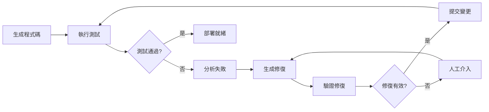
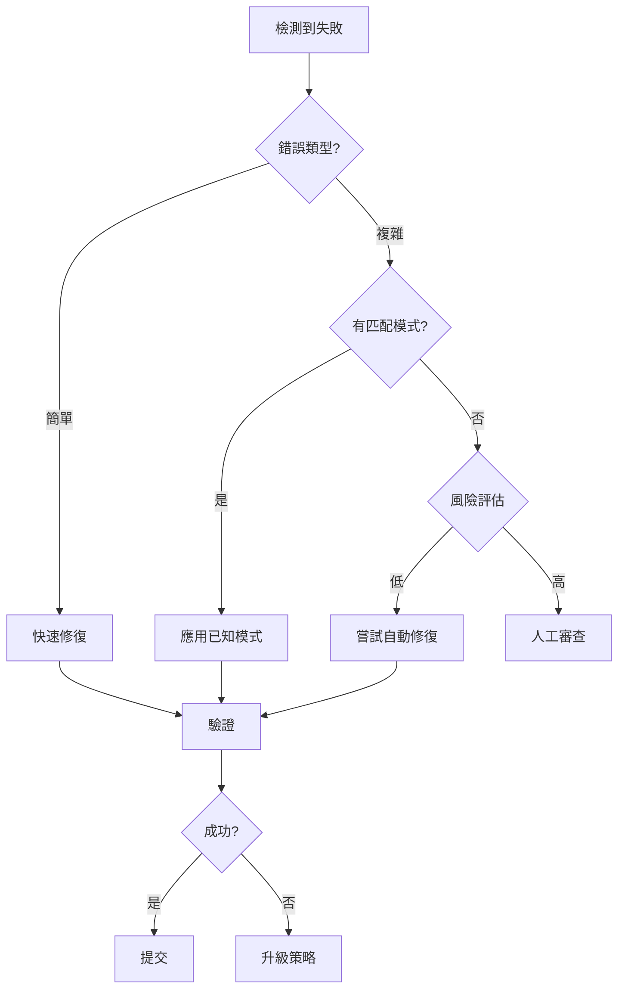

# 最終樂章：AI 完成自我修復閉環

## 章節概述

這是整個自循環工作流程的高潮——讓 AI 不僅能發現和分析問題，還能自動修復它們。本章將探討如何建立完整的自我修復系統，實現從問題發現到自動修復的閉環流程，真正實現「自循環」的開發測試工作流。

## 學習目標

完成本章節後，你將能夠：

- 建立自動化的問題修復流程
- 實施程式碼修復的驗證機制
- 完成自循環工作流程的整合
- 掌握修復品質保證技術
- 建立持續改進的回饋循環

## 前置需求

- 完成 Chapter 5，掌握測試分析技能
- 理解版本控制（Git）基礎
- 熟悉 CI/CD 概念
- 具備程式碼審查經驗

## 核心概念

### 1. 自我修復閉環架構



### 2. 修復策略層級

```typescript
enum RepairStrategy {
  QUICK_FIX = 'quick',      // 快速修復：簡單的程式碼調整
  REFACTOR = 'refactor',    // 重構：改善程式碼結構
  REDESIGN = 'redesign',    // 重新設計：架構層面調整
  WORKAROUND = 'workaround', // 暫時方案：繞過問題
  ROLLBACK = 'rollback'     // 回滾：恢復到穩定版本
}
```

### 3. 修復信心評分

```typescript
interface RepairConfidence {
  score: number;          // 0-100 信心分數
  factors: {
    testCoverage: number; // 測試覆蓋率
    complexity: number;   // 修復複雜度
    impact: number;       // 影響範圍
    history: number;      // 歷史成功率
  };
  recommendation: 'auto-apply' | 'review-required' | 'manual-only';
}
```

## 實作練習：建立自我修復系統

### 步驟 1：修復策略生成

```markdown
Create an AI-powered repair strategy generator:

```typescript
class RepairStrategyGenerator {
  async generateStrategy(failure: TestFailure, analysis: RootCauseAnalysis) {
    // 使用 AI 生成修復策略
    const prompt = `
      Based on the following test failure and root cause analysis:
      
      Failure: ${failure.description}
      Root Cause: ${analysis.rootCause}
      Error Type: ${analysis.errorType}
      Affected Code: ${analysis.affectedCode}
      
      Generate repair strategies:
      1. Identify the specific code that needs modification
      2. Propose multiple fix approaches
      3. Evaluate each approach's risk and benefit
      4. Recommend the best strategy
      
      Output format:
      - Primary Strategy: [detailed fix description]
      - Alternative Strategies: [list of alternatives]
      - Code Changes: [specific modifications]
      - Risk Assessment: [potential side effects]
      - Confidence Score: [0-100]
      
      請提供詳細的修復策略，包含具體的程式碼修改建議。
    `;
    
    const aiResponse = await this.callAI(prompt);
    return this.parseRepairStrategy(aiResponse);
  }
  
  private parseRepairStrategy(response: string): RepairStrategy {
    // 解析 AI 回應並結構化
    return {
      primary: this.extractPrimaryStrategy(response),
      alternatives: this.extractAlternatives(response),
      codeChanges: this.extractCodeChanges(response),
      riskAssessment: this.extractRiskAssessment(response),
      confidence: this.calculateConfidence(response)
    };
  }
}
```

實作完整的修復策略生成系統。
```

### 步驟 2：自動修復執行

```markdown
Implement automatic repair execution:

```typescript
class AutoRepairExecutor {
  async executeRepair(strategy: RepairStrategy, options: RepairOptions = {}) {
    const result = {
      success: false,
      changes: [],
      validation: null,
      rollbackPoint: null
    };
    
    try {
      // 1. 創建回滾點
      result.rollbackPoint = await this.createRollbackPoint();
      
      // 2. 應用修復
      for (const change of strategy.codeChanges) {
        const applied = await this.applyCodeChange(change);
        result.changes.push(applied);
      }
      
      // 3. 驗證修復
      result.validation = await this.validateRepair(strategy);
      
      // 4. 確認修復成功
      if (result.validation.passed) {
        result.success = true;
        await this.commitChanges(result.changes);
      } else {
        await this.rollback(result.rollbackPoint);
      }
      
    } catch (error) {
      // 錯誤處理和回滾
      await this.handleRepairError(error, result.rollbackPoint);
    }
    
    return result;
  }
  
  private async applyCodeChange(change: CodeChange) {
    const file = await this.readFile(change.filePath);
    const modified = this.applyModification(file, change);
    await this.writeFile(change.filePath, modified);
    
    return {
      file: change.filePath,
      diff: this.generateDiff(file, modified),
      timestamp: new Date()
    };
  }
  
  private async validateRepair(strategy: RepairStrategy) {
    // 執行多層驗證
    const validations = await Promise.all([
      this.runUnitTests(),
      this.runIntegrationTests(),
      this.runE2ETests(),
      this.performStaticAnalysis(),
      this.checkPerformance()
    ]);
    
    return {
      passed: validations.every(v => v.passed),
      details: validations,
      confidence: this.calculateValidationConfidence(validations)
    };
  }
}
```

建立自動修復執行系統。
```

### 步驟 3：修復驗證機制

```markdown
Create comprehensive repair validation system:

```typescript
class RepairValidator {
  async validate(repair: RepairResult, originalFailure: TestFailure) {
    const validation = {
      functional: await this.validateFunctional(repair),
      regression: await this.checkRegression(repair),
      performance: await this.validatePerformance(repair),
      security: await this.validateSecurity(repair),
      codeQuality: await this.validateCodeQuality(repair)
    };
    
    return {
      passed: this.allValidationsPassed(validation),
      score: this.calculateValidationScore(validation),
      report: this.generateValidationReport(validation),
      recommendations: this.generateRecommendations(validation)
    };
  }
  
  private async validateFunctional(repair: RepairResult) {
    // 功能驗證
    const tests = await this.runTestSuite();
    return {
      passed: tests.failed === 0,
      coverage: tests.coverage,
      failedTests: tests.failures,
      successRate: (tests.passed / tests.total) * 100
    };
  }
  
  private async checkRegression(repair: RepairResult) {
    // 回歸測試
    const baseline = await this.getBaselineResults();
    const current = await this.getCurrentResults();
    
    return {
      passed: !this.hasRegression(baseline, current),
      affectedFeatures: this.identifyAffectedFeatures(baseline, current),
      regressionRisk: this.calculateRegressionRisk(baseline, current)
    };
  }
  
  private async validatePerformance(repair: RepairResult) {
    // 效能驗證
    const metrics = await this.measurePerformance();
    const baseline = await this.getPerformanceBaseline();
    
    return {
      passed: this.meetsPerformanceThresholds(metrics, baseline),
      metrics: metrics,
      comparison: this.compareWithBaseline(metrics, baseline),
      bottlenecks: this.identifyBottlenecks(metrics)
    };
  }
}
```

實作完整的修復驗證系統。
```

### 步驟 4：整合自循環工作流

```markdown
Integrate the complete self-cycling workflow:

```typescript
class SelfCyclingOrchestrator {
  private generator: CodeGenerator;
  private tester: TestRunner;
  private analyzer: FailureAnalyzer;
  private repairer: AutoRepairer;
  private validator: RepairValidator;
  
  async runCycle(requirements: Requirements, options: CycleOptions = {}) {
    const cycleResult = {
      iterations: [],
      finalCode: null,
      success: false,
      metrics: {}
    };
    
    let iteration = 0;
    let code = await this.generator.generate(requirements);
    
    while (iteration < options.maxIterations || 10) {
      console.log(`🔄 循環迭代 #${iteration + 1}`);
      
      // 1. 執行測試
      const testResults = await this.tester.run(code);
      
      if (testResults.allPassed) {
        cycleResult.success = true;
        cycleResult.finalCode = code;
        break;
      }
      
      // 2. 分析失敗
      const analysis = await this.analyzer.analyze(testResults.failures);
      
      // 3. 生成修復
      const repair = await this.repairer.repair(analysis);
      
      // 4. 驗證修復
      const validation = await this.validator.validate(repair);
      
      if (validation.passed) {
        code = repair.modifiedCode;
        cycleResult.iterations.push({
          number: iteration + 1,
          failure: testResults.failures,
          repair: repair,
          validation: validation
        });
      } else {
        // 需要人工介入
        if (options.allowManualIntervention) {
          code = await this.requestManualFix(analysis);
        } else {
          break;
        }
      }
      
      iteration++;
    }
    
    cycleResult.metrics = this.calculateCycleMetrics(cycleResult);
    return cycleResult;
  }
  
  private calculateCycleMetrics(result: CycleResult) {
    return {
      totalIterations: result.iterations.length,
      autoFixRate: this.calculateAutoFixRate(result),
      averageFixTime: this.calculateAverageFixTime(result),
      codeQualityImprovement: this.measureQualityImprovement(result),
      testCoverage: this.measureFinalCoverage(result),
      confidenceScore: this.calculateOverallConfidence(result)
    };
  }
}
```

實作完整的自循環協調器。
```

## 進階修復技術

### 1. 智慧程式碼生成

```markdown
Implement intelligent code generation for repairs:

```typescript
class IntelligentCodeRepairer {
  async generateRepairCode(
    buggyCode: string,
    analysis: RootCauseAnalysis,
    context: CodeContext
  ) {
    // 使用 AI 生成修復程式碼
    const prompt = `
      You are an expert developer fixing a bug. Here's the context:
      
      ## Buggy Code
      \`\`\`javascript
      ${buggyCode}
      \`\`\`
      
      ## Root Cause Analysis
      ${JSON.stringify(analysis, null, 2)}
      
      ## Code Context
      - Dependencies: ${context.dependencies}
      - Related Files: ${context.relatedFiles}
      - Test Requirements: ${context.testRequirements}
      
      ## Task
      1. Fix the identified issue
      2. Maintain backward compatibility
      3. Follow existing code style
      4. Add necessary error handling
      5. Include inline comments explaining the fix
      
      Generate the repaired code with Traditional Chinese comments.
    `;
    
    const repairedCode = await this.callAI(prompt);
    
    // 驗證生成的程式碼
    return await this.validateGeneratedCode(repairedCode, context);
  }
  
  private async validateGeneratedCode(code: string, context: CodeContext) {
    const validation = {
      syntaxValid: await this.checkSyntax(code),
      typesValid: await this.checkTypes(code, context),
      testsPass: await this.runTestsAgainst(code),
      styleCompliant: await this.checkCodeStyle(code),
      securityScan: await this.performSecurityScan(code)
    };
    
    if (Object.values(validation).every(v => v === true)) {
      return { valid: true, code };
    } else {
      // 嘗試自動修正驗證問題
      return await this.attemptAutoCorrection(code, validation);
    }
  }
}
```

建立智慧程式碼修復生成器。
```

### 2. 修復模式學習

```markdown
Create a repair pattern learning system:

```typescript
class RepairPatternLearner {
  private patterns: Map<string, RepairPattern> = new Map();
  
  async learnFromRepair(
    failure: TestFailure,
    repair: RepairResult,
    outcome: RepairOutcome
  ) {
    const pattern = this.extractPattern(failure, repair);
    
    if (outcome.successful) {
      // 成功的修復模式
      this.reinforcePattern(pattern);
      await this.saveToKnowledgeBase(pattern);
    } else {
      // 失敗的修復模式
      this.penalizePattern(pattern);
      await this.analyzeFailureReason(pattern, outcome);
    }
    
    // 更新模式匹配算法
    await this.updatePatternMatcher();
  }
  
  async suggestRepairFromPatterns(failure: TestFailure): RepairSuggestion[] {
    const matchedPatterns = await this.findMatchingPatterns(failure);
    
    return matchedPatterns
      .sort((a, b) => b.successRate - a.successRate)
      .slice(0, 5)
      .map(pattern => ({
        pattern: pattern,
        confidence: pattern.successRate,
        previousApplications: pattern.applications,
        suggestedFix: this.adaptPatternToContext(pattern, failure)
      }));
  }
  
  private extractPattern(failure: TestFailure, repair: RepairResult): RepairPattern {
    return {
      id: this.generatePatternId(),
      errorSignature: this.computeErrorSignature(failure),
      repairStrategy: this.abstractRepairStrategy(repair),
      contextFeatures: this.extractContextFeatures(failure),
      codeTransformation: this.extractTransformation(repair),
      successRate: 0,
      applications: []
    };
  }
}
```

實作修復模式學習系統。
```

### 3. 多策略修復協調

```markdown
Implement multi-strategy repair coordination:

```typescript
class MultiStrategyRepairer {
  private strategies = [
    new QuickFixStrategy(),
    new RefactorStrategy(),
    new WorkaroundStrategy(),
    new RollbackStrategy()
  ];
  
  async repair(failure: TestFailure, options: RepairOptions) {
    const candidates = await this.generateCandidates(failure);
    const ranked = await this.rankCandidates(candidates);
    
    for (const candidate of ranked) {
      console.log(`嘗試修復策略: ${candidate.strategy.name}`);
      
      const result = await this.tryRepair(candidate);
      
      if (result.success) {
        return result;
      }
      
      // 從失敗中學習
      await this.learnFromFailure(candidate, result);
    }
    
    // 所有策略都失敗，需要人工介入
    return this.requestManualIntervention(failure, candidates);
  }
  
  private async generateCandidates(failure: TestFailure) {
    const candidates = [];
    
    for (const strategy of this.strategies) {
      if (await strategy.isApplicable(failure)) {
        const candidate = await strategy.generateCandidate(failure);
        candidates.push(candidate);
      }
    }
    
    return candidates;
  }
  
  private async rankCandidates(candidates: RepairCandidate[]) {
    // 多維度評分
    for (const candidate of candidates) {
      candidate.score = await this.calculateScore(candidate, {
        successProbability: 0.3,
        implementationCost: 0.2,
        sideEffectRisk: 0.2,
        performanceImpact: 0.15,
        maintainability: 0.15
      });
    }
    
    return candidates.sort((a, b) => b.score - a.score);
  }
}
```

建立多策略修復協調系統。
```

## 品質保證機制

### 1. 修復品質評分

```markdown
Create repair quality scoring system:

```typescript
class RepairQualityScorer {
  scoreRepair(original: Code, repaired: Code, testResults: TestResults) {
    const metrics = {
      // 功能性指標
      functionality: this.scoreFunctionality(testResults),
      
      // 程式碼品質指標
      codeQuality: this.scoreCodeQuality(original, repaired),
      
      // 效能指標
      performance: this.scorePerformance(original, repaired),
      
      // 可維護性指標
      maintainability: this.scoreMaintainability(repaired),
      
      // 安全性指標
      security: this.scoreSecurity(repaired)
    };
    
    const overallScore = this.calculateOverallScore(metrics);
    
    return {
      score: overallScore,
      metrics: metrics,
      grade: this.assignGrade(overallScore),
      recommendations: this.generateRecommendations(metrics)
    };
  }
  
  private scoreCodeQuality(original: Code, repaired: Code) {
    return {
      complexity: this.compareComplexity(original, repaired),
      readability: this.assessReadability(repaired),
      duplication: this.checkDuplication(repaired),
      standards: this.checkCodingStandards(repaired),
      documentation: this.assessDocumentation(repaired)
    };
  }
  
  private assignGrade(score: number): string {
    if (score >= 90) return 'A - 優秀';
    if (score >= 80) return 'B - 良好';
    if (score >= 70) return 'C - 及格';
    if (score >= 60) return 'D - 需改進';
    return 'F - 不及格';
  }
}
```

實作修復品質評分系統。
```

### 2. 回歸防護

```markdown
Implement regression protection:

```typescript
class RegressionProtector {
  async protectAgainstRegression(repair: RepairResult) {
    // 1. 建立回歸測試套件
    const regressionSuite = await this.createRegressionSuite(repair);
    
    // 2. 執行全面測試
    const results = await this.runComprehensiveTests(regressionSuite);
    
    // 3. 比較基準線
    const comparison = await this.compareWithBaseline(results);
    
    // 4. 檢測潛在回歸
    const regressions = this.detectRegressions(comparison);
    
    if (regressions.length > 0) {
      // 處理檢測到的回歸
      return await this.handleRegressions(regressions, repair);
    }
    
    // 更新基準線
    await this.updateBaseline(results);
    
    return {
      protected: true,
      testSuite: regressionSuite,
      baseline: results
    };
  }
  
  private async createRegressionSuite(repair: RepairResult) {
    return {
      // 原有測試
      existingTests: await this.getAllExistingTests(),
      
      // 新增測試（針對修復）
      repairTests: await this.generateRepairSpecificTests(repair),
      
      // 邊界測試
      boundaryTests: await this.generateBoundaryTests(repair),
      
      // 整合測試
      integrationTests: await this.generateIntegrationTests(repair)
    };
  }
}
```

建立回歸防護系統。
```

## 監控與回饋

### 1. 修復效果監控

```markdown
Create repair effectiveness monitoring:

```typescript
class RepairMonitor {
  async monitorRepairEffectiveness(repair: RepairResult) {
    const monitoring = {
      immediate: await this.checkImmediateEffects(repair),
      shortTerm: await this.scheduleShortTermChecks(repair),
      longTerm: await this.scheduleLongTermChecks(repair)
    };
    
    // 設定警報
    await this.setupAlerts({
      onRegression: async (issue) => {
        await this.handleRegression(issue);
      },
      onPerformanceDegradation: async (metrics) => {
        await this.handlePerformanceIssue(metrics);
      },
      onNewFailure: async (failure) => {
        await this.analyzeNewFailure(failure, repair);
      }
    });
    
    return monitoring;
  }
  
  private async checkImmediateEffects(repair: RepairResult) {
    return {
      testsPassing: await this.verifyTestsPassing(),
      performanceMetrics: await this.measurePerformance(),
      errorRate: await this.checkErrorRate(),
      userImpact: await this.assessUserImpact()
    };
  }
}
```

實作修復效果監控系統。
```

### 2. 持續學習機制

```markdown
Implement continuous learning mechanism:

```typescript
class ContinuousLearner {
  async learn(cycleResult: CycleResult) {
    // 1. 提取學習資料
    const learningData = this.extractLearningData(cycleResult);
    
    // 2. 更新知識庫
    await this.updateKnowledgeBase(learningData);
    
    // 3. 改進 AI 模型
    await this.improveAIModels(learningData);
    
    // 4. 優化策略
    await this.optimizeStrategies(learningData);
    
    // 5. 生成洞察報告
    const insights = await this.generateInsights(learningData);
    
    return {
      learned: learningData,
      improvements: await this.measureImprovements(),
      insights: insights,
      recommendations: await this.generateRecommendations()
    };
  }
  
  private extractLearningData(cycleResult: CycleResult) {
    return {
      successfulPatterns: this.identifySuccessPatterns(cycleResult),
      failurePatterns: this.identifyFailurePatterns(cycleResult),
      performanceData: this.extractPerformanceData(cycleResult),
      codeEvolution: this.trackCodeEvolution(cycleResult),
      testEvolution: this.trackTestEvolution(cycleResult)
    };
  }
}
```

建立持續學習機制。
```

## 最佳實踐

### 1. 修復決策樹



### 2. 修復信心矩陣

| 錯誤複雜度 | 測試覆蓋率 | 歷史成功率 | 建議行動 |
|-----------|-----------|-----------|---------|
| 低 | 高 | 高 | 自動修復 |
| 低 | 高 | 低 | 審查後修復 |
| 低 | 低 | 高 | 增加測試後修復 |
| 高 | 高 | 高 | 謹慎自動修復 |
| 高 | 低 | - | 人工處理 |

### 3. 回滾策略

```typescript
class RollbackStrategy {
  async executeRollback(failure: RepairFailure) {
    const strategy = this.determineRollbackStrategy(failure);
    
    switch(strategy) {
      case 'immediate':
        // 立即回滾到上一個穩定版本
        return await this.immediateRollback();
        
      case 'gradual':
        // 漸進式回滾
        return await this.gradualRollback();
        
      case 'partial':
        // 部分回滾（只回滾失敗的部分）
        return await this.partialRollback(failure.affectedComponents);
        
      case 'checkpoint':
        // 回滾到特定檢查點
        return await this.rollbackToCheckpoint(failure.lastStableCheckpoint);
    }
  }
}
```

## 常見問題與解決方案

### Q1: 修復導致新問題

**解決方案**：
```typescript
class RepairSideEffectHandler {
  async handleSideEffects(repair: RepairResult, newIssues: Issue[]) {
    // 1. 評估影響
    const impact = await this.assessImpact(newIssues);
    
    // 2. 決定策略
    if (impact.severity === 'critical') {
      // 立即回滾
      await this.rollback(repair);
    } else {
      // 嘗試增量修復
      await this.incrementalFix(newIssues);
    }
  }
}
```

### Q2: 修復循環（修復A導致B，修復B導致A）

**解決方案**：
```typescript
class RepairCycleDetector {
  detectCycle(repairHistory: RepairRecord[]) {
    // 使用圖算法檢測循環
    const graph = this.buildRepairGraph(repairHistory);
    const cycles = this.findCycles(graph);
    
    if (cycles.length > 0) {
      // 打破循環
      return this.breakCycle(cycles[0]);
    }
  }
}
```

### Q3: 修復信心不足

**解決方案**：
```typescript
class ConfidenceBooster {
  async improveConfidence(repair: RepairResult) {
    // 1. 增加測試覆蓋
    await this.addMoreTests(repair);
    
    // 2. 進行 A/B 測試
    await this.performABTesting(repair);
    
    // 3. 漸進式部署
    await this.gradualRollout(repair);
  }
}
```

## 思考與挑戰

### 深度思考題

1. **倫理考量**：完全自動化的修復是否會降低開發者的技能？
2. **責任歸屬**：AI 自動修復導致的問題誰來負責？
3. **創新 vs 穩定**：自動修復會否限制創新？
4. **人機協作**：如何在自動化和人工控制間找到平衡？

### 進階挑戰

1. **跨服務修復**：實現微服務架構下的自動修復
2. **智慧回滾**：基於業務影響的智慧回滾決策
3. **預防性修復**：在問題發生前主動修復
4. **自適應系統**：建立自我進化的修復系統

## 實作專案：完整自循環系統

### 專案需求

建立一個完整的自循環開發測試系統：

1. **需求輸入**：自然語言需求描述
2. **程式碼生成**：AI 生成初始程式碼
3. **測試策略**：AI 制定測試計劃
4. **測試執行**：自動化測試執行
5. **問題分析**：智慧問題診斷
6. **自動修復**：AI 修復問題
7. **持續改進**：學習和優化

### 系統架構

```typescript
class SelfCyclingSystem {
  private components = {
    generator: new CodeGenerator(),
    strategist: new TestStrategist(),
    executor: new TestExecutor(),
    analyzer: new FailureAnalyzer(),
    repairer: new AutoRepairer(),
    validator: new RepairValidator(),
    learner: new ContinuousLearner()
  };
  
  async run(requirements: string) {
    // 完整的自循環實現
  }
}
```

### 提交要求

- 完整的系統原始碼
- 系統架構文檔
- 測試案例和結果
- 效能評估報告
- 使用指南和 API 文檔

## 下一步

恭喜你完成了最終樂章！你已經掌握了完整的 AI 自循環開發測試工作流程。從需求到程式碼，從測試到修復，整個流程都可以由 AI 協助完成。在下一章「變奏曲：擴展與優化工作流」中，我們將探討如何將這個工作流程擴展到更複雜的場景。

記住，自動化的目的不是取代人類，而是讓人類專注於更有創造性和價值的工作。

## 資源連結

- [Continuous Integration Best Practices](https://www.atlassian.com/continuous-delivery/continuous-integration)
- [Self-Healing Systems](https://www.oreilly.com/library/view/self-healing-systems/9781491980545/)
- [Automated Program Repair](https://program-repair.org/)
- [AI for Code Review](https://github.com/features/copilot)

---

*「真正的自動化不是讓機器取代人類，而是讓人類和機器各自發揮所長。」*