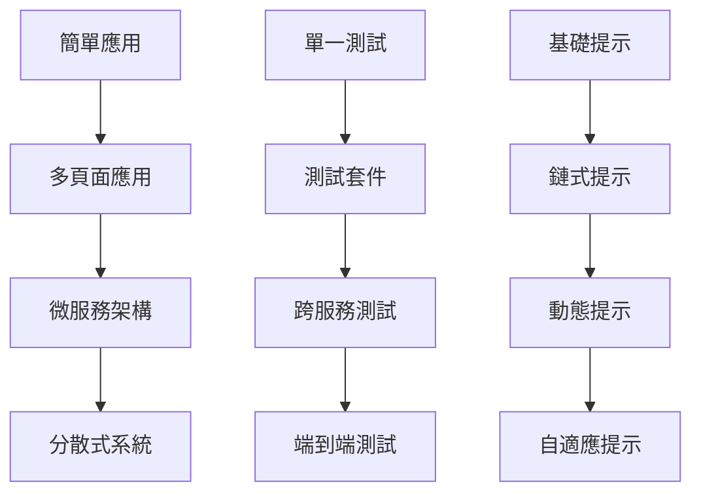
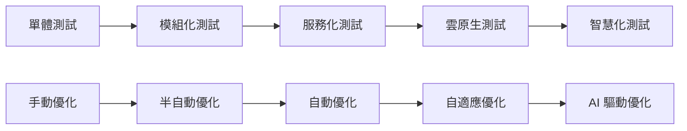

# 變奏曲：擴展與優化工作流

## 章節概述

掌握了基本的自循環工作流程後，本章將探討如何將這個流程擴展到更複雜的場景。我們將學習處理多頁面應用、優化提示詞工程、實施進階測試策略，以及建立可擴展的 AI 協作架構。這是從基礎到精通的關鍵轉變。

## 學習目標

完成本章節後，你將能夠：

- 處理複雜的多頁面應用測試場景
- 掌握進階的提示詞優化技術
- 實施複雜的測試編排策略
- 建立可擴展的 AI 工作流架構
- 優化整體開發效率和品質

## 前置需求

- 完成 Chapters 1-6 的所有內容
- 具備完整的自循環工作流經驗
- 了解微服務和分散式系統概念
- 熟悉進階測試模式

## 核心概念

### 1. 複雜度層級



### 2. 擴展策略矩陣

| 維度 | 基礎 | 進階 | 專家 |
|-----|------|------|------|
| 應用複雜度 | 單頁應用 | 多頁應用 | 微服務系統 |
| 測試策略 | 功能測試 | 整合測試 | 混沌測試 |
| AI 協作 | 單一 AI | 多 AI 協作 | AI 團隊 |
| 自動化程度 | 半自動 | 全自動 | 自適應 |

### 3. 優化維度

```typescript
interface OptimizationDimensions {
  performance: {
    executionSpeed: number;
    resourceUsage: number;
    parallelization: number;
  };
  quality: {
    codeQuality: number;
    testCoverage: number;
    bugDetection: number;
  };
  efficiency: {
    developmentTime: number;
    maintenanceEffort: number;
    learningCurve: number;
  };
}
```

## 實作練習：多頁面應用測試

### 步驟 1：設計多頁面測試架構

```markdown
Design a multi-page application testing architecture:

```typescript
class MultiPageTestOrchestrator {
  private pages: Map<string, PageObject> = new Map();
  private flows: Map<string, UserFlow> = new Map();
  private state: ApplicationState;
  
  async orchestrateTest(scenario: TestScenario) {
    // 1. 初始化測試環境
    await this.initializeEnvironment(scenario);
    
    // 2. 設定頁面物件
    await this.setupPageObjects(scenario.pages);
    
    // 3. 執行使用者流程
    const results = await this.executeUserFlows(scenario.flows);
    
    // 4. 驗證跨頁面狀態
    await this.verifyCrossPageState(results);
    
    // 5. 清理測試環境
    await this.cleanup();
    
    return this.generateReport(results);
  }
  
  private async executeUserFlows(flows: UserFlow[]) {
    const results = [];
    
    for (const flow of flows) {
      // 執行複雜的多頁面流程
      const result = await this.executeFlow(flow);
      results.push(result);
      
      // 保存中間狀態
      await this.saveIntermediateState(flow.id, result);
    }
    
    return results;
  }
  
  private async executeFlow(flow: UserFlow) {
    const steps = [];
    
    for (const step of flow.steps) {
      // 導航到目標頁面
      await this.navigateToPage(step.page);
      
      // 執行頁面動作
      const stepResult = await this.executeStep(step);
      
      // 驗證步驟結果
      await this.validateStep(stepResult, step.expectations);
      
      steps.push(stepResult);
    }
    
    return {
      flowId: flow.id,
      steps: steps,
      overallStatus: this.calculateFlowStatus(steps)
    };
  }
}
```

實作完整的多頁面測試協調器。
```

### 步驟 2：跨頁面狀態管理

```markdown
Implement cross-page state management:

```typescript
class CrossPageStateManager {
  private globalState: Map<string, any> = new Map();
  private pageStates: Map<string, PageState> = new Map();
  
  async syncState(fromPage: string, toPage: string) {
    // 1. 擷取來源頁面狀態
    const sourceState = await this.capturePageState(fromPage);
    
    // 2. 轉換狀態格式
    const transferableState = this.transformState(sourceState);
    
    // 3. 注入到目標頁面
    await this.injectState(toPage, transferableState);
    
    // 4. 驗證狀態同步
    await this.verifyStateSync(fromPage, toPage);
  }
  
  async capturePageState(pageId: string): Promise<PageState> {
    const page = this.getPage(pageId);
    
    return {
      url: page.url(),
      localStorage: await page.evaluate(() => ({ ...localStorage })),
      sessionStorage: await page.evaluate(() => ({ ...sessionStorage })),
      cookies: await page.context().cookies(),
      customData: await this.extractCustomData(page)
    };
  }
  
  private async extractCustomData(page: Page) {
    // 提取應用特定的狀態資料
    return await page.evaluate(() => {
      // 例如：Redux store, Vuex state, 等
      return window.__APP_STATE__ || {};
    });
  }
  
  async verifyStateConsistency(pages: string[]) {
    const states = await Promise.all(
      pages.map(p => this.capturePageState(p))
    );
    
    // 檢查關鍵狀態的一致性
    const inconsistencies = this.findInconsistencies(states);
    
    if (inconsistencies.length > 0) {
      throw new StateInconsistencyError(inconsistencies);
    }
  }
}
```

建立跨頁面狀態管理系統。
```

### 步驟 3：複雜流程測試

```markdown
Create complex user journey tests:

```typescript
class ComplexJourneyTester {
  async testE2EJourney(journey: UserJourney) {
    const stages = [
      this.testDiscoveryStage,
      this.testRegistrationStage,
      this.testOnboardingStage,
      this.testCoreFeatureStage,
      this.testCheckoutStage,
      this.testPostPurchaseStage
    ];
    
    const results = [];
    let context = {};
    
    for (const stage of stages) {
      const stageResult = await stage.call(this, journey, context);
      results.push(stageResult);
      
      // 累積上下文
      context = { ...context, ...stageResult.context };
      
      // 檢查是否應該繼續
      if (!stageResult.success && journey.stopOnFailure) {
        break;
      }
    }
    
    return this.analyzeJourneyResults(results);
  }
  
  private async testDiscoveryStage(journey: UserJourney, context: Context) {
    // 測試使用者發現產品的流程
    return {
      success: true,
      metrics: {
        timeToFirstInteraction: 1500,
        bounceRate: 0.15,
        engagementScore: 85
      },
      context: {
        entryPoint: 'organic-search',
        landingPage: '/features'
      }
    };
  }
  
  private async testCoreFeatureStage(journey: UserJourney, context: Context) {
    // 測試核心功能使用流程
    const scenarios = [
      'create-first-item',
      'edit-existing-item',
      'share-with-team',
      'export-data'
    ];
    
    const results = await Promise.all(
      scenarios.map(s => this.testScenario(s, context))
    );
    
    return {
      success: results.every(r => r.success),
      metrics: this.aggregateMetrics(results),
      context: {
        featuresUsed: scenarios,
        userSegment: this.identifyUserSegment(results)
      }
    };
  }
}
```

實作複雜使用者旅程測試。
```

## 進階提示詞優化

### 1. 動態提示詞生成

```markdown
Implement dynamic prompt generation:

```typescript
class DynamicPromptGenerator {
  async generatePrompt(context: TestContext, objective: TestObjective) {
    // 1. 分析上下文
    const contextAnalysis = await this.analyzeContext(context);
    
    // 2. 選擇提示詞模板
    const template = await this.selectTemplate(contextAnalysis, objective);
    
    // 3. 填充動態內容
    const prompt = await this.populateTemplate(template, {
      context: contextAnalysis,
      objective: objective,
      history: await this.getRelevantHistory(context),
      examples: await this.selectExamples(objective)
    });
    
    // 4. 優化提示詞
    return await this.optimizePrompt(prompt);
  }
  
  private async optimizePrompt(prompt: string): Promise<string> {
    // 使用 AI 優化提示詞
    const optimizationPrompt = `
      Optimize this prompt for clarity and effectiveness:
      
      Original Prompt:
      ${prompt}
      
      Optimization Goals:
      1. Clarity: Remove ambiguity
      2. Specificity: Add precise requirements
      3. Structure: Improve organization
      4. Examples: Add if helpful
      5. Constraints: Clarify boundaries
      
      Return the optimized prompt:
    `;
    
    return await this.callAI(optimizationPrompt);
  }
  
  async chainPrompts(prompts: Prompt[]): Promise<ChainedPromptResult> {
    const results = [];
    let context = {};
    
    for (const prompt of prompts) {
      // 使用前一個結果作為上下文
      const enrichedPrompt = this.enrichWithContext(prompt, context);
      
      // 執行提示詞
      const result = await this.executePrompt(enrichedPrompt);
      results.push(result);
      
      // 更新上下文
      context = this.updateContext(context, result);
    }
    
    return {
      individualResults: results,
      finalOutput: this.consolidateResults(results),
      context: context
    };
  }
}
```

建立動態提示詞生成系統。
```

### 2. 提示詞效能評估

```markdown
Create prompt performance evaluation system:

```typescript
class PromptPerformanceEvaluator {
  async evaluatePrompt(prompt: Prompt, testCases: TestCase[]) {
    const metrics = {
      accuracy: 0,
      consistency: 0,
      completeness: 0,
      efficiency: 0,
      clarity: 0
    };
    
    const results = [];
    
    for (const testCase of testCases) {
      const result = await this.runTestCase(prompt, testCase);
      results.push(result);
    }
    
    // 計算各項指標
    metrics.accuracy = this.calculateAccuracy(results);
    metrics.consistency = this.calculateConsistency(results);
    metrics.completeness = this.calculateCompleteness(results);
    metrics.efficiency = this.calculateEfficiency(results);
    metrics.clarity = await this.assessClarity(prompt);
    
    return {
      metrics: metrics,
      overallScore: this.calculateOverallScore(metrics),
      recommendations: this.generateRecommendations(metrics),
      comparisons: await this.compareWithBaseline(metrics)
    };
  }
  
  private calculateConsistency(results: TestResult[]): number {
    // 對相同輸入的多次執行結果進行比較
    const groups = this.groupBySimilarInput(results);
    let totalConsistency = 0;
    
    for (const group of groups) {
      const similarity = this.calculateSimilarity(group);
      totalConsistency += similarity;
    }
    
    return totalConsistency / groups.length;
  }
  
  async optimizePromptIteratively(
    initialPrompt: Prompt,
    targetMetrics: TargetMetrics
  ): Promise<OptimizedPrompt> {
    let currentPrompt = initialPrompt;
    let iteration = 0;
    const maxIterations = 10;
    
    while (iteration < maxIterations) {
      // 評估當前提示詞
      const evaluation = await this.evaluatePrompt(currentPrompt, this.testCases);
      
      // 檢查是否達到目標
      if (this.meetsTargets(evaluation.metrics, targetMetrics)) {
        break;
      }
      
      // 生成改進建議
      const improvements = await this.generateImprovements(
        currentPrompt,
        evaluation,
        targetMetrics
      );
      
      // 應用改進
      currentPrompt = await this.applyImprovements(currentPrompt, improvements);
      
      iteration++;
    }
    
    return {
      prompt: currentPrompt,
      iterations: iteration,
      finalMetrics: await this.evaluatePrompt(currentPrompt, this.testCases)
    };
  }
}
```

實作提示詞效能評估系統。
```

### 3. 多模型協作

```markdown
Implement multi-model collaboration:

```typescript
class MultiModelOrchestrator {
  private models = {
    claude: new ClaudeModel(),
    gemini: new GeminiModel(),
    gpt: new GPTModel()
  };
  
  async collaborativeGeneration(task: GenerationTask) {
    // 1. 任務分解
    const subtasks = await this.decomposeTask(task);
    
    // 2. 分配給最適合的模型
    const assignments = await this.assignToModels(subtasks);
    
    // 3. 並行執行
    const results = await Promise.all(
      assignments.map(a => this.executeAssignment(a))
    );
    
    // 4. 結果整合
    const integrated = await this.integrateResults(results);
    
    // 5. 品質檢查
    return await this.qualityCheck(integrated);
  }
  
  private async assignToModels(subtasks: Subtask[]) {
    const assignments = [];
    
    for (const subtask of subtasks) {
      // 根據任務特性選擇最適合的模型
      const model = await this.selectBestModel(subtask);
      
      assignments.push({
        subtask: subtask,
        model: model,
        prompt: await this.generateModelSpecificPrompt(subtask, model)
      });
    }
    
    return assignments;
  }
  
  async consensusGeneration(prompt: string) {
    // 讓多個模型生成結果，然後取共識
    const responses = await Promise.all([
      this.models.claude.generate(prompt),
      this.models.gemini.generate(prompt),
      this.models.gpt.generate(prompt)
    ]);
    
    // 分析共識和差異
    const analysis = this.analyzeResponses(responses);
    
    if (analysis.consensus > 0.8) {
      return analysis.consensusResponse;
    } else {
      // 需要進一步協調
      return await this.negotiateConsensus(responses, analysis);
    }
  }
  
  private async negotiateConsensus(
    responses: ModelResponse[],
    analysis: ConsensusAnalysis
  ) {
    // 識別分歧點
    const disagreements = analysis.disagreements;
    
    // 對每個分歧點進行深入分析
    for (const disagreement of disagreements) {
      const resolution = await this.resolveDisagreement(disagreement, responses);
      disagreement.resolution = resolution;
    }
    
    // 整合解決方案
    return this.synthesizeFinalResponse(responses, disagreements);
  }
}
```

建立多模型協作系統。
```

## 測試編排優化

### 1. 智慧測試排程

```markdown
Create intelligent test scheduling:

```typescript
class IntelligentTestScheduler {
  async scheduleTests(tests: Test[], constraints: ScheduleConstraints) {
    // 1. 分析測試依賴關係
    const dependencies = this.analyzeDependencies(tests);
    
    // 2. 計算優先級
    const priorities = await this.calculatePriorities(tests);
    
    // 3. 資源分配
    const resources = await this.allocateResources(tests, constraints);
    
    // 4. 生成執行計劃
    const schedule = await this.generateSchedule({
      tests,
      dependencies,
      priorities,
      resources
    });
    
    // 5. 優化並行執行
    return this.optimizeParallelExecution(schedule);
  }
  
  private async calculatePriorities(tests: Test[]) {
    const priorities = new Map();
    
    for (const test of tests) {
      const priority = await this.calculateTestPriority({
        businessImpact: test.metadata.businessImpact,
        failureHistory: await this.getFailureHistory(test.id),
        executionTime: test.estimatedDuration,
        lastRunTime: test.lastRun,
        dependencies: test.dependencies.length,
        riskLevel: test.metadata.riskLevel
      });
      
      priorities.set(test.id, priority);
    }
    
    return priorities;
  }
  
  private optimizeParallelExecution(schedule: TestSchedule) {
    // 使用圖算法優化並行執行
    const graph = this.buildDependencyGraph(schedule);
    const criticalPath = this.findCriticalPath(graph);
    const parallelGroups = this.identifyParallelGroups(graph, criticalPath);
    
    return {
      criticalPath,
      parallelGroups,
      estimatedDuration: this.calculateTotalDuration(parallelGroups),
      resourceUtilization: this.calculateResourceUtilization(parallelGroups)
    };
  }
}
```

實作智慧測試排程系統。
```

### 2. 自適應測試策略

```markdown
Implement adaptive testing strategy:

```typescript
class AdaptiveTestStrategy {
  async adaptStrategy(
    currentResults: TestResults,
    historicalData: HistoricalData,
    systemState: SystemState
  ) {
    // 1. 分析當前狀況
    const analysis = await this.analyzeCurrentSituation({
      failureRate: currentResults.failureRate,
      failurePatterns: this.identifyPatterns(currentResults),
      systemLoad: systemState.load,
      recentChanges: systemState.recentChanges
    });
    
    // 2. 預測未來趨勢
    const predictions = await this.predictTrends(analysis, historicalData);
    
    // 3. 調整測試策略
    const adjustments = await this.determineAdjustments(analysis, predictions);
    
    // 4. 應用調整
    return await this.applyAdjustments(adjustments);
  }
  
  private async determineAdjustments(
    analysis: SituationAnalysis,
    predictions: TrendPredictions
  ) {
    const adjustments = {
      testSelection: [],
      executionOrder: [],
      parallelism: 1,
      retryStrategy: {},
      focusAreas: []
    };
    
    // 根據失敗率調整
    if (analysis.failureRate > 0.2) {
      adjustments.retryStrategy = {
        maxRetries: 3,
        backoff: 'exponential'
      };
      adjustments.parallelism = Math.max(1, adjustments.parallelism - 2);
    }
    
    // 根據預測調整重點區域
    if (predictions.highRiskAreas.length > 0) {
      adjustments.focusAreas = predictions.highRiskAreas;
      adjustments.testSelection = this.selectFocusedTests(predictions.highRiskAreas);
    }
    
    // 根據系統負載調整並行度
    if (analysis.systemLoad > 0.8) {
      adjustments.parallelism = Math.ceil(adjustments.parallelism * 0.5);
    }
    
    return adjustments;
  }
}
```

建立自適應測試策略系統。
```

## 效能優化技術

### 1. 測試執行優化

```markdown
Optimize test execution performance:

```typescript
class TestExecutionOptimizer {
  async optimizeExecution(testSuite: TestSuite) {
    // 1. 測試分組優化
    const groups = await this.optimizeTestGroups(testSuite);
    
    // 2. 資源池管理
    const resourcePool = await this.setupResourcePool(groups);
    
    // 3. 快取策略
    const cacheStrategy = await this.determineCacheStrategy(testSuite);
    
    // 4. 執行優化
    return await this.executeOptimized(groups, resourcePool, cacheStrategy);
  }
  
  private async optimizeTestGroups(testSuite: TestSuite) {
    // 基於多個因素對測試進行分組
    const factors = {
      dataRequirements: this.analyzeDataRequirements(testSuite),
      resourceNeeds: this.analyzeResourceNeeds(testSuite),
      executionTime: this.estimateExecutionTimes(testSuite),
      dependencies: this.analyzeDependencies(testSuite)
    };
    
    // 使用聚類算法優化分組
    return this.clusterTests(testSuite.tests, factors);
  }
  
  private async setupResourcePool(groups: TestGroup[]) {
    const pool = {
      browsers: new BrowserPool({
        min: 2,
        max: 10,
        idleTimeout: 30000
      }),
      databases: new DatabasePool({
        min: 1,
        max: 5,
        resetOnReturn: true
      }),
      apiClients: new APIClientPool({
        min: 5,
        max: 20,
        reuseConnections: true
      })
    };
    
    // 預熱資源池
    await this.warmupPool(pool, groups);
    
    return pool;
  }
}
```

實作測試執行優化器。
```

### 2. 記憶體和資源管理

```markdown
Implement memory and resource management:

```typescript
class ResourceManager {
  private resources = new Map<string, Resource>();
  private usage = new Map<string, ResourceUsage>();
  
  async manageResources(execution: TestExecution) {
    // 1. 監控資源使用
    const monitor = this.startMonitoring();
    
    // 2. 動態分配
    execution.on('resource-request', async (request) => {
      await this.allocateResource(request);
    });
    
    // 3. 自動回收
    execution.on('test-complete', async (test) => {
      await this.releaseResources(test);
    });
    
    // 4. 記憶體優化
    execution.on('memory-pressure', async () => {
      await this.optimizeMemory();
    });
    
    return monitor;
  }
  
  private async optimizeMemory() {
    // 清理未使用的資源
    await this.cleanupUnusedResources();
    
    // 壓縮大型資料結構
    await this.compressLargeDataStructures();
    
    // 觸發垃圾回收
    if (global.gc) {
      global.gc();
    }
    
    // 調整快取策略
    await this.adjustCacheStrategy();
  }
  
  async profileResourceUsage(testRun: TestRun) {
    return {
      memory: {
        peak: this.usage.get('memory').peak,
        average: this.usage.get('memory').average,
        leaks: await this.detectMemoryLeaks()
      },
      cpu: {
        peak: this.usage.get('cpu').peak,
        average: this.usage.get('cpu').average,
        bottlenecks: this.identifyCPUBottlenecks()
      },
      io: {
        reads: this.usage.get('io').reads,
        writes: this.usage.get('io').writes,
        networkCalls: this.usage.get('network').calls
      },
      recommendations: this.generateOptimizationRecommendations()
    };
  }
}
```

建立資源管理系統。
```

## 可擴展架構設計

### 1. 插件系統

```markdown
Create extensible plugin system:

```typescript
interface Plugin {
  name: string;
  version: string;
  hooks: PluginHooks;
  config?: PluginConfig;
}

class PluginSystem {
  private plugins: Map<string, Plugin> = new Map();
  private hooks: Map<string, Set<HookHandler>> = new Map();
  
  async registerPlugin(plugin: Plugin) {
    // 驗證插件
    await this.validatePlugin(plugin);
    
    // 註冊鉤子
    for (const [hookName, handler] of Object.entries(plugin.hooks)) {
      this.registerHook(hookName, handler);
    }
    
    // 初始化插件
    if (plugin.initialize) {
      await plugin.initialize(this.context);
    }
    
    this.plugins.set(plugin.name, plugin);
  }
  
  async executeHook(hookName: string, ...args: any[]) {
    const handlers = this.hooks.get(hookName) || new Set();
    const results = [];
    
    for (const handler of handlers) {
      try {
        const result = await handler(...args);
        results.push(result);
      } catch (error) {
        console.error(`Hook execution failed: ${hookName}`, error);
      }
    }
    
    return results;
  }
  
  createPlugin(definition: PluginDefinition): Plugin {
    return {
      name: definition.name,
      version: definition.version,
      hooks: {
        'before-test': async (test) => {
          // 測試前處理
        },
        'after-test': async (test, result) => {
          // 測試後處理
        },
        'on-failure': async (failure) => {
          // 失敗處理
        },
        'on-repair': async (repair) => {
          // 修復處理
        }
      }
    };
  }
}
```

建立可擴展的插件系統。
```

### 2. 微服務整合

```markdown
Implement microservices integration:

```typescript
class MicroservicesTestOrchestrator {
  private services: Map<string, ServiceClient> = new Map();
  private mesh: ServiceMesh;
  
  async orchestrateMicroservicesTest(scenario: MicroservicesScenario) {
    // 1. 服務發現
    await this.discoverServices(scenario.namespace);
    
    // 2. 建立服務網格
    this.mesh = await this.setupServiceMesh();
    
    // 3. 注入測試流量
    const traffic = await this.injectTestTraffic(scenario.traffic);
    
    // 4. 監控服務互動
    const interactions = await this.monitorInteractions(traffic);
    
    // 5. 驗證端到端流程
    const validation = await this.validateE2EFlow(interactions);
    
    // 6. 混沌測試
    if (scenario.chaosEnabled) {
      await this.performChaosTest(scenario.chaosConfig);
    }
    
    return this.generateMicroservicesReport(validation);
  }
  
  private async performChaosTest(config: ChaosConfig) {
    const experiments = [
      this.injectLatency(config.latency),
      this.simulateFailure(config.failureRate),
      this.throttleTraffic(config.throttling),
      this.corruptData(config.dataCorruption)
    ];
    
    const results = await Promise.allSettled(experiments);
    
    return {
      resilience: this.assessResilience(results),
      recovery: this.measureRecovery(results),
      impact: this.assessBusinessImpact(results)
    };
  }
}
```

實作微服務測試協調器。
```

## 最佳實踐總結

### 1. 擴展原則

```markdown
Scaling Principles:

1. **漸進式擴展**
   - 從簡單開始，逐步增加複雜度
   - 驗證每個階段的穩定性
   - 保持向後相容

2. **模組化設計**
   - 保持元件獨立性
   - 明確定義介面
   - 支援熱插拔

3. **效能優先**
   - 監控關鍵指標
   - 及早優化瓶頸
   - 實施快取策略

4. **容錯設計**
   - 預期失敗情況
   - 實施重試機制
   - 提供降級策略
```

### 2. 優化檢查清單

- [ ] 測試執行時間 < 目標時間
- [ ] 資源使用率 < 80%
- [ ] 並行效率 > 70%
- [ ] 測試穩定性 > 95%
- [ ] 程式碼覆蓋率 > 80%
- [ ] 維護成本降低 > 30%

### 3. 架構演進路線圖



## 思考與挑戰

### 深度思考題

1. **規模化挑戰**：如何處理千萬級測試案例的管理？
2. **成本效益**：擴展的投資回報如何量化？
3. **技術債務**：如何避免過度優化帶來的複雜性？
4. **團隊能力**：如何培養團隊的進階技能？

### 進階挑戰

1. **全球化測試**：實現跨地域的分散式測試
2. **實時優化**：建立實時自適應優化系統
3. **預測性測試**：基於 AI 的預測性測試策略
4. **零停機部署**：實現測試驅動的零停機部署

## 實作專案：企業級測試平台

### 專案需求

建立一個企業級的 AI 驅動測試平台：

1. **多專案支援**：同時管理多個專案的測試
2. **團隊協作**：支援多團隊協作測試
3. **資源調度**：智慧資源分配和調度
4. **報告中心**：統一的報告和分析中心
5. **知識庫**：測試知識和模式共享

### 架構設計

```typescript
class EnterpriseTestPlatform {
  private projects: ProjectManager;
  private teams: TeamManager;
  private resources: ResourceScheduler;
  private analytics: AnalyticsEngine;
  private knowledge: KnowledgeBase;
  
  async initialize() {
    // 完整的企業級平台初始化
  }
}
```

### 提交要求

- 平台原始碼和架構文檔
- 部署指南和配置說明
- API 文檔和整合指南
- 效能基準測試報告
- 使用案例和最佳實踐

## 下一步

恭喜你完成了變奏曲章節！你已經掌握了如何將基礎的自循環工作流程擴展到企業級應用。在最後一章「Capstone 專案」中，你將獨立完成一個綜合性的專案，展示你作為 AI 指揮家的全部技能。

記住，優化是一個持續的過程，而不是一個終點。保持學習和改進的心態。

## 資源連結

- [Microservices Testing Strategies](https://martinfowler.com/articles/microservice-testing/)
- [Performance Testing Best Practices](https://www.guru99.com/performance-testing.html)
- [Chaos Engineering Principles](https://principlesofchaos.org/)
- [Distributed Systems Testing](https://www.microsoft.com/en-us/research/publication/distributed-systems-testing/)

---

*「真正的大師不是掌握所有技術的人，而是知道何時使用哪種技術的人。」*