# Capstone 專案：指揮一場 AI 開發交響樂

## 章節概述

這是你展現 AI 指揮家完整技能的時刻。在這個 Capstone 專案中，你將獨立完成一個端到端的複雜應用開發專案，從需求分析到自動修復，展示你掌握的所有技能。這不僅是一個測試，更是你成為真正 AI 指揮家的認證。

## 學習目標

完成本專案後，你將能夠：

- 獨立規劃和執行完整的 AI 驅動開發專案
- 整合所有學到的技術和方法
- 處理真實世界的複雜需求
- 建立可重用的工作流程模板
- 成為合格的 AI 開發指揮家

## 前置需求

- 完成 Chapters 1-7 的所有內容和練習
- 準備好完整的開發環境
- 具備獨立解決問題的能力
- 至少 8 小時的專注時間

## 專案需求：線上學習平台

### 業務背景

你被委託開發一個線上學習平台 "EduFlow"，這是一個支援課程管理、學習進度追蹤、互動測驗和社群討論的綜合性平台。

### 核心功能需求

```markdown
# EduFlow 線上學習平台需求

## 使用者角色
1. 學生（Student）
2. 講師（Instructor）
3. 管理員（Admin）

## 功能模組

### 1. 使用者管理
- 註冊/登入/登出
- 個人資料管理
- 角色權限控制
- 密碼重設

### 2. 課程管理
- 課程建立和編輯（講師）
- 課程瀏覽和搜尋（所有人）
- 課程註冊（學生）
- 課程內容管理（章節、影片、文件）

### 3. 學習功能
- 影片播放與進度記錄
- 筆記功能
- 書籤收藏
- 學習進度追蹤

### 4. 評量系統
- 測驗建立（講師）
- 測驗作答（學生）
- 自動評分
- 成績報告

### 5. 互動功能
- 課程討論區
- 問答系統
- 即時通訊
- 公告通知

### 6. 分析報表
- 學習分析儀表板
- 課程完成率統計
- 成績分布圖表
- 使用者活動報告

## 技術需求
- 響應式設計（支援手機、平板、桌面）
- 即時資料同步
- 支援大檔案上傳（影片）
- 多語言支援（中文、英文）
- 資料匯出功能
```

### 非功能性需求

```markdown
## 效能需求
- 頁面載入時間 < 2 秒
- 影片串流順暢（自適應位元率）
- 支援 1000+ 同時在線使用者
- API 響應時間 < 500ms

## 安全需求
- 資料加密傳輸（HTTPS）
- 防止 SQL 注入和 XSS 攻擊
- 角色基礎的存取控制（RBAC）
- 敏感資料加密儲存

## 可用性需求
- 99.9% 正常運行時間
- 優雅的錯誤處理
- 離線功能支援
- 自動儲存草稿

## 相容性需求
- 跨瀏覽器支援（Chrome, Firefox, Safari, Edge）
- 行動裝置優化
- 無障礙設計（WCAG 2.1 AA）
```

## 專案執行階段

### 第一階段：需求分析與架構設計（2小時）

#### 任務 1.1：需求細化

使用 AI 協助你：
1. 分析和細化業務需求
2. 識別潛在的邊界情況
3. 建立使用者故事
4. 定義驗收標準

**提示詞範例：**
```markdown
Based on the EduFlow online learning platform requirements, help me:

1. Create detailed user stories for each role
2. Identify edge cases and potential issues
3. Define acceptance criteria for core features
4. Suggest additional features that would enhance user experience

Focus on:
- Student learning journey
- Instructor content management workflow
- Admin monitoring and control needs

Output in Traditional Chinese with clear structure.
```

#### 任務 1.2：系統架構設計

設計系統架構，包含：
1. 前端架構（元件結構）
2. 後端架構（API 設計）
3. 資料庫架構（資料模型）
4. 部署架構（容器化）

**架構決策記錄（ADR）模板：**
```markdown
# 架構決策記錄

## 決策：[決策標題]

### 狀態
[提議 | 接受 | 棄用]

### 背景
[為什麼需要這個決策]

### 決策
[做出的具體決策]

### 後果
[這個決策的影響]

### 替代方案
[考慮過的其他選項]
```

### 第二階段：AI 生成核心程式碼（3小時）

#### 任務 2.1：前端應用生成

使用 AI 生成：
1. React/Vue 元件結構
2. 路由配置
3. 狀態管理
4. UI 元件庫整合

**評估標準：**
- [ ] 元件可重用性
- [ ] 程式碼組織清晰
- [ ] 遵循最佳實踐
- [ ] 響應式設計實現

#### 任務 2.2：後端 API 生成

使用 AI 生成：
1. RESTful API 端點
2. 資料庫模型
3. 認證授權邏輯
4. 業務邏輯實現

**品質檢查清單：**
- [ ] API 設計符合 RESTful 原則
- [ ] 錯誤處理完善
- [ ] 輸入驗證嚴格
- [ ] 安全措施到位

#### 任務 2.3：資料庫設計

設計並實現：
1. 實體關係圖（ERD）
2. 資料表結構
3. 索引優化
4. 資料遷移腳本

### 第三階段：測試策略制定（1.5小時）

#### 任務 3.1：測試計劃設計

使用 AI 協助制定：
1. 單元測試策略
2. 整合測試策略
3. E2E 測試場景
4. 效能測試計劃

**測試矩陣範例：**

| 功能模組 | 單元測試 | 整合測試 | E2E測試 | 效能測試 |
|---------|---------|---------|---------|---------|
| 使用者認證 | ✓ | ✓ | ✓ | ✓ |
| 課程管理 | ✓ | ✓ | ✓ | ✓ |
| 影片播放 | ✓ | ✓ | ✓ | ✓ |
| 測驗系統 | ✓ | ✓ | ✓ | - |
| 討論區 | ✓ | ✓ | ✓ | ✓ |

#### 任務 3.2：測試案例生成

為每個核心功能生成詳細測試案例：

```typescript
interface TestCase {
  id: string;
  title: string;
  description: string;
  preconditions: string[];
  steps: TestStep[];
  expectedResults: string[];
  priority: 'Critical' | 'High' | 'Medium' | 'Low';
  category: 'Functional' | 'Performance' | 'Security' | 'Usability';
}
```

### 第四階段：Playwright 測試實現（2小時）

#### 任務 4.1：E2E 測試腳本編寫

實現關鍵使用者旅程的 E2E 測試：

1. **學生學習流程**
```typescript
// 學生從註冊到完成課程的完整流程
test.describe('Student Learning Journey', () => {
  test('Complete course from registration to certificate', async ({ page }) => {
    // 1. 註冊新帳號
    // 2. 瀏覽課程目錄
    // 3. 註冊課程
    // 4. 觀看影片
    // 5. 完成測驗
    // 6. 獲得證書
  });
});
```

2. **講師課程管理**
```typescript
// 講師建立和管理課程的流程
test.describe('Instructor Course Management', () => {
  test('Create and publish a complete course', async ({ page }) => {
    // 1. 登入講師帳號
    // 2. 建立新課程
    // 3. 添加章節和內容
    // 4. 設定測驗
    // 5. 發布課程
  });
});
```

3. **管理員監控**
```typescript
// 管理員監控和管理平台
test.describe('Admin Platform Management', () => {
  test('Monitor and manage platform activities', async ({ page }) => {
    // 1. 查看儀表板
    // 2. 管理使用者
    // 3. 審核課程
    // 4. 生成報告
  });
});
```

#### 任務 4.2：測試自動化配置

設定完整的測試自動化：
1. CI/CD 整合
2. 並行測試執行
3. 測試報告生成
4. 失敗通知機制

### 第五階段：問題注入與分析（1.5小時）

#### 任務 5.1：故意引入缺陷

在程式碼中故意引入不同類型的問題：

```javascript
// 缺陷類型範例
const defects = {
  logical: "邏輯錯誤（如權限檢查失敗）",
  performance: "效能問題（如 N+1 查詢）",
  security: "安全漏洞（如 XSS 攻擊）",
  usability: "可用性問題（如無錯誤提示）",
  compatibility: "相容性問題（如瀏覽器特定）"
};
```

#### 任務 5.2：AI 分析和診斷

使用 AI 分析測試失敗：
1. 收集失敗資訊
2. 分析根本原因
3. 生成修復建議
4. 評估影響範圍

**分析報告模板：**
```markdown
# 測試失敗分析報告

## 失敗摘要
- 測試名稱：
- 失敗時間：
- 影響範圍：

## 根本原因分析
- 錯誤類型：
- 具體原因：
- 相關程式碼：

## 修復建議
1. 立即修復：
2. 短期改進：
3. 長期優化：

## 預防措施
- 程式碼審查重點：
- 測試覆蓋改進：
- 監控指標建議：
```

### 第六階段：自動修復實現（2小時）

#### 任務 6.1：修復策略執行

實現自動修復流程：
1. 解析錯誤報告
2. 生成修復程式碼
3. 驗證修復效果
4. 提交程式碼變更

#### 任務 6.2：修復驗證

確保修復的品質：
- [ ] 原問題已解決
- [ ] 無新問題引入
- [ ] 測試全部通過
- [ ] 效能無退化
- [ ] 程式碼品質維持

### 第七階段：優化與擴展（1小時）

#### 任務 7.1：效能優化

識別並優化效能瓶頸：
1. 前端載入優化
2. API 響應優化
3. 資料庫查詢優化
4. 快取策略實施

#### 任務 7.2：功能擴展

添加進階功能：
1. AI 推薦系統
2. 個人化學習路徑
3. 社群功能增強
4. 數據分析深化

## 評估標準

### 技術評估（60%）

| 評估項目 | 權重 | 評分標準 |
|---------|------|----------|
| 程式碼品質 | 15% | 結構清晰、可維護性高 |
| 測試覆蓋 | 15% | 覆蓋率 > 80% |
| 自動化程度 | 15% | 全流程自動化 |
| 效能表現 | 15% | 滿足所有效能需求 |

### 流程評估（40%）

| 評估項目 | 權重 | 評分標準 |
|---------|------|----------|
| AI 協作效率 | 10% | 有效利用 AI 工具 |
| 問題解決能力 | 10% | 獨立解決複雜問題 |
| 文檔完整性 | 10% | 清晰完整的文檔 |
| 創新性 | 10% | 創新的解決方案 |

## 提交要求

### 必要交付物

1. **原始碼倉庫**
   - 完整的應用程式碼
   - 測試程式碼
   - 配置檔案
   - README.md

2. **文檔集**
   - 架構設計文檔
   - API 文檔
   - 測試報告
   - 使用指南

3. **演示材料**
   - 錄製演示影片（10-15分鐘）
   - 簡報檔案
   - 線上演示連結

4. **學習記錄**
   - AI 互動歷史
   - 問題解決過程
   - 學習心得總結

### 提交格式

```
/capstone-project
  /src                 # 原始碼
    /frontend         # 前端程式碼
    /backend          # 後端程式碼
    /database         # 資料庫腳本
  /tests              # 測試程式碼
    /unit            # 單元測試
    /integration     # 整合測試
    /e2e             # E2E 測試
  /docs              # 文檔
    /architecture    # 架構文檔
    /api            # API 文檔
    /user-guide     # 使用指南
  /deployment        # 部署配置
    /docker         # Docker 配置
    /k8s            # Kubernetes 配置
  /reports          # 報告
    /test-reports   # 測試報告
    /performance    # 效能報告
  README.md         # 專案說明
  LEARNING.md       # 學習記錄
```

## 時間管理建議

### 建議時間分配

```mermaid
gantt
    title Capstone 專案時間規劃
    dateFormat HH:mm
    section 準備階段
    環境檢查        :00:00, 30m
    需求理解        :00:30, 30m
    
    section 開發階段
    架構設計        :01:00, 1h
    程式碼生成      :02:00, 3h
    測試策略        :05:00, 1h30m
    
    section 測試階段
    測試實現        :06:30, 2h
    問題分析        :08:30, 1h30m
    
    section 優化階段
    自動修復        :10:00, 2h
    最終優化        :12:00, 1h
    
    section 提交階段
    文檔整理        :13:00, 30m
    最終檢查        :13:30, 30m
```



### 檢查點

- **2小時檢查點**：架構設計完成
- **5小時檢查點**：核心功能實現
- **8小時檢查點**：測試套件完成
- **12小時檢查點**：自動修復實現
- **14小時檢查點**：專案完成

## 常見挑戰與解決方案

### 挑戰 1：需求理解不清

**解決方案**：
- 使用 AI 協助分析需求
- 建立需求追蹤矩陣
- 及早識別歧義並澄清

### 挑戰 2：測試覆蓋不足

**解決方案**：
- 使用覆蓋率工具監控
- AI 協助識別遺漏場景
- 優先測試關鍵路徑

### 挑戰 3：修復引入新問題

**解決方案**：
- 完整的回歸測試
- 修復前建立快照
- 漸進式修復策略

## 成功秘訣

### 1. 善用 AI 工具

```markdown
AI 使用策略：
1. 需求階段：分析、細化、驗證
2. 開發階段：生成、優化、重構
3. 測試階段：策略、案例、腳本
4. 修復階段：診斷、修復、驗證
```

### 2. 保持迭代節奏

```markdown
迭代原則：
- 小步快跑，頻繁驗證
- 每完成一個模組就測試
- 及時調整方向
- 持續優化改進
```

### 3. 文檔先行

```markdown
文檔策略：
- 開始前寫需求文檔
- 開發中更新設計文檔
- 測試時記錄測試文檔
- 完成後整理使用文檔
```

## 獲得認證

### 認證標準

完成 Capstone 專案並達到以下標準，即可獲得「AI 開發指揮家」認證：

- **技術分數** ≥ 80/100
- **流程分數** ≥ 80/100
- **總分** ≥ 160/200
- 完成所有必要交付物
- 通過程式碼審查

### 認證等級

- **銅級指揮家**（160-170分）：掌握基本技能
- **銀級指揮家**（171-185分）：熟練運用技能
- **金級指揮家**（186-200分）：精通所有技能

## 後續學習路徑

### 進階主題

1. **AI 原生開發**：完全由 AI 驅動的開發流程
2. **多模型協作**：協調多個 AI 模型協同工作
3. **自適應系統**：建立自我學習和改進的系統
4. **規模化應用**：企業級 AI 開發流程

### 社群參與

- 分享你的 Capstone 專案
- 參與開源專案貢獻
- 指導其他學習者
- 持續學習新技術

## 結語

恭喜你即將完成這個充滿挑戰的 Capstone 專案！這不僅是一個技術測試，更是你成為 AI 開發指揮家的重要里程碑。

記住，真正的指揮家不是控制每個細節的人，而是能夠協調各種資源，創造出和諧作品的人。在 AI 時代，你的角色是引導和協調 AI 工具，創造出高品質的軟體產品。

祝你在專案中取得成功，期待看到你的精彩作品！

## 資源支援

- [專案模板倉庫](https://github.com/play-right-with-ai/capstone-template)
- [社群討論區](https://github.com/play-right-with-ai/discussions)
- [常見問題解答](https://github.com/play-right-with-ai/FAQ)
- [技術支援](mailto:support@play-right-with-ai.dev)

---

*「完成這個專案，你就完成了從開發者到 AI 指揮家的蛻變。」*

**開始你的 Capstone 專案，展現你的 AI 指揮才能！🎼**