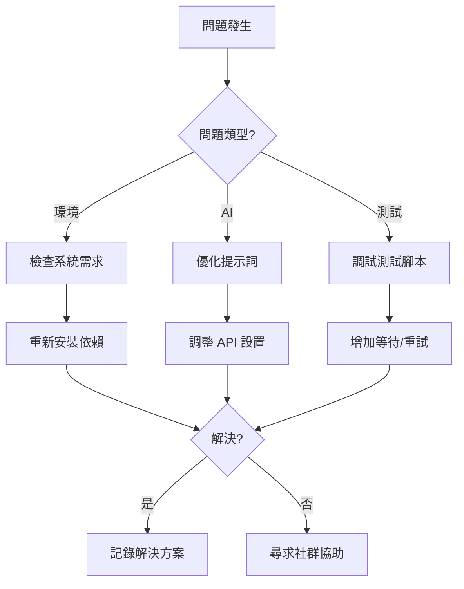

# Play Right with AI - 常見問題集 (FAQ)

## 基礎問題

### 什麼是 Play Right with AI？
Play Right with AI 是一個創新的線上工作坊，教導開發者如何成為「AI 指揮家」，使用自然語言指揮 AI 工具完成應用開發、測試生成、錯誤分析和自動修復的完整循環。

### 這個工作坊適合誰？
- 有基礎 JavaScript 知識的開發者
- 想要學習 AI 輔助開發的工程師
- 對自動化測試有興趣的 QA 人員
- 希望提升開發效率的團隊

### 需要多少時間完成？
- **快速路徑**：16 小時（2 天密集學習）
- **標準路徑**：20-24 小時（1 週彈性學習）
- **深度學習**：30+ 小時（包含所有延伸練習）

## 技術需求

### 硬體需求
```yaml
最低需求：
  - CPU: 雙核心 2.0GHz
  - RAM: 8GB
  - 儲存空間: 10GB 可用空間
  - 網路: 穩定連線（用於 AI API）

建議配置：
  - CPU: 四核心 2.5GHz+
  - RAM: 16GB
  - 儲存空間: 20GB 可用空間
  - 網路: 高速寬頻
```

### 軟體需求
```yaml
必要軟體：
  - Node.js: 18.0.0 或更新版本
  - npm: 8.0.0 或更新版本
  - Git: 2.0.0 或更新版本
  - 瀏覽器: Chrome/Edge (Chromium 核心)

建議工具：
  - VS Code 或 Cursor
  - Chrome DevTools
  - Postman (API 測試)
```

### AI 服務需求
```yaml
支援的 AI 模型：
  - Claude (Anthropic): 推薦
  - GPT-4 (OpenAI): 完全支援
  - Gemini (Google): 實驗性支援

API 額度建議：
  - 學習階段: ~$20-30 額度
  - 實戰專案: ~$50-100 額度
```

## 常見問題與解決方案

### 環境設置問題

**Q: Node.js 安裝後版本不正確？**
```bash
# 使用 nvm 管理版本
curl -o- https://raw.githubusercontent.com/nvm-sh/nvm/v0.39.0/install.sh | bash
nvm install 18
nvm use 18
node --version  # 確認版本
```

**Q: npm 安裝套件時出現權限錯誤？**
```bash
# 方案 1：修改 npm 預設目錄
mkdir ~/.npm-global
npm config set prefix '~/.npm-global'
echo 'export PATH=~/.npm-global/bin:$PATH' >> ~/.bashrc
source ~/.bashrc

# 方案 2：使用 npx (推薦)
npx playwright install
```

**Q: Playwright 安裝失敗？**
```bash
# 清理並重新安裝
npm cache clean --force
rm -rf node_modules package-lock.json
npm install
npx playwright install --with-deps
```

### AI 使用問題

**Q: AI 回應品質不佳或不準確？**
```markdown
優化策略：
1. 提供更具體的上下文
2. 使用範例引導輸出格式
3. 分解複雜任務為小步驟
4. 嘗試不同的提示詞寫法
```

**Q: API 速率限制錯誤？**
```javascript
// 實施重試機制
async function callAIWithRetry(prompt, maxRetries = 3) {
  for (let i = 0; i < maxRetries; i++) {
    try {
      return await ai.generate(prompt);
    } catch (error) {
      if (error.code === 'RATE_LIMIT' && i < maxRetries - 1) {
        await new Promise(r => setTimeout(r, 60000 * (i + 1)));
        continue;
      }
      throw error;
    }
  }
}
```

**Q: Token 超出限制？**
```markdown
解決方案：
1. 使用摘要技術壓縮上下文
2. 分割大型任務
3. 清理不必要的對話歷史
4. 考慮升級 API 方案
```

### 測試相關問題

**Q: Playwright 測試超時？**
```javascript
// 調整超時設置
test('example test', async ({ page }) => {
  test.setTimeout(60000); // 60 秒
  
  await page.goto('http://localhost:3000', {
    waitUntil: 'networkidle',
    timeout: 30000
  });
  
  await page.waitForSelector('#app', {
    state: 'visible',
    timeout: 10000
  });
});
```

**Q: 測試在 CI/CD 環境失敗？**
```yaml
# GitHub Actions 配置範例
- name: Install Playwright
  run: |
    npm ci
    npx playwright install --with-deps chromium
    
- name: Run tests
  run: |
    npm run test:e2e
  env:
    CI: true
    PLAYWRIGHT_BROWSERS_PATH: 0
```

**Q: 如何處理動態生成的元素？**
```javascript
// 使用智能等待策略
async function waitForDynamicContent(page) {
  // 方法 1：等待特定元素
  await page.waitForSelector('[data-testid="dynamic-content"]');
  
  // 方法 2：等待網路空閒
  await page.waitForLoadState('networkidle');
  
  // 方法 3：自定義等待函數
  await page.waitForFunction(() => {
    const elements = document.querySelectorAll('.item');
    return elements.length > 0;
  });
}
```

### MCP 整合問題

**Q: MCP 連接失敗？**
```bash
# 檢查清單
1. 確認 MCP 服務運行中
   ps aux | grep mcp
   
2. 檢查端口是否被占用
   lsof -i :3000
   
3. 重啟 MCP 服務
   npm run mcp:restart
   
4. 檢查防火牆設置
   sudo ufw status
```

**Q: 瀏覽器自動化不穩定？**
```javascript
// 穩定性改進技巧
const browser = await chromium.launch({
  headless: false, // 調試時使用
  slowMo: 100,     // 放慢操作速度
  args: [
    '--disable-dev-shm-usage',
    '--no-sandbox',
    '--disable-setuid-sandbox'
  ]
});
```

## 最佳實踐

### AI 提示詞編寫
```markdown
DO：
✅ 提供明確的需求和預期輸出
✅ 包含相關的上下文資訊
✅ 使用具體的範例
✅ 指定程式語言和框架

DON'T：
❌ 過於模糊的描述
❌ 一次要求太多功能
❌ 忽略錯誤處理
❌ 省略邊界條件
```

### 測試策略
```markdown
1. 先測試核心功能流程
2. 逐步增加邊界案例
3. 包含錯誤場景測試
4. 驗證效能需求
5. 確保跨瀏覽器相容性
```

### 代碼組織
```
project/
├── src/              # 應用程式代碼
├── tests/
│   ├── unit/        # 單元測試
│   ├── integration/ # 整合測試
│   └── e2e/         # 端到端測試
├── prompts/         # AI 提示詞模板
└── docs/            # 文檔
```

## 社群資源

### 官方資源
- **GitHub**: https://github.com/play-right-with-ai/workshop
- **文檔網站**: https://play-right-with-ai.dev
- **Discord 社群**: https://discord.gg/play-right-ai

### 學習資源
- **Playwright 文檔**: https://playwright.dev
- **AI 提示工程**: https://prompt-engineering.dev
- **JavaScript MDN**: https://developer.mozilla.org

### 相關工具
- **Claude**: https://claude.ai
- **VS Code**: https://code.visualstudio.com
- **Cursor**: https://cursor.sh

## 進階主題

### 企業級應用
```markdown
考慮因素：
- 安全性與合規性
- 可擴展性架構
- 監控與日誌
- 持續整合/部署
```

### 效能優化
```javascript
// 並行測試執行
test.describe.parallel('Performance Tests', () => {
  test('test 1', async ({ page }) => { /* ... */ });
  test('test 2', async ({ page }) => { /* ... */ });
});

// 資源快取
const context = await browser.newContext({
  storageState: 'auth.json' // 重用認證狀態
});
```

### 客製化擴展
```javascript
// 自定義測試助手
class TestHelper {
  constructor(page) {
    this.page = page;
  }
  
  async login(username, password) {
    await this.page.goto('/login');
    await this.page.fill('#username', username);
    await this.page.fill('#password', password);
    await this.page.click('#submit');
    await this.page.waitForURL('/dashboard');
  }
}
```

## 疑難排解流程圖



## 獲得幫助

### 提問技巧
1. 描述具體的錯誤訊息
2. 提供相關的代碼片段
3. 說明已嘗試的解決方案
4. 包含環境資訊

### 回報問題模板
```markdown
### 問題描述
[簡要描述問題]

### 重現步驟
1. [步驟 1]
2. [步驟 2]
3. [步驟 3]

### 預期行為
[應該發生什麼]

### 實際行為
[實際發生什麼]

### 環境資訊
- OS: [e.g., macOS 14.0]
- Node.js: [e.g., 18.17.0]
- 瀏覽器: [e.g., Chrome 120]

### 錯誤日誌
```
[貼上錯誤訊息]
```
```

---

*最後更新：2025-09-11*
*版本：1.0.0*

如有其他問題，歡迎透過 GitHub Issues 或 Discord 社群聯繫我們！