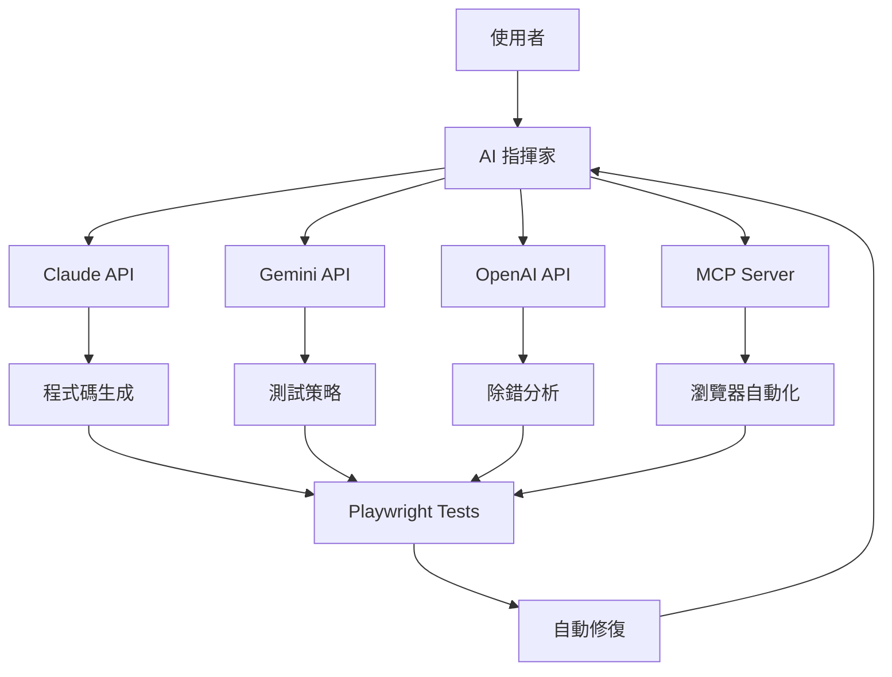

# AI 整合指南

本目錄包含所有 AI 服務的整合模組，用於 "Play right with AI" 工作坊的自循環開發工作流程。

## 🎯 整合架構



## 📦 可用整合

### 1. Claude (Anthropic)
**路徑**: `/integrations/claude/`

```javascript
const ClaudeIntegration = require('./integrations/claude/setup.js');
const claude = new ClaudeIntegration(process.env.ANTHROPIC_API_KEY);

// 生成應用
const app = await claude.generateApplication('建立待辦事項應用');

// 分析程式碼
const analysis = await claude.analyzeCode(appCode);

// 生成測試
const tests = await claude.generatePlaywrightTests(testStrategy);
```

**主要功能**:
- 自然語言轉程式碼
- 程式碼品質分析
- 測試策略生成
- 自動修復建議

### 2. Gemini (Google)
**路徑**: `/integrations/gemini/`

```python
from integrations.gemini.setup import GeminiIntegration

gemini = GeminiIntegration()

# 生成應用
app_code = gemini.generate_application("建立計算機應用")

# 分析測試失敗
debug_result = gemini.debug_test_failure(error_log, test_code, app_code)

# 自動修復
fixed_code = gemini.auto_repair_code(broken_code, debug_result)
```

**主要功能**:
- 多模態分析（圖片+文字）
- 測試場景建立
- 除錯分析
- 程式碼修復

### 3. OpenAI (GPT-4)
**路徑**: `/integrations/openai/`

```javascript
const OpenAIIntegration = require('./integrations/openai/setup.js');
const openai = new OpenAIIntegration(process.env.OPENAI_API_KEY);

// 程式碼審查
const review = await openai.reviewCode(code);

// 生成測試計畫
const testPlan = await openai.generateTestPlan(appDescription);

// 對話式除錯
const help = await openai.debugAssistant(context, "為什麼測試失敗？");
```

**主要功能**:
- 程式碼審查
- 測試計畫生成
- 對話式除錯助手
- 成本估算

### 4. Playwright MCP
**路徑**: `/integrations/mcp/`

```javascript
// 啟動 MCP 伺服器
const PlaywrightMCPServer = require('./integrations/mcp/playwright-mcp.js');
const server = new PlaywrightMCPServer(3001);
server.start();

// 客戶端使用
const response = await fetch('http://localhost:3001/session/create', {
  method: 'POST',
  headers: { 'Content-Type': 'application/json' },
  body: JSON.stringify({ browserType: 'chromium', headless: false })
});

const { sessionId } = await response.json();

// 執行命令
await fetch(`http://localhost:3001/session/${sessionId}/execute`, {
  method: 'POST',
  headers: { 'Content-Type': 'application/json' },
  body: JSON.stringify({
    command: 'navigate',
    parameters: { url: 'http://localhost:3000' }
  })
});
```

**MCP API 端點**:
- `POST /session/create` - 建立瀏覽器會話
- `POST /session/:id/execute` - 執行 Playwright 命令
- `POST /session/:id/interpret` - 解析自然語言指令
- `GET /session/:id/state` - 取得頁面狀態
- `GET /session/:id/screenshot` - 擷取螢幕截圖
- `DELETE /session/:id` - 關閉會話

## 🔧 設定指南

### 環境變數設定

建立 `.env` 檔案：

```bash
# API 金鑰
ANTHROPIC_API_KEY=sk-ant-api03-xxxxx
GOOGLE_API_KEY=AIzaSyxxxxx
OPENAI_API_KEY=sk-xxxxx

# MCP 設定
MCP_PORT=3001

# 選用設定
NODE_ENV=development
DEBUG=true
```

### 安裝相依套件

```bash
# Node.js 套件
npm install @anthropic-ai/sdk openai express cors uuid

# Python 套件
pip install google-generativeai pillow

# Playwright
npm install @playwright/test
npx playwright install
```

## 🎭 使用範例

### 完整工作流程範例

```javascript
// workflow-example.js
const ClaudeIntegration = require('./integrations/claude/setup.js');
const GeminiIntegration = require('./integrations/gemini/setup.py');
const OpenAIIntegration = require('./integrations/openai/setup.js');

async function runAIWorkflow() {
  // 步驟 1: 使用 Claude 生成應用
  const claude = new ClaudeIntegration(process.env.ANTHROPIC_API_KEY);
  const appCode = await claude.generateApplication(
    '建立一個具有新增、刪除、標記完成功能的待辦事項應用'
  );
  
  // 步驟 2: 使用 OpenAI 審查程式碼
  const openai = new OpenAIIntegration(process.env.OPENAI_API_KEY);
  const codeReview = await openai.reviewCode(appCode);
  console.log('程式碼品質分數:', codeReview.score);
  
  // 步驟 3: 使用 Gemini 生成測試場景
  // (需要從 Python 呼叫或使用 API)
  
  // 步驟 4: 使用 Claude 生成 Playwright 測試
  const testStrategy = '測試新增、刪除、標記完成等核心功能';
  const testCode = await claude.generatePlaywrightTests(testStrategy);
  
  // 步驟 5: 執行測試（假設失敗）
  const testResults = await runTests(testCode);
  
  // 步驟 6: 使用 OpenAI 分析失敗
  if (!testResults.passed) {
    const analysis = await openai.analyzeTestResults(
      testResults.output,
      testCode
    );
    
    // 步驟 7: 使用 Claude 自動修復
    const fixedCode = await claude.autoFixCode(appCode, analysis);
    
    // 步驟 8: 重新測試
    await runTests(testCode, fixedCode);
  }
}
```

### 並行 AI 處理

```javascript
async function parallelAIProcessing(prompt) {
  const [claudeResult, openaiResult] = await Promise.all([
    claude.generateApplication(prompt),
    openai.generateApplication(prompt)
  ]);
  
  // 比較並選擇較佳結果
  const claudeReview = await openai.reviewCode(claudeResult);
  const openaiReview = await claude.analyzeCode(openaiResult);
  
  return claudeReview.score > openaiReview.score 
    ? claudeResult 
    : openaiResult;
}
```

### 錯誤處理與降級

```javascript
async function robustAICall(prompt) {
  try {
    // 優先使用 Claude
    return await claude.generateApplication(prompt);
  } catch (claudeError) {
    console.warn('Claude 失敗，切換到 OpenAI:', claudeError.message);
    
    try {
      // 降級到 OpenAI
      return await openai.generateApplication(prompt);
    } catch (openaiError) {
      console.warn('OpenAI 失敗，使用本地備用:', openaiError.message);
      
      // 最後使用本地範本
      return getLocalTemplate(prompt);
    }
  }
}
```

## 📊 成本管理

### 估算 API 成本

```javascript
// 成本追蹤
class CostTracker {
  constructor() {
    this.usage = {
      claude: { calls: 0, tokens: 0, cost: 0 },
      openai: { calls: 0, tokens: 0, cost: 0 },
      gemini: { calls: 0, tokens: 0, cost: 0 }
    };
  }
  
  track(service, inputTokens, outputTokens) {
    const rates = {
      claude: { input: 0.008, output: 0.024 },
      openai: { input: 0.03, output: 0.06 },
      gemini: { input: 0.00025, output: 0.0005 }
    };
    
    const cost = (inputTokens * rates[service].input + 
                  outputTokens * rates[service].output) / 1000;
    
    this.usage[service].calls++;
    this.usage[service].tokens += inputTokens + outputTokens;
    this.usage[service].cost += cost;
  }
  
  getReport() {
    const total = Object.values(this.usage)
      .reduce((sum, s) => sum + s.cost, 0);
    
    return {
      services: this.usage,
      totalCost: total.toFixed(4),
      mostExpensive: Object.entries(this.usage)
        .sort((a, b) => b[1].cost - a[1].cost)[0][0]
    };
  }
}
```

### 優化策略

1. **使用快取**:
```javascript
const cache = new Map();

async function cachedAICall(prompt, model) {
  const key = `${model}:${prompt}`;
  
  if (cache.has(key)) {
    return cache.get(key);
  }
  
  const result = await callAI(model, prompt);
  cache.set(key, result);
  
  return result;
}
```

2. **批次處理**:
```javascript
async function batchProcess(prompts) {
  // 分組以避免速率限制
  const chunks = chunkArray(prompts, 5);
  const results = [];
  
  for (const chunk of chunks) {
    const chunkResults = await Promise.all(
      chunk.map(p => processPrompt(p))
    );
    results.push(...chunkResults);
    
    // 避免速率限制
    await sleep(1000);
  }
  
  return results;
}
```

## 🛠️ 故障排除

### 常見問題

**1. API 金鑰錯誤**
```bash
# 檢查環境變數
echo $ANTHROPIC_API_KEY
echo $GOOGLE_API_KEY
echo $OPENAI_API_KEY

# 重新載入環境變數
source .env
```

**2. 速率限制**
```javascript
// 實施指數退避
async function retryWithBackoff(fn, maxRetries = 3) {
  for (let i = 0; i < maxRetries; i++) {
    try {
      return await fn();
    } catch (error) {
      if (error.status === 429 && i < maxRetries - 1) {
        const delay = Math.pow(2, i) * 1000;
        await new Promise(r => setTimeout(r, delay));
      } else {
        throw error;
      }
    }
  }
}
```

**3. MCP 連接失敗**
```bash
# 檢查 MCP 伺服器
curl http://localhost:3001/health

# 重啟 MCP
npm run mcp:start
```

## 📚 進階主題

### 自訂 AI 鏈

```javascript
class AIChain {
  constructor() {
    this.steps = [];
  }
  
  add(step) {
    this.steps.push(step);
    return this;
  }
  
  async execute(input) {
    let result = input;
    
    for (const step of this.steps) {
      result = await step.process(result);
      
      if (step.validate && !step.validate(result)) {
        throw new Error(`驗證失敗: ${step.name}`);
      }
    }
    
    return result;
  }
}

// 使用範例
const chain = new AIChain()
  .add(new GenerateCodeStep())
  .add(new ReviewCodeStep())
  .add(new GenerateTestsStep())
  .add(new RunTestsStep())
  .add(new AutoFixStep());

const result = await chain.execute(requirements);
```

### 監控與分析

```javascript
// 整合監控
const { WorkshopAnalytics } = require('./monitoring/analytics');
const analytics = new WorkshopAnalytics();

// 追蹤 AI 使用
async function trackedAICall(model, prompt) {
  const startTime = Date.now();
  
  try {
    const result = await callAI(model, prompt);
    
    analytics.trackAIInteraction(model, prompt, result, {
      duration: Date.now() - startTime,
      success: true
    });
    
    return result;
  } catch (error) {
    analytics.trackEvent('ai_error', {
      model,
      error: error.message
    });
    throw error;
  }
}
```

## 🔗 相關資源

- [Claude API 文件](https://docs.anthropic.com/claude/reference/getting-started-with-the-api)
- [Gemini API 文件](https://ai.google.dev/tutorials/python_quickstart)
- [OpenAI API 文件](https://platform.openai.com/docs/api-reference)
- [Playwright 文件](https://playwright.dev/docs/intro)
- [MCP 規範](https://github.com/modelcontextprotocol/specification)