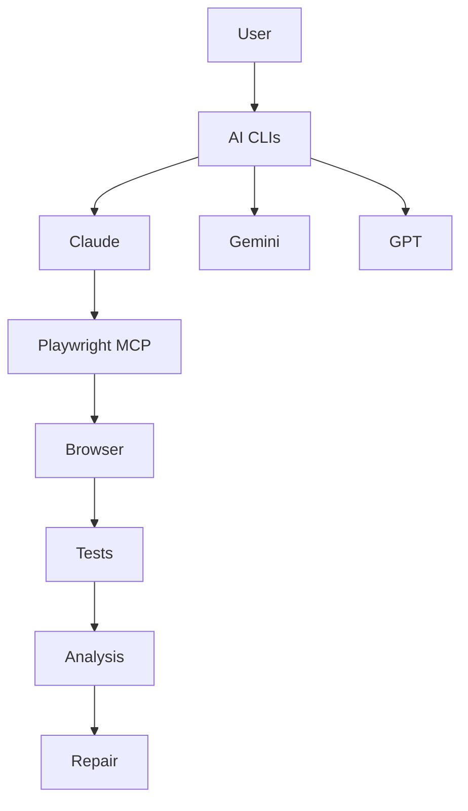
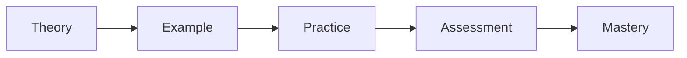
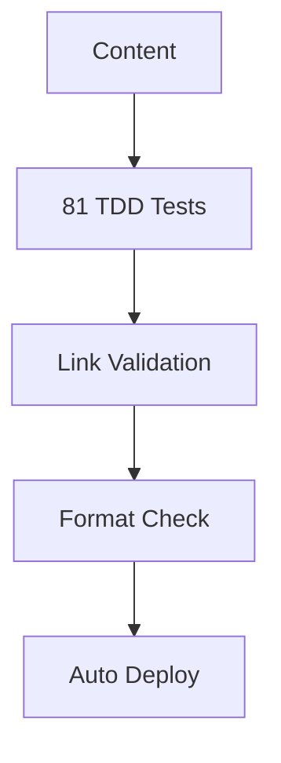

# System Patterns: Play right with AI Workshop

## System Architecture

### Repository Structure
```
play-right-with-ai/
├── .claude/agents/          # AI agent definitions
├── memory-bank/             # Context persistence
├── content/                 # Single source of truth
│   ├── chapters/            # All 8 chapters (25,000+ words)
│   ├── prompts/             # Golden prompts collection
│   └── apps/                # Sample applications
├── scripts/                 # Build pipeline
│   ├── build-chapters.js    # Content generation
│   ├── validate-links.js    # Link validation
│   └── sync-content.js      # Content synchronization
├── tests/                   # TDD test suite (81 tests)
├── docs/                    # Generated website
└── workshop/                # Legacy structure (deprecated)

```

### Key Technical Decisions

#### 1. Bilingual Prompting Architecture
```
Input → [English Reasoning] → [Chinese Output] → User
         ↑                      ↑
     (Better Logic)      (Better Accessibility)
```

#### 2. Progressive Learning Pattern
```
Guided Practice → Semi-Independent → Independent → Creative
Chapter 1-2     → Chapter 3-5      → Chapter 6-7 → Chapter 8
```

#### 3. Self-Cycling Workflow Pattern
```
Requirements → Generate → Test → Debug → Repair → Validate
     ↓            ↓        ↓       ↓        ↓         ↓
    AI₁          AI₂      AI₃     AI₄      AI₅      AI₆
```

## Design Patterns in Use

### 1. Single Source of Truth Pattern
All content maintained in `/content/` directory:
- Eliminates duplication across locations
- Automated synchronization with build pipeline
- Version controlled content with git
- Consistent formatting and validation

### 2. Agent Specialization Pattern
Each agent has specific expertise:
- `workshop-content`: Teaching materials
- `prompt-engineering`: Prompt optimization
- `playwright-expert`: Test automation
- `ai-integration`: Tool orchestration
- `learning-experience`: Pedagogy
- `code-generation`: Application examples
- `debugging-analysis`: Error diagnosis
- `workshop-testing`: Quality assurance

### 2. Memory Bank Pattern
Persistent context across sessions:
- `projectbrief.md`: Core requirements
- `productContext.md`: Why and how
- `activeContext.md`: Current state
- `systemPatterns.md`: Architecture (this file)
- `techContext.md`: Technical details
- `progress.md`: Completion tracking

### 3. Golden Prompt Pattern
Reusable, tested prompts:
- Version controlled
- Performance measured
- Community refined
- Model agnostic

## Component Relationships

### AI Tool Integration


### Learning Flow


### Content Generation Flow
```mermaid
graph TD
    Source[/content/ Source] --> Build[Build Scripts]
    Build --> HTML[Generated HTML]
    Build --> Validate[Link Validation]
    HTML --> Deploy[GitHub Pages]
    Validate --> Tests[TDD Tests]
    Tests --> CI[CI/CD Pipeline]
    CI --> Deploy
```

### Quality Assurance Pattern


## Architectural Principles

### 1. Modularity
- Independent chapters
- Reusable prompts
- Pluggable agents
- Composable workflows

### 2. Progressive Disclosure
- Complexity revealed gradually
- Skills build on each other
- Advanced topics optional
- Multiple learning paths

### 3. Community-Driven
- Open source everything
- Encourage contributions
- Share improvements
- Collective learning

### 4. Tool Agnostic
- Works with multiple AI models
- Not tied to specific versions
- Fallback strategies included
- Future-proof design

## Integration Points

### External Services
1. **AI Models**: Claude, GPT, Gemini
2. **Browser Automation**: Playwright
3. **Version Control**: GitHub
4. **Package Management**: npm/yarn
5. **IDEs**: VS Code, Cursor

### Internal Components
1. **Agents** ↔ **Prompts**: Agents use prompts
2. **Workshop** ↔ **Examples**: Exercises reference examples
3. **Memory Bank** ↔ **Agents**: Agents read context
4. **Community** ↔ **Repository**: PRs and Issues

## Error Handling Patterns

### Graceful Degradation
- Primary AI fails → Try alternate model
- MCP unavailable → Manual browser control
- API limits hit → Cached responses

### Self-Healing
- Detect failures automatically
- Diagnose root causes
- Generate fixes
- Validate repairs

## Performance Patterns

### Optimization Strategies
1. **Prompt Caching**: Reuse successful prompts
2. **Parallel Processing**: Multiple AI calls simultaneously
3. **Incremental Learning**: Build on previous outputs
4. **Token Management**: Minimize API costs

### Scalability Considerations
- Stateless prompts
- Distributed learning
- Async workflows
- Resource pooling