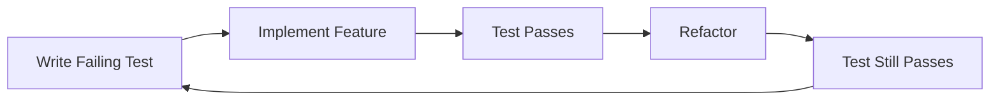

# Test Specifications for "Play right with AI" Workshop

## 測試規範總覽 (Test Specifications Overview)

This directory contains comprehensive test specifications for the "Play right with AI" workshop, following Test-Driven Development (TDD) principles. All specifications are written before implementation to ensure quality and completeness.

## 📁 Specification Files

### 1. **workshop.test.spec.md**
Overall workshop validation covering:
- Complete workshop structure and flow
- Learning progression validation
- Cross-chapter integration
- Platform compatibility
- Performance benchmarks
- Accessibility requirements

### 2. **chapters.test.spec.md**
Individual chapter testing requirements:
- Chapter 1: AI Conductor setup validation
- Chapter 2: Application generation testing
- Chapter 3: Test strategy analysis
- Chapter 4: Playwright script generation
- Chapter 5: Failure analysis and debugging
- Chapter 6: Self-repair loop validation
- Chapter 7: Advanced scenarios testing
- Chapter 8: Capstone project assessment

### 3. **prompts.test.spec.md**
Golden prompt validation criteria:
- Multi-model compatibility (Claude, GPT-4, Gemini)
- Output consistency metrics
- Response quality assessment
- Bilingual (Traditional Chinese) support
- Performance benchmarks
- Error handling validation

### 4. **apps.test.spec.md**
Sample application testing:
- TODO application functionality
- E-commerce product page
- User authentication flows
- Progressive complexity examples
- Bug-injected versions for testing
- Performance testing scenarios

### 5. **test-runner.config.md**
Test execution configuration:
- Playwright setup and configuration
- Test organization structure
- Execution profiles (dev, CI, regression)
- Parallel execution strategy
- Reporting configuration
- CI/CD integration

## 🎯 Testing Strategy

### TDD Workflow


### Test Pyramid
```
         /\
        /E2E\        <- End-to-end workshop journey tests
       /------\
      /Integra-\     <- Tool chain and AI integration tests
     /  tion    \
    /------------\
   /   Unit      \   <- Prompt, utility, and component tests
  /________________\
```

## 🚀 Quick Start

### Prerequisites
```bash
# Install Node.js 18+
node --version  # Should be >= 18.0.0

# Install dependencies
npm install

# Install Playwright browsers
npx playwright install
```

### Running Tests

#### Development Testing
```bash
# Run specific test file
npx playwright test tests/e2e/workshop/chapter-1.spec.ts

# Run with UI mode
npx playwright test --ui

# Debug mode
npx playwright test --debug
```

#### Continuous Integration
```bash
# Run all tests
npm run test:ci

# Run with specific shard
SHARD_TOTAL=4 SHARD_INDEX=1 npm run test:ci
```

#### Full Regression
```bash
# Complete test suite with all browsers
npm run test:full
```

## 📊 Test Coverage Requirements

### Minimum Coverage Targets
- **Unit Tests**: 90% coverage
- **Integration Tests**: 85% coverage  
- **E2E Tests**: Critical user paths 100%
- **Overall**: 85% coverage

### Critical Test Areas
1. ✅ Environment setup (Chapter 1)
2. ✅ Application generation (Chapter 2)
3. ✅ Test script creation (Chapter 4)
4. ✅ Self-repair loop (Chapter 6)
5. ✅ Multi-model AI support
6. ✅ Cross-platform compatibility

## 🤖 AI Model Testing

### Supported Models
- **Claude 3 Opus**: Primary model for workshop
- **GPT-4 Turbo**: Alternative model support
- **Gemini Pro**: Additional model validation
- **Local LLMs**: Optional for offline mode

### Model Testing Strategy
```typescript
// Each prompt must work with all models
const models = ['claude', 'gpt-4', 'gemini'];
for (const model of models) {
  await testPrompt(goldenPrompt, model);
}
```

## 🌐 Bilingual Support Testing

All content must support:
- **Traditional Chinese (繁體中文)**: Primary language
- **English**: Code and technical terms
- **Mixed Context**: Proper language separation

## 📈 Performance Benchmarks

### Page Load Times
- Initial load: < 3 seconds
- Navigation: < 1 second
- Interaction response: < 100ms

### AI Response Times
- Simple prompts: < 2 seconds
- Complex generation: < 10 seconds
- Analysis tasks: < 5 seconds

## 🔍 Test Execution Monitoring

### Key Metrics
- **Pass Rate**: Target > 95%
- **Flaky Rate**: Target < 5%
- **Execution Time**: Target < 30 minutes
- **Coverage**: Target > 85%

### Reporting
Test results are generated in multiple formats:
- HTML reports in `test-results/html/`
- JSON results in `test-results/results.json`
- JUnit XML in `test-results/junit.xml`
- Allure reports in `test-results/allure/`

## 🐛 Bug Management

### Bug Categories
1. **P0 - Critical**: Blocks workshop completion
2. **P1 - High**: Major functionality broken
3. **P2 - Medium**: Minor issues, workarounds exist
4. **P3 - Low**: Cosmetic or nice-to-have fixes

### Bug Injection Testing
Intentionally buggy versions are provided for testing the debugging and self-repair chapters:
- `/sample-app-source/todo-app-buggy/`
- `/sample-app-source/auth-flow-buggy/`

## 👥 Contributing

### Adding New Tests
1. Follow TDD principles - write tests first
2. Use TypeScript for type safety
3. Follow existing patterns and conventions
4. Ensure tests are independent and idempotent
5. Add appropriate tags (@smoke, @regression)
6. Update this README with new test areas

### Test Review Checklist
- [ ] Test name clearly describes what is being tested
- [ ] Test has clear arrange-act-assert structure
- [ ] Appropriate assertions are used
- [ ] Test data is properly managed
- [ ] Cleanup is performed in afterEach/afterAll
- [ ] Test is tagged appropriately
- [ ] Documentation is updated

## 📚 Additional Resources

### Documentation
- [Playwright Documentation](https://playwright.dev/docs)
- [Testing Best Practices](https://testingjavascript.com/)
- [TDD Guide](https://martinfowler.com/bliki/TestDrivenDevelopment.html)

### Workshop Materials
- [Workshop README](/README.md)
- [Chapter Guides](/workshop/)
- [Golden Prompts](/prompts/)
- [Sample Applications](/sample-app-source/)

## 📞 Support

For test-related issues:
1. Check existing [GitHub Issues](https://github.com/play-right-with-ai/issues)
2. Review test logs in `test-results/`
3. Run tests in debug mode for detailed information
4. Create a new issue with test failure details

## 📝 Version History

- **v1.0.0** - Initial test specifications
- **v1.1.0** - Added multi-model AI testing
- **v1.2.0** - Enhanced performance benchmarks
- **v1.3.0** - Bilingual support testing

---

*These test specifications ensure the "Play right with AI" workshop delivers a high-quality, effective learning experience for developers transitioning to AI-driven development workflows.*