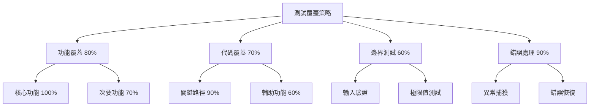

# 第二樂章：AI 擔任測試策略師 🎯

## 學習目標

在本章節中，您將學習如何指揮 AI 成為您的測試策略師，幫助您：

- 🔍 **分析應用程式碼**：讓 AI 深入理解程式架構與業務邏輯
- 📋 **制定測試策略**：運用 AI 設計全面的測試計劃
- ⚖️ **評估風險優先級**：識別關鍵路徑與高風險區域
- 📊 **規劃測試覆蓋率**：確保測試的完整性與有效性
- 🌐 **雙語思維優勢**：Think in English for analysis, Output in Chinese for clarity

## 前置需求

- ✅ 完成 Chapter 2：已有 TODO 應用程式的源代碼
- ✅ 理解基本測試概念（功能測試、邊界測試、負向測試）
- ✅ 熟悉 AI 提示詞基本技巧

## 核心概念：AI 測試策略師的角色

### 傳統測試 vs AI 驅動測試策略

**傳統方式**：
```
開發者 → 手動分析代碼 → 撰寫測試計劃 → 執行測試
```

**AI 驅動方式**：
```
開發者 → AI 分析代碼 → AI 生成測試策略 → AI 建議優先級 → 人類審核確認
```

### 雙語提示詞策略的威力

當我們使用雙語思維時，能夠獲得更好的測試策略：

```markdown
[English Thinking - Technical Analysis]
Analyze the TODO application structure
Identify critical user paths
Evaluate edge cases and error boundaries
Consider performance implications

[Chinese Output - Clear Documentation]
將分析結果轉換為清晰的中文測試文檔
使用台灣慣用的測試術語
提供易於理解的測試案例說明
```

## 實作步驟

### Step 1: 準備測試分析環境

首先，確保您有 Chapter 2 生成的 TODO 應用程式碼：

```bash
# 檢查應用程式結構
ls -la ../../chapter-02/example-output/todo-app/
```

### Step 2: 使用 AI 分析應用程式碼

使用以下黃金提示詞讓 AI 分析您的應用：

```markdown
# Test Strategy Analysis Prompt

[Context]
I have a TODO application with the following features:
- Add new tasks
- Mark tasks as complete
- Delete tasks
- Filter tasks (All/Active/Completed)
- Clear completed tasks
- Local storage persistence

[Task - Think in English]
Please analyze this application and create a comprehensive test strategy:
1. Identify all critical user paths
2. List potential edge cases and error scenarios
3. Suggest test priority based on risk assessment
4. Recommend test coverage targets
5. Define test categories (unit, integration, E2E)

[Output - 繁體中文]
請以繁體中文輸出完整的測試策略文檔，包含：
- 測試目標與範圍
- 風險評估矩陣
- 測試案例優先級
- 覆蓋率目標
- 資源需求評估
```

### Step 3: 評估測試風險矩陣

AI 將幫助您建立風險評估矩陣：

| 功能區域 | 影響程度 | 發生機率 | 測試優先級 | 建議覆蓋率 |
|---------|---------|---------|-----------|-----------|
| 新增任務 | 高 | 高 | P0 - 關鍵 | 95% |
| 刪除任務 | 高 | 中 | P1 - 重要 | 90% |
| 篩選功能 | 中 | 高 | P1 - 重要 | 85% |
| 本地儲存 | 高 | 低 | P2 - 一般 | 80% |
| UI 響應 | 低 | 中 | P3 - 選擇性 | 70% |

### Step 4: 制定測試覆蓋策略



### Step 5: 生成測試計劃文檔

讓 AI 幫您生成專業的測試計劃：

```markdown
# Test Plan Generation Prompt

Based on the risk assessment and coverage strategy, create a detailed test plan.

[Requirements in English]
- Test objectives and success criteria
- Test scope and boundaries  
- Resource requirements and timeline
- Test environment setup
- Entry and exit criteria
- Risk mitigation strategies

[輸出要求]
生成符合 IEEE 829 標準的測試計劃文檔（繁體中文）
```

## 練習項目

### 練習 1：測試案例分析 📝
**檔案位置**: `exercises/01-test-case-analysis.md`

分析 TODO 應用並識別至少 10 個關鍵測試案例。使用 AI 幫助您：
- 找出正向測試案例
- 識別負向測試案例
- 發現邊界條件
- 定義效能測試需求

### 練習 2：風險評估工作坊 ⚖️
**檔案位置**: `exercises/02-risk-assessment.md`

使用 AI 建立完整的風險評估：
- 識別技術風險
- 評估業務影響
- 制定緩解策略
- 優先級排序

### 練習 3：測試計劃撰寫 📋
**檔案位置**: `exercises/03-test-planning.md`

創建專業的測試計劃文檔：
- 測試目標與範圍
- 測試策略與方法
- 資源與時程規劃
- 風險與應變計劃

### 練習 4：覆蓋率策略設計 📊
**檔案位置**: `exercises/04-coverage-strategy.md`

設計測試覆蓋率策略：
- 功能覆蓋目標
- 代碼覆蓋指標
- 測試層級分配
- 成本效益分析

## 範例輸出

查看 `example-output/` 目錄中的完整範例：

- `complete-test-strategy.md` - 完整的測試策略文檔
- `risk-assessment-matrix.xlsx` - 風險評估矩陣
- `test-plan-template.md` - 測試計劃模板
- `coverage-report.json` - 覆蓋率目標設定

## 思考與挑戰 💭

### 深度思考問題

1. **雙語優勢**：為什麼用英文思考技術邏輯，用中文輸出文檔會更有效？
2. **AI 侷限性**：AI 在測試策略制定中可能忽略哪些人類經驗？
3. **風險平衡**：如何在測試完整性與資源限制之間取得平衡？
4. **持續改進**：如何讓 AI 從測試結果中學習並改進策略？

### 進階挑戰

🎯 **挑戰 1：複雜應用分析**
選擇一個更複雜的應用（如電商網站），使用 AI 制定完整測試策略。

🎯 **挑戰 2：多語言測試**
設計支援多語言界面的測試策略，考慮國際化測試需求。

🎯 **挑戰 3：性能測試規劃**
使用 AI 設計性能測試策略，包含負載測試、壓力測試等。

## 常見問題 ❓

### Q1: AI 生成的測試策略可信度如何？
**A**: AI 提供的是基於模式識別的建議，需要人類專家審核和調整。將 AI 視為強大的助手，而非決策者。

### Q2: 如何確保測試策略的完整性？
**A**: 結合多個 AI 模型的建議，使用檢查清單驗證，並請團隊成員審核。

### Q3: 雙語提示詞真的有差異嗎？
**A**: 是的！英文在技術分析上更精確，中文在文檔表達上更清晰。這種組合能發揮各自優勢。

### Q4: 測試優先級如何動態調整？
**A**: 根據缺陷發現率、用戶反饋和業務需求變化，定期讓 AI 重新評估並調整優先級。

## 學習檢查點 ✅

完成本章後，您應該能夠：

- [ ] 使用 AI 分析應用程式並識別測試需求
- [ ] 創建風險評估矩陣並確定測試優先級
- [ ] 設計合理的測試覆蓋率目標
- [ ] 撰寫專業的測試計劃文檔
- [ ] 理解並應用雙語提示詞策略的優勢
- [ ] 評估 AI 建議並做出明智的測試決策

## 下一步

恭喜您完成了測試策略的學習！在下一章中，我們將學習如何讓 AI 將這些策略轉化為實際的 Playwright 測試腳本。

➡️ [前往 Chapter 4: AI 執行測試腳本編寫](../chapter-04/README.md)

---

💡 **小提示**: 記住，優秀的測試策略是迭代的過程。隨著對應用的理解加深，不斷優化您的測試計劃。

🎭 **Play right with AI** - 讓 AI 成為您的測試策略師，共同演奏完美的測試樂章！