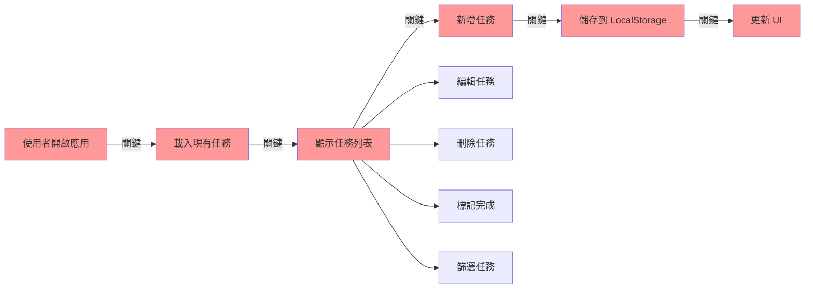
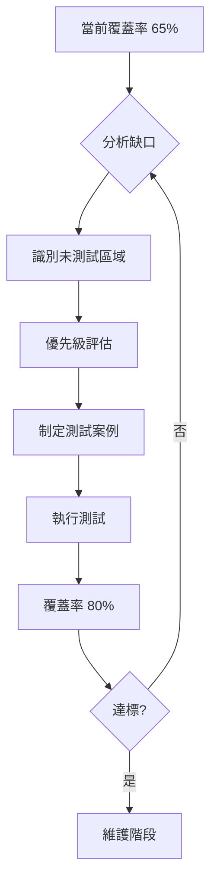
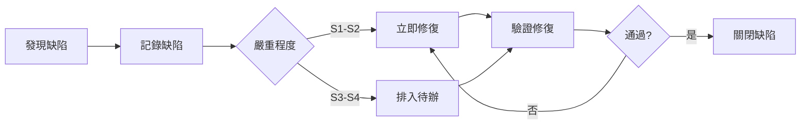
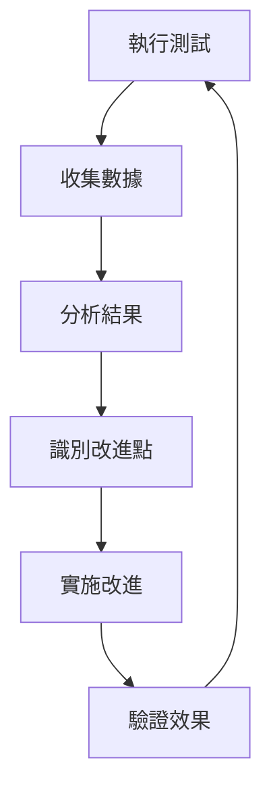

# TODO 應用程式完整測試策略 📋

> 本文檔展示 AI 協助生成的完整測試策略範例

## 執行摘要

本測試策略針對 TODO 應用程式設計，旨在確保應用程式的功能完整性、效能穩定性和使用者體驗品質。策略採用風險驅動方法，結合自動化測試和手動測試，預期達到 85% 的整體測試覆蓋率。

## 1. 測試目標與範圍

### 1.1 測試目標

- **功能正確性**: 確保所有 CRUD 操作正常運作
- **資料完整性**: 驗證 LocalStorage 持久化機制可靠
- **使用者體驗**: 保證介面響應迅速且直觀
- **跨瀏覽器相容**: 支援主流瀏覽器（Chrome, Firefox, Safari）
- **效能標準**: 頁面載入 < 2秒，操作響應 < 200ms

### 1.2 測試範圍

#### 範圍內 (In Scope)
- ✅ 核心任務管理功能（新增、編輯、刪除、標記）
- ✅ 篩選與排序功能
- ✅ 資料持久化與恢復
- ✅ 鍵盤快捷鍵支援
- ✅ 響應式設計（桌面和平板）

#### 範圍外 (Out of Scope)
- ❌ 多使用者協作功能
- ❌ 雲端同步功能
- ❌ 行動應用程式版本
- ❌ 第三方整合

## 2. 風險評估與優先級

### 2.1 風險矩陣

| 風險項目 | 影響 | 機率 | 風險值 | 測試優先級 | 緩解策略 |
|---------|------|------|--------|-----------|----------|
| 資料遺失 | 5 | 2 | 10 | P0 | 完整的持久化測試、備份機制測試 |
| 功能失效 | 4 | 3 | 12 | P0 | 全面的功能測試、迴歸測試 |
| 效能降級 | 3 | 3 | 9 | P1 | 負載測試、效能監控 |
| UI 錯誤 | 2 | 4 | 8 | P2 | 跨瀏覽器測試、視覺測試 |
| 安全漏洞 | 5 | 1 | 5 | P2 | 輸入驗證測試、XSS 防護測試 |

### 2.2 關鍵路徑識別



## 3. 測試層級策略

### 3.1 測試金字塔分配

```
測試金字塔分配：
┌─────────────┐
│  手動測試   │ 10% - 探索性測試、可用性測試
├─────────────┤
│  E2E 測試   │ 25% - 關鍵使用者流程
├─────────────┤
│  整合測試   │ 30% - 模組間互動、API 測試
├─────────────┤
│  單元測試   │ 35% - 函數邏輯、元件測試
└─────────────┘
```

### 3.2 各層級測試重點

#### 單元測試 (35%)
- **測試重點**: 業務邏輯函數、資料驗證、工具函數
- **覆蓋率目標**: 85%
- **工具選擇**: Jest + Testing Library
- **自動化程度**: 100%

```javascript
// 單元測試範例
describe('TodoValidator', () => {
  test('應拒絕空白任務', () => {
    expect(validateTodo('')).toBe(false);
  });
  
  test('應接受有效任務', () => {
    expect(validateTodo('購買牛奶')).toBe(true);
  });
  
  test('應限制任務長度', () => {
    const longText = 'a'.repeat(201);
    expect(validateTodo(longText)).toBe(false);
  });
});
```

#### 整合測試 (30%)
- **測試重點**: 元件互動、狀態管理、LocalStorage 操作
- **覆蓋率目標**: 75%
- **工具選擇**: Jest + React Testing Library
- **自動化程度**: 90%

#### E2E 測試 (25%)
- **測試重點**: 完整使用者流程、跨瀏覽器相容性
- **覆蓋率目標**: 70%
- **工具選擇**: Playwright
- **自動化程度**: 85%

#### 手動測試 (10%)
- **測試重點**: 探索性測試、可用性測試、視覺檢查
- **覆蓋率目標**: N/A
- **方法**: 情境測試、使用者訪談
- **自動化程度**: 0%

## 4. 測試案例設計策略

### 4.1 測試案例分類

| 類別 | 數量 | 優先級 | 自動化 | 執行頻率 |
|-----|------|--------|--------|----------|
| 冒煙測試 | 10 | P0 | 100% | 每次建置 |
| 功能測試 | 50 | P0-P1 | 80% | 每日 |
| 邊界測試 | 20 | P1-P2 | 70% | 每週 |
| 負向測試 | 15 | P2 | 60% | 每週 |
| 效能測試 | 10 | P1 | 90% | 每週 |
| 安全測試 | 8 | P2 | 50% | 每月 |
| 探索性測試 | N/A | P3 | 0% | 每迭代 |

### 4.2 測試資料策略

```json
{
  "testDataSets": {
    "basic": {
      "description": "基本功能測試資料",
      "items": ["購買牛奶", "完成報告", "運動30分鐘"]
    },
    "boundary": {
      "description": "邊界測試資料",
      "items": ["", "a", "這是一個非常長的任務描述..."]
    },
    "special": {
      "description": "特殊字元測試",
      "items": ["<script>alert('XSS')</script>", "任務 & 符號", "😀表情符號"]
    },
    "performance": {
      "description": "效能測試資料",
      "itemCount": 1000
    }
  }
}
```

## 5. 覆蓋率目標與指標

### 5.1 覆蓋率目標設定

| 覆蓋率類型 | 目標 | 最低標準 | 測量方法 |
|-----------|------|----------|----------|
| 功能覆蓋率 | 90% | 85% | 需求追溯矩陣 |
| 代碼覆蓋率 | 80% | 70% | Jest Coverage |
| 分支覆蓋率 | 75% | 65% | Istanbul |
| 需求覆蓋率 | 95% | 90% | TestRail |
| 風險覆蓋率 | 100% | 95% | 風險矩陣映射 |

### 5.2 覆蓋率提升策略



## 6. 測試執行策略

### 6.1 測試執行階段

#### 第一階段：基礎測試（第 1-3 天）
- 環境準備與配置
- 冒煙測試執行
- 核心功能測試

#### 第二階段：深度測試（第 4-7 天）
- 完整功能測試
- 邊界與負向測試
- 整合測試

#### 第三階段：品質保證（第 8-10 天）
- 跨瀏覽器測試
- 效能測試
- 探索性測試

#### 第四階段：驗收測試（第 11-12 天）
- 使用者驗收測試
- 迴歸測試
- 最終確認

### 6.2 測試執行矩陣

| 測試類型 | Chrome | Firefox | Safari | Edge | 執行時機 |
|---------|--------|---------|--------|------|----------|
| 單元測試 | ✅ | - | - | - | CI/CD |
| 整合測試 | ✅ | - | - | - | 每日 |
| E2E 測試 | ✅ | ✅ | ✅ | ✅ | 每日 |
| 效能測試 | ✅ | ✅ | - | - | 每週 |
| 視覺測試 | ✅ | ✅ | ✅ | - | 發布前 |

## 7. 缺陷管理策略

### 7.1 缺陷分類標準

| 嚴重程度 | 定義 | 範例 | SLA |
|---------|------|------|-----|
| S1 - 阻塞 | 系統無法使用 | 應用崩潰 | 4小時 |
| S2 - 嚴重 | 主要功能失效 | 無法新增任務 | 8小時 |
| S3 - 一般 | 次要功能問題 | 篩選不準確 | 24小時 |
| S4 - 輕微 | 不影響使用 | UI 對齊問題 | 48小時 |

### 7.2 缺陷處理流程



## 8. 自動化測試策略

### 8.1 自動化優先級

1. **最高優先級**（立即自動化）
   - 冒煙測試
   - 關鍵路徑測試
   - 迴歸測試

2. **高優先級**（第一階段）
   - 核心功能測試
   - 資料驗證測試
   - API 測試

3. **中優先級**（第二階段）
   - UI 互動測試
   - 跨瀏覽器測試
   - 效能基準測試

4. **低優先級**（評估後決定）
   - 視覺測試
   - 邊緣案例
   - 探索性測試場景

### 8.2 自動化框架選擇

```javascript
// Playwright 配置範例
const config = {
  testDir: './tests',
  timeout: 30000,
  retries: 2,
  use: {
    baseURL: 'http://localhost:3000',
    trace: 'on-first-retry',
    screenshot: 'only-on-failure',
    video: 'retain-on-failure',
  },
  projects: [
    { name: 'chromium', use: { ...devices['Desktop Chrome'] } },
    { name: 'firefox', use: { ...devices['Desktop Firefox'] } },
    { name: 'webkit', use: { ...devices['Desktop Safari'] } },
  ],
};
```

## 9. 持續改進機制

### 9.1 度量指標

- **測試效率**: 缺陷發現率、測試執行時間
- **測試效果**: 生產缺陷逃逸率、客戶滿意度
- **測試覆蓋**: 需求覆蓋率、代碼覆蓋率
- **自動化收益**: 自動化率、ROI

### 9.2 改進循環



## 10. 風險與應變

### 10.1 潛在風險

| 風險 | 影響 | 應變措施 |
|-----|------|----------|
| 測試環境不穩定 | 測試延遲 | 準備備用環境、容器化部署 |
| 自動化腳本維護成本高 | 效率降低 | 採用 Page Object Model、定期重構 |
| 需求變更頻繁 | 測試返工 | 敏捷測試方法、持續溝通 |
| 測試資源不足 | 覆蓋不全 | 優先級管理、風險接受 |

### 10.2 應急方案

- **Plan A**: 完整測試策略執行
- **Plan B**: 核心功能優先，降低覆蓋率標準
- **Plan C**: 僅執行關鍵路徑測試，接受已知風險

## 結論

本測試策略通過系統化的方法確保 TODO 應用程式的品質。策略強調：

1. ✅ 風險驅動的測試優先級
2. ✅ 平衡的測試層級分配
3. ✅ 明確的覆蓋率目標
4. ✅ 高度自動化的執行
5. ✅ 持續改進的機制

預期成果：
- 缺陷檢出率: 85%
- 測試覆蓋率: 85%
- 自動化比例: 75%
- ROI: 3.5x

---

📌 **備註**: 本策略為活文檔，將根據專案進展和反饋持續更新。

🎭 **Play right with AI** - 智慧測試，品質保證！