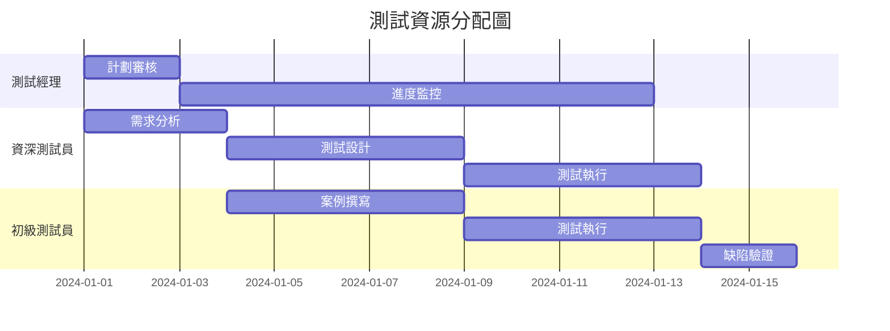

# 練習 3：測試計劃撰寫 📋

## 學習目標

通過本練習，您將學會：
- 撰寫符合 IEEE 829 標準的測試計劃
- 定義清晰的測試目標與範圍
- 制定可執行的測試策略
- 規劃資源與時程安排

## 背景說明

測試計劃是測試活動的藍圖，它定義了測試的方向、方法和資源配置。一份優秀的測試計劃能確保測試活動有序進行，並達到預期的品質目標。

## 任務說明

### Part 1: 測試計劃結構

使用 AI 協助您建立完整的測試計劃：

```markdown
# Test Plan Generation Prompt

[Project Context - English]
Project: TODO Application Testing
Duration: 2 weeks
Team Size: 2 testers
Environment: Web browsers (Chrome, Firefox, Safari)
Test Types: Functional, Usability, Performance, Security

[IEEE 829 Standard Sections]
1. Test Plan Identifier
2. Introduction
3. Test Items
4. Features to be Tested
5. Features not to be Tested
6. Approach
7. Item Pass/Fail Criteria
8. Suspension and Resumption Criteria
9. Test Deliverables
10. Testing Tasks
11. Environmental Needs
12. Responsibilities
13. Staffing and Training
14. Schedule
15. Risks and Contingencies
16. Approvals

[輸出需求 - 繁體中文]
生成完整的測試計劃文檔，使用專業術語，清晰易懂
```

### Part 2: 撰寫測試計劃

創建 `03-test-plan.md` 文檔，包含以下內容：

```markdown
# TODO 應用程式測試計劃

## 1. 測試計劃識別碼
- 文檔編號：TP-TODO-2024-001
- 版本：1.0
- 日期：2024-01-15
- 作者：[您的名字]
- 審核者：[審核者名字]

## 2. 簡介

### 2.1 目的
本測試計劃旨在定義 TODO 應用程式的測試策略、範圍、方法和資源，確保應用程式符合功能需求和品質標準。

### 2.2 範圍
涵蓋 TODO 應用程式的所有核心功能，包括任務管理、資料持久化、使用者介面等。

### 2.3 參考文件
- 需求規格書
- 設計文檔
- 使用者故事

## 3. 測試項目
- TODO 應用程式 v1.0
- 支援瀏覽器：Chrome 100+, Firefox 95+, Safari 15+
- 測試環境：開發、測試、生產前

## 4. 待測試功能

### 4.1 核心功能
- [ ] 新增待辦事項
- [ ] 編輯待辦事項
- [ ] 刪除待辦事項
- [ ] 標記完成/未完成
- [ ] 篩選功能（全部/進行中/已完成）
- [ ] 清除已完成項目
- [ ] 資料持久化（LocalStorage）

### 4.2 使用者介面
- [ ] 響應式設計
- [ ] 鍵盤導航
- [ ] 錯誤訊息顯示
- [ ] 載入狀態指示

### 4.3 效能需求
- [ ] 頁面載入時間 < 2秒
- [ ] 操作響應時間 < 200ms
- [ ] 支援 1000+ 項目

## 5. 不測試的功能
- 第三方整合（未實作）
- 多使用者協作（超出範圍）
- 行動應用程式版本

## 6. 測試方法

### 6.1 測試層級
```
單元測試 (30%)
  ├── 函數邏輯測試
  └── 元件測試

整合測試 (30%)
  ├── 模組間互動
  └── 資料流測試

系統測試 (30%)
  ├── 端到端流程
  └── 使用者場景

驗收測試 (10%)
  └── 使用者驗收標準
```

### 6.2 測試技術
- 等價類劃分
- 邊界值分析
- 決策表測試
- 狀態轉換測試
- 探索性測試

## 7. 通過/失敗標準

### 7.1 項目通過標準
- 所有 P0 和 P1 測試案例通過
- 無嚴重（Severity 1）缺陷
- 功能覆蓋率 ≥ 90%
- 效能指標達標

### 7.2 項目失敗標準
- 任何 P0 測試案例失敗
- 存在資料遺失風險
- 效能嚴重降級

## 8. 暫停與恢復標準

### 8.1 暫停標準
- 測試環境不可用
- 阻塞性缺陷未修復
- 需求重大變更

### 8.2 恢復標準
- 環境問題已解決
- 阻塞缺陷已修復
- 需求變更已確認

## 9. 測試交付物

### 9.1 測試文檔
- [ ] 測試計劃（本文檔）
- [ ] 測試案例規格
- [ ] 測試執行報告
- [ ] 缺陷報告
- [ ] 測試總結報告

### 9.2 測試腳本
- [ ] 自動化測試腳本
- [ ] 測試資料集
- [ ] 測試工具配置

## 10. 測試任務

### 10.1 計劃階段
- 需求分析（2天）
- 測試計劃撰寫（1天）
- 測試案例設計（3天）

### 10.2 執行階段
- 環境準備（1天）
- 測試執行（5天）
- 缺陷驗證（2天）

### 10.3 結束階段
- 報告撰寫（1天）
- 知識轉移（1天）

## 11. 環境需求

### 11.1 硬體需求
- CPU: 2 核心以上
- RAM: 4GB 以上
- 儲存空間: 10GB

### 11.2 軟體需求
- 作業系統: Windows 10+, macOS 11+, Ubuntu 20.04+
- 瀏覽器: 最新版本
- 測試工具: Playwright, Jest

### 11.3 測試資料
- 基礎測試資料集
- 邊界測試資料
- 效能測試資料（1000+ 項目）

## 12. 職責分配

| 角色 | 職責 | 人員 |
|-----|-----|-----|
| 測試經理 | 計劃審核、資源協調 | [姓名] |
| 測試工程師 | 案例設計、執行、自動化 | [姓名] |
| 開發人員 | 缺陷修復、技術支援 | [姓名] |
| 產品負責人 | 需求確認、驗收 | [姓名] |

## 13. 人員與培訓

### 13.1 人員需求
- 資深測試工程師 1 名
- 初級測試工程師 1 名

### 13.2 培訓需求
- Playwright 自動化測試培訓
- TODO 應用業務邏輯培訓

## 14. 時程安排

### 甘特圖
```
週 1: ■■■■□ 需求分析、計劃
週 2: ■■■■■ 測試案例設計
週 3: ■■■■■ 測試執行
週 4: ■■■□□ 缺陷修復、驗證
週 5: ■■□□□ 報告、結案
```

## 15. 風險與應變

### 15.1 風險識別
| 風險 | 機率 | 影響 | 應變措施 |
|-----|-----|-----|---------|
| 需求變更 | 中 | 高 | 敏捷調整、增量測試 |
| 資源不足 | 低 | 中 | 優先級調整、自動化 |
| 環境問題 | 中 | 中 | 備用環境、容器化 |

## 16. 審批

| 角色 | 姓名 | 簽名 | 日期 |
|-----|-----|-----|-----|
| 測試經理 | | | |
| 開發經理 | | | |
| 產品經理 | | | |
```

### Part 3: 測試策略細節

#### 3.1 功能測試策略

```markdown
# Functional Testing Strategy Prompt

[Requirements]
Design detailed functional testing approach for:
- CRUD operations
- State management
- Data persistence
- UI interactions

[Expected Output - 繁體中文]
功能測試策略文檔，包含：
- 測試方法選擇理由
- 測試資料準備策略
- 自動化優先級
- 手動測試保留項目
```

#### 3.2 效能測試策略

```markdown
# Performance Testing Strategy Prompt

[Performance Requirements]
- Page load: < 2 seconds
- Operation response: < 200ms
- Support 1000+ items
- Memory usage: < 100MB

[輸出需求]
效能測試計劃，包含：
- 測試場景設計
- 負載模型
- 效能指標
- 監控方案
```

### Part 4: 資源規劃

#### 人力資源分配



#### 工具資源規劃

| 工具類型 | 工具名稱 | 用途 | 授權 |
|---------|---------|------|------|
| 自動化測試 | Playwright | E2E 測試 | 開源 |
| 單元測試 | Jest | 單元測試 | 開源 |
| 效能測試 | Lighthouse | 效能分析 | 開源 |
| 缺陷管理 | JIRA | 缺陷追蹤 | 商業 |

### Part 5: 測試進入/退出標準

#### 進入標準 (Entry Criteria)

- [ ] 開發完成度 ≥ 80%
- [ ] 單元測試通過率 ≥ 90%
- [ ] 測試環境已就緒
- [ ] 測試資料已準備
- [ ] 測試案例已審核

#### 退出標準 (Exit Criteria)

- [ ] 計劃測試案例執行率 = 100%
- [ ] P0/P1 測試通過率 = 100%
- [ ] P2 測試通過率 ≥ 95%
- [ ] 無未解決的嚴重缺陷
- [ ] 測試報告已完成

## 實作步驟

### Step 1: 分析專案需求
深入理解 TODO 應用的功能和非功能需求。

### Step 2: 定義測試範圍
明確劃分測試和非測試項目。

### Step 3: 制定測試策略
選擇適合的測試方法和技術。

### Step 4: 規劃資源
分配人力、時間和工具資源。

### Step 5: 設定標準
定義明確的通過/失敗標準。

## 預期產出

1. ✅ `03-test-plan.md` - 完整測試計劃
2. ✅ `test-strategy-detail.md` - 詳細測試策略
3. ✅ `resource-plan.xlsx` - 資源規劃表
4. ✅ `test-schedule.gantt` - 測試時程圖

## 評估標準

| 標準 | 權重 | 說明 |
|-----|-----|-----|
| 完整性 | 30% | 涵蓋所有必要章節 |
| 可行性 | 25% | 計劃的實際可執行性 |
| 清晰度 | 20% | 文檔的易讀性和邏輯性 |
| 專業性 | 15% | 符合業界標準 |
| 創新性 | 10% | 創新方法的應用 |

## 範本與工具

### 測試計劃檢查清單

- [ ] 目標明確且可測量
- [ ] 範圍定義清晰
- [ ] 風險已識別並有應對
- [ ] 資源分配合理
- [ ] 時程可達成
- [ ] 標準明確定義
- [ ] 角色職責清楚

### AI 輔助優化

```markdown
# Test Plan Review Prompt

[My Test Plan]
[貼上您的測試計劃]

[Review Request]
Please review this test plan and identify:
1. Missing sections or details
2. Unrealistic assumptions
3. Resource allocation issues
4. Risk gaps
5. Improvement suggestions

[輸出]
提供改進建議的優先級列表
```

## 進階挑戰 🚀

### 挑戰 1：敏捷測試計劃
將傳統測試計劃改造為適合敏捷開發的輕量級版本。

### 挑戰 2：風險驅動計劃
基於風險評估結果，動態調整測試計劃。

### 挑戰 3：自動化優先計劃
設計以自動化為核心的測試計劃，最小化手動測試。

## 學習資源

- [IEEE 829 測試文檔標準](https://standards.ieee.org/standard/829-2008.html)
- [ISTQB 測試計劃指南](https://www.istqb.org/)
- [敏捷測試計劃實踐](https://www.agilealliance.org/agile101/)

---

📝 **專業提示**：優秀的測試計劃是活文檔，需要根據專案進展持續更新。

🎭 **Play right with AI** - 讓測試計劃成為品質保證的指南針！