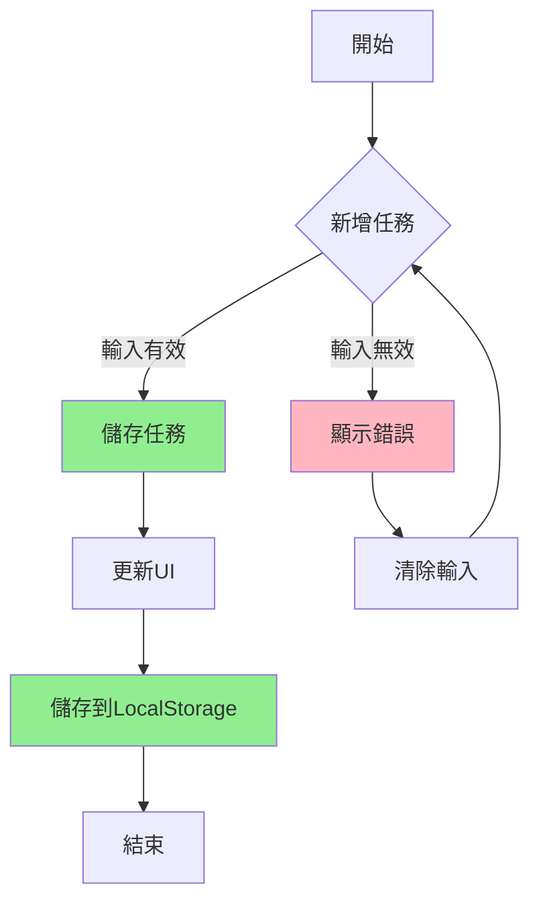
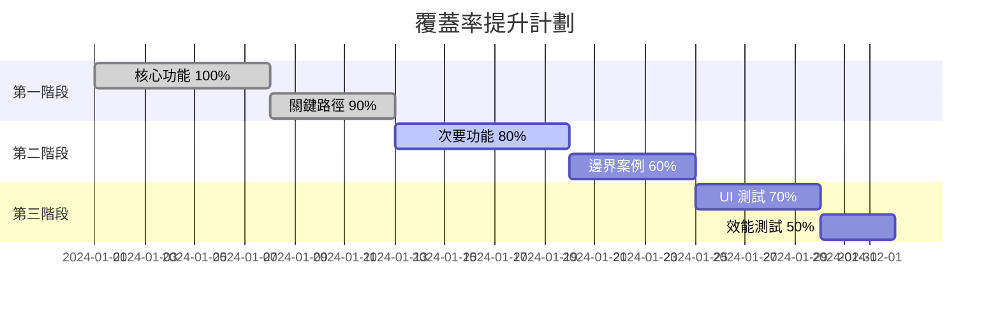

# 練習 4：覆蓋率策略設計 📊

## 學習目標

通過本練習，您將學會：
- 設計多層次的測試覆蓋率策略
- 計算和評估不同類型的覆蓋率指標
- 平衡覆蓋率目標與資源限制
- 使用 AI 優化覆蓋率分配

## 背景說明

測試覆蓋率是衡量測試完整性的關鍵指標。合理的覆蓋率策略能確保以最小的成本達到最大的品質保證效果。

## 覆蓋率類型介紹

### 1. 功能覆蓋率 (Functional Coverage)
衡量測試案例對功能需求的覆蓋程度。

### 2. 代碼覆蓋率 (Code Coverage)
- **語句覆蓋率**: 執行的代碼行數比例
- **分支覆蓋率**: 執行的條件分支比例
- **函數覆蓋率**: 調用的函數比例
- **路徑覆蓋率**: 執行的邏輯路徑比例

### 3. 需求覆蓋率 (Requirements Coverage)
測試案例與需求的追溯關係。

### 4. 風險覆蓋率 (Risk Coverage)
高風險區域的測試覆蓋程度。

## 任務說明

### Part 1: 覆蓋率目標設定

使用 AI 協助設定合理的覆蓋率目標：

```markdown
# Coverage Strategy Design Prompt

[Application Context - English]
TODO application with:
- 15 user stories
- 500 lines of JavaScript code
- 10 main functions
- 5 UI components
- Critical data persistence logic

[Coverage Goals Analysis]
Help me determine optimal coverage targets considering:
1. Industry best practices
2. Application criticality
3. Resource constraints (2 testers, 2 weeks)
4. Risk assessment results

[輸出需求 - 繁體中文]
提供覆蓋率策略建議：
- 各類型覆蓋率目標
- 優先級分配
- 成本效益分析
- 實施路線圖
```

### Part 2: 建立覆蓋率矩陣

創建 `04-coverage-strategy.json`：

```json
{
  "coverageTargets": {
    "functionalCoverage": 85,
    "codeCoverage": 75,
    "requirementsCoverage": 90,
    "riskCoverage": 95,
    "edgeCaseCoverage": 60,
    "uiCoverage": 80
  },
  "codeCoverageBreakdown": {
    "statement": 80,
    "branch": 70,
    "function": 85,
    "line": 80
  },
  "testDistribution": {
    "unit": 40,
    "integration": 30,
    "e2e": 20,
    "manual": 10
  },
  "priorityAllocation": {
    "P0_critical": {
      "targetCoverage": 100,
      "testTypes": ["unit", "integration", "e2e"],
      "automationLevel": 90
    },
    "P1_high": {
      "targetCoverage": 90,
      "testTypes": ["unit", "integration"],
      "automationLevel": 80
    },
    "P2_medium": {
      "targetCoverage": 70,
      "testTypes": ["unit", "e2e"],
      "automationLevel": 60
    },
    "P3_low": {
      "targetCoverage": 50,
      "testTypes": ["manual"],
      "automationLevel": 20
    }
  },
  "costBenefitAnalysis": {
    "totalEffort": "80 person-hours",
    "expectedROI": 3.5,
    "defectPreventionRate": 85,
    "maintenanceCostReduction": 40
  }
}
```

### Part 3: 功能覆蓋率分析

#### 功能點識別與映射

```markdown
# 功能覆蓋率矩陣

| 功能模組 | 功能點 | 測試案例數 | 覆蓋率 | 優先級 |
|---------|--------|-----------|---------|---------|
| 任務管理 | 新增任務 | 8 | 100% | P0 |
| | 編輯任務 | 6 | 85% | P1 |
| | 刪除任務 | 5 | 90% | P0 |
| | 標記完成 | 7 | 95% | P0 |
| 篩選功能 | 顯示全部 | 3 | 80% | P1 |
| | 顯示進行中 | 3 | 80% | P1 |
| | 顯示已完成 | 3 | 80% | P1 |
| 資料持久化 | 自動儲存 | 5 | 100% | P0 |
| | 資料恢復 | 4 | 85% | P1 |
| UI 互動 | 鍵盤快捷鍵 | 6 | 70% | P2 |
| | 拖放排序 | 4 | 60% | P3 |
```

#### 功能覆蓋率計算

```javascript
// 功能覆蓋率計算器
function calculateFunctionalCoverage(features) {
  const totalFeatures = features.length;
  const testedFeatures = features.filter(f => f.tested).length;
  const coverage = (testedFeatures / totalFeatures) * 100;
  
  return {
    total: totalFeatures,
    tested: testedFeatures,
    coverage: coverage.toFixed(2) + '%',
    untested: features.filter(f => !f.tested)
  };
}

// 範例使用
const features = [
  { name: '新增任務', tested: true, priority: 'P0' },
  { name: '編輯任務', tested: true, priority: 'P1' },
  { name: '刪除任務', tested: true, priority: 'P0' },
  { name: '批量操作', tested: false, priority: 'P2' },
  // ... 更多功能
];

const result = calculateFunctionalCoverage(features);
console.log('功能覆蓋率報告:', result);
```

### Part 4: 代碼覆蓋率策略

#### 代碼覆蓋率工具配置

```javascript
// jest.config.js - 代碼覆蓋率配置
module.exports = {
  collectCoverage: true,
  collectCoverageFrom: [
    'src/**/*.{js,jsx}',
    '!src/index.js',
    '!src/serviceWorker.js',
  ],
  coverageThreshold: {
    global: {
      branches: 70,
      functions: 75,
      lines: 80,
      statements: 80
    },
    './src/components/': {
      branches: 80,
      functions: 85,
      lines: 85,
      statements: 85
    },
    './src/utils/': {
      branches: 90,
      functions: 95,
      lines: 90,
      statements: 90
    }
  },
  coverageReporters: ['json', 'lcov', 'text', 'html']
};
```

#### 關鍵路徑覆蓋



關鍵路徑覆蓋率計算：
- 總路徑數: 3
- 已測試路徑: 2
- 覆蓋率: 66.67%

### Part 5: 測試層級分配策略

#### 測試金字塔設計

```
         /\
        /  \  10% - 手動測試
       /    \     (探索性、可用性)
      /------\
     /        \ 20% - E2E 測試
    /          \   (關鍵用戶流程)
   /------------\
  /              \ 30% - 整合測試
 /                \   (模組互動、API)
/------------------\
                    40% - 單元測試
                       (函數、元件邏輯)
```

#### 各層級覆蓋率目標

```json
{
  "testPyramid": {
    "unit": {
      "percentage": 40,
      "coverage": 85,
      "focus": ["業務邏輯", "工具函數", "資料驗證"],
      "tools": ["Jest", "Mocha"],
      "automationRate": 100
    },
    "integration": {
      "percentage": 30,
      "coverage": 75,
      "focus": ["模組互動", "資料流", "狀態管理"],
      "tools": ["Jest", "Testing Library"],
      "automationRate": 90
    },
    "e2e": {
      "percentage": 20,
      "coverage": 70,
      "focus": ["用戶流程", "跨瀏覽器", "關鍵路徑"],
      "tools": ["Playwright", "Cypress"],
      "automationRate": 80
    },
    "manual": {
      "percentage": 10,
      "coverage": 60,
      "focus": ["探索性", "可用性", "視覺檢查"],
      "tools": ["手動測試"],
      "automationRate": 0
    }
  }
}
```

### Part 6: 成本效益分析

#### ROI 計算模型

```javascript
// 測試覆蓋率 ROI 計算
function calculateTestROI(coverage, effort, defectCost) {
  // 預期捕獲的缺陷數
  const defectsCaught = coverage.rate * coverage.potentialDefects;
  
  // 節省的成本
  const costSaved = defectsCaught * defectCost.production;
  
  // 測試成本
  const testCost = effort.hours * effort.hourlyRate;
  
  // ROI 計算
  const roi = ((costSaved - testCost) / testCost) * 100;
  
  return {
    defectsCaught: Math.round(defectsCaught),
    costSaved: costSaved.toFixed(2),
    testCost: testCost.toFixed(2),
    roi: roi.toFixed(2) + '%',
    breakEvenPoint: (testCost / (defectCost.production * coverage.rate)).toFixed(0)
  };
}

// 使用範例
const result = calculateTestROI(
  { rate: 0.85, potentialDefects: 50 },
  { hours: 80, hourlyRate: 50 },
  { development: 100, production: 1000 }
);

console.log('測試 ROI 分析:', result);
```

#### 覆蓋率提升路線圖



### Part 7: 覆蓋率監控與報告

#### 實時覆蓋率儀表板

```html
<!-- 覆蓋率儀表板 HTML 模板 -->
<div class="coverage-dashboard">
  <div class="coverage-metric">
    <h3>功能覆蓋率</h3>
    <div class="progress-bar">
      <div class="progress" style="width: 85%">85%</div>
    </div>
    <p>目標: 85% | 實際: 85% ✓</p>
  </div>
  
  <div class="coverage-metric">
    <h3>代碼覆蓋率</h3>
    <div class="progress-bar">
      <div class="progress" style="width: 72%">72%</div>
    </div>
    <p>目標: 75% | 實際: 72% ⚠️</p>
  </div>
  
  <div class="coverage-trend">
    <h3>覆蓋率趨勢</h3>
    <canvas id="coverageTrend"></canvas>
  </div>
</div>
```

## 實作步驟

### Step 1: 分析應用結構
識別所有可測試的功能點和代碼路徑。

### Step 2: 設定覆蓋率目標
根據風險評估和資源限制設定合理目標。

### Step 3: 設計測試分配
確定各測試層級的比例和重點。

### Step 4: 計算成本效益
評估不同覆蓋率水平的投資回報。

### Step 5: 建立監控機制
設置覆蓋率追蹤和報告系統。

## 預期產出

1. ✅ `04-coverage-strategy.json` - 覆蓋率策略配置
2. ✅ `coverage-analysis.md` - 覆蓋率分析報告
3. ✅ `test-allocation.xlsx` - 測試分配表
4. ✅ `roi-calculation.js` - ROI 計算腳本

## 評估標準

| 標準 | 權重 | 說明 |
|-----|-----|-----|
| 目標合理性 | 30% | 覆蓋率目標的可達成性 |
| 策略完整性 | 25% | 涵蓋各類型覆蓋率 |
| 成本效益 | 25% | ROI 分析的準確性 |
| 可執行性 | 20% | 策略的實際可操作性 |

## 實戰演練

### 情境 1：資源受限
```markdown
情境：只有 1 名測試人員，5 天時間
挑戰：如何調整覆蓋率策略？

考慮要點：
1. 優先級重新排序
2. 自動化比例提升
3. 風險接受度調整
4. 分階段實施
```

### 情境 2：關鍵版本發布
```markdown
情境：即將發布重要版本，需要高品質保證
挑戰：如何快速提升覆蓋率？

策略建議：
1. 集中測試關鍵路徑
2. 增加迴歸測試
3. 引入探索性測試
4. 加強風險區域覆蓋
```

## 進階挑戰 🚀

### 挑戰 1：智能覆蓋率優化
使用 AI 分析歷史缺陷數據，動態調整覆蓋率目標。

### 挑戰 2：覆蓋率預測模型
建立機器學習模型，預測不同覆蓋率水平的缺陷發現率。

### 挑戰 3：實時覆蓋率監控
開發實時覆蓋率監控系統，自動觸發補充測試。

## 最佳實踐

### DO's ✅
- 根據風險調整覆蓋率目標
- 定期審查和更新策略
- 結合多種覆蓋率指標
- 考慮維護成本
- 使用工具自動化追蹤

### DON'Ts ❌
- 盲目追求 100% 覆蓋率
- 忽視測試品質只看數量
- 所有功能同等對待
- 忽略邊界和異常情況
- 過度依賴單一指標

## 學習資源

- [測試覆蓋率最佳實踐](https://martinfowler.com/bliki/TestCoverage.html)
- [代碼覆蓋率工具比較](https://www.atlassian.com/continuous-delivery/software-testing/code-coverage)
- [Google 測試博客](https://testing.googleblog.com/)

## 工具推薦

- **代碼覆蓋率**: Istanbul, NYC, Jest Coverage
- **功能覆蓋率**: TestRail, Zephyr
- **視覺化工具**: Codecov, Coveralls
- **報告生成**: Allure, ExtentReports

---

📊 **專業見解**：覆蓋率是指標而非目標，品質才是最終追求。

🎭 **Play right with AI** - 用智慧分配測試資源，達到最佳品質保證！