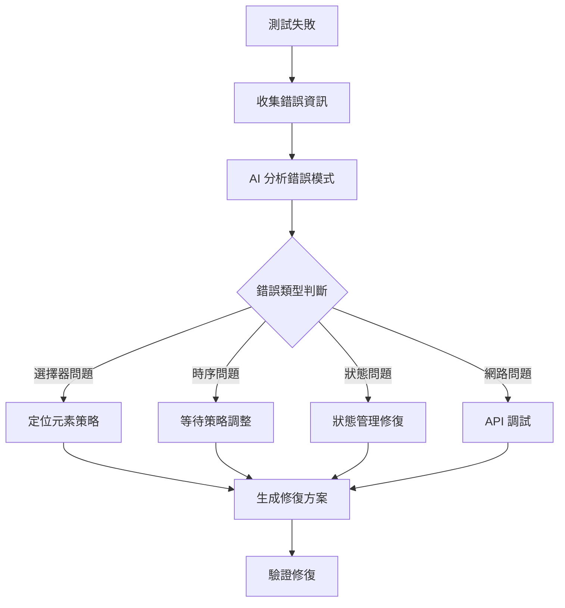

# 第五章：第四樂章 - AI 分析測試失敗

## 章節概述

在這個章節中，我們將學習如何利用 AI 進行智能的錯誤診斷、根本原因分析，以及自動化問題解決。將調試從繁瑣的過程轉變為智能、系統化的調查，快速準確地解決問題。

## 學習目標

完成本章後，您將能夠：

1. **錯誤分析專家**：準確診斷測試失敗和運行時錯誤
2. **追蹤分析大師**：解讀 Playwright trace 文件和截圖
3. **模式識別高手**：識別常見錯誤模式和反模式
4. **解決方案生成器**：生成精確的修復建議

## 章節架構

```
chapter-05/
├── README.md (本文件)
├── scenarios/
│   ├── 01-javascript-errors/    # JavaScript 常見錯誤
│   ├── 02-async-timing/        # 非同步時序問題
│   ├── 03-dom-manipulation/    # DOM 操作問題
│   └── 04-api-integration/     # API 整合失敗
├── exercises/
│   ├── exercise-01-error-analysis.md
│   ├── exercise-02-trace-debugging.md
│   ├── exercise-03-pattern-recognition.md
│   └── exercise-04-ai-diagnosis.md
├── analysis-tools/
│   ├── error-analyzer.js
│   ├── trace-parser.js
│   └── debug-helper.js
├── logs/
│   ├── sample-errors/
│   └── trace-files/
└── prompts/
    └── debugging-prompts.md
```

## 核心概念

### 1. 智能錯誤診斷流程



### 2. 錯誤分類體系

| 錯誤類別 | 常見症狀 | AI 診斷重點 | 修復策略 |
|---------|---------|------------|---------|
| 選擇器錯誤 | TimeoutError | 元素定位失敗 | 更新選擇器策略 |
| 時序問題 | 間歇性失敗 | 競態條件 | 智能等待機制 |
| 狀態污染 | 測試相互影響 | 資料隔離問題 | 狀態清理策略 |
| 網路錯誤 | API 失敗 | 連接問題 | 重試與容錯 |

### 3. Playwright Trace 分析技巧

```javascript
// 使用 AI 分析 trace 文件的範例
async function analyzeTraceWithAI(tracePath) {
    const trace = await loadTrace(tracePath);
    
    const analysisPrompt = `
    分析這個 Playwright 測試追蹤：
    - 總步驟: ${trace.steps.length}
    - 失敗步驟: ${trace.failedStep}
    - 錯誤類型: ${trace.errorType}
    - 執行時間: ${trace.duration}ms
    
    請提供：
    1. 失敗的根本原因
    2. 具體的修復建議
    3. 預防措施
    `;
    
    return await aiAnalyze(analysisPrompt);
}
```

## 實戰演練

### 場景 1：處理選擇器變更

當應用程式 UI 更新導致選擇器失效時，AI 可以智能地找到替代選擇器：

```javascript
// 錯誤場景
await page.click('#old-button-id'); // 元素不存在

// AI 診斷與修復
const diagnosis = {
    issue: "選擇器 '#old-button-id' 找不到元素",
    analysis: "檢查 DOM 發現按鈕 ID 已改變",
    suggestion: "使用更穩定的選擇器策略",
    fix: "await page.click('[data-testid=\"submit-button\"]')"
};
```

### 場景 2：解決非同步時序問題

```javascript
// 錯誤場景
await page.fill('#search', 'keyword');
const results = await page.locator('.results').count(); // 結果還未載入

// AI 診斷與修復
const diagnosis = {
    issue: "在結果載入前就進行檢查",
    analysis: "缺少等待 AJAX 請求完成的機制",
    fix: `
        await page.fill('#search', 'keyword');
        await page.waitForResponse(resp => 
            resp.url().includes('/api/search') && resp.status() === 200
        );
        const results = await page.locator('.results').count();
    `
};
```

## AI 調試提示詞模板

### 基礎錯誤分析模板

```markdown
作為測試調試專家，請分析以下測試失敗：

錯誤訊息：
[錯誤內容]

測試程式碼：
[相關程式碼]

執行環境：
- Playwright 版本：[版本]
- 瀏覽器：[瀏覽器類型]
- 作業系統：[OS]

請提供：
1. 錯誤的根本原因
2. 詳細的修復步驟
3. 修復後的程式碼
4. 如何避免類似問題
```

### Trace 文件分析模板

```markdown
請分析這個 Playwright trace 文件的關鍵信息：

失敗步驟：[步驟描述]
錯誤類型：[錯誤分類]
執行序列：[動作列表]
網路請求：[請求摘要]

診斷重點：
1. 失敗的直接原因
2. 可能的環境因素
3. 建議的修復方案
4. 測試穩定性改進
```

## 練習任務

### 練習 1：錯誤模式識別

給定一組測試失敗日誌，使用 AI 識別錯誤模式並分類。

### 練習 2：Trace 文件深度分析

使用提供的 trace 文件，練習提取關鍵診斷信息。

### 練習 3：自動化修復建議

為常見錯誤類型建立自動化修復建議系統。

### 練習 4：調試工作流整合

將 AI 調試整合到 CI/CD 管道中。

## 最佳實踐

### 1. 系統化的錯誤收集

```javascript
class ErrorCollector {
    async collectDiagnosticInfo(error, page) {
        return {
            error: {
                message: error.message,
                stack: error.stack,
                type: error.constructor.name
            },
            page: {
                url: await page.url(),
                title: await page.title(),
                screenshot: await page.screenshot()
            },
            console: await this.getConsoleLogs(page),
            network: await this.getNetworkActivity(page),
            timestamp: new Date().toISOString()
        };
    }
}
```

### 2. 智能重試策略

```javascript
async function intelligentRetry(testFn, options = {}) {
    const maxAttempts = options.maxAttempts || 3;
    const aiDiagnose = options.aiDiagnose || false;
    
    for (let attempt = 1; attempt <= maxAttempts; attempt++) {
        try {
            return await testFn();
        } catch (error) {
            if (attempt < maxAttempts) {
                if (aiDiagnose) {
                    const fix = await getAIFix(error);
                    await applyFix(fix);
                }
                await waitWithBackoff(attempt);
            } else {
                throw error;
            }
        }
    }
}
```

### 3. 預防性錯誤檢測

```javascript
// 在測試執行前檢測潛在問題
async function preTestDiagnosis(page) {
    const diagnostics = [];
    
    // 檢查頁面載入狀態
    if (!await page.evaluate(() => document.readyState === 'complete')) {
        diagnostics.push('頁面未完全載入');
    }
    
    // 檢查關鍵元素
    const criticalElements = ['#app', '.main-content'];
    for (const selector of criticalElements) {
        if (!await page.locator(selector).isVisible()) {
            diagnostics.push(`關鍵元素 ${selector} 不可見`);
        }
    }
    
    return diagnostics;
}
```

## 進階技巧

### 1. 錯誤指紋識別

建立錯誤指紋系統，快速識別重複問題：

```javascript
function generateErrorFingerprint(error) {
    const key = [
        error.type,
        error.selector,
        error.action,
        error.url
    ].filter(Boolean).join('::');
    
    return crypto.createHash('md5').update(key).digest('hex');
}
```

### 2. 智能日誌聚合

```javascript
class SmartLogger {
    constructor() {
        this.patterns = new Map();
    }
    
    async analyzePatterns(logs) {
        // 使用 AI 識別日誌模式
        const prompt = `
        分析以下日誌，識別錯誤模式：
        ${logs.join('\n')}
        
        返回：
        1. 重複出現的錯誤
        2. 錯誤之間的關聯
        3. 潛在的根本原因
        `;
        
        return await aiAnalyze(prompt);
    }
}
```

## 下一步

完成本章學習後，您將準備好進入[第六章：AI 完成自我修復](../chapter-06/README.md)，學習如何讓測試系統具備自我修復能力。

## 資源連結

- [Playwright Trace Viewer 文檔](https://playwright.dev/docs/trace-viewer)
- [錯誤處理最佳實踐](https://playwright.dev/docs/test-retry)
- [調試技巧指南](https://playwright.dev/docs/debug)

## 課後思考

1. 如何設計一個能夠自動分類錯誤的 AI 系統？
2. 什麼樣的錯誤模式最適合自動修復？
3. 如何平衡自動修復的便利性和代碼的可維護性？
4. 在團隊協作中，如何共享調試知識和經驗？

---

> 💡 **提示**：調試不是找出錯誤，而是理解系統行為。AI 能幫助我們更快地建立這種理解。