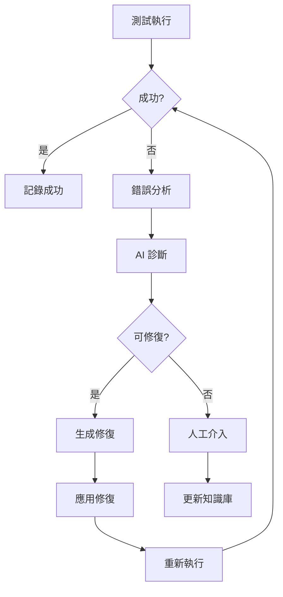

# 第六章：最終樂章 - AI 完成自我修復

## 章節概述

在這個章節中，我們將學習如何建立具有自我修復能力的測試系統。透過 AI 的智能分析和自動化修復，讓測試能夠自動適應變化、修復問題，實現真正的自主測試循環。

## 學習目標

完成本章後，您將能夠：

1. **自動修復生成器**：讓 AI 自動生成修復代碼
2. **智能重試策略**：實施智能的測試重試機制
3. **動態定位器**：建立自適應的元素定位系統
4. **容錯機制**：設計健壯的錯誤處理和回退方案

## 章節架構

```
chapter-06/
├── README.md (本文件)
├── self-repair/
│   ├── 01-auto-fix-generation/    # 自動修復生成
│   ├── 02-retry-strategies/       # 重試策略
│   ├── 03-smart-locators/        # 智能定位器
│   └── 04-fallback-mechanisms/   # 回退機制
├── exercises/
│   ├── exercise-01-self-healing.md
│   ├── exercise-02-auto-repair.md
│   ├── exercise-03-resilience.md
│   └── exercise-04-integration.md
├── automation/
│   ├── ci-cd-integration/
│   ├── monitoring/
│   └── reporting/
└── examples/
    └── complete-workflow/
```

## 核心概念

### 1. 自我修復測試架構



### 2. 自我修復能力層級

| 層級 | 能力 | 範例 | 實現難度 |
|------|------|------|---------|
| L1 | 基礎重試 | 簡單重試失敗操作 | 低 |
| L2 | 智能等待 | 動態調整等待策略 | 中 |
| L3 | 選擇器修復 | 自動更新失效選擇器 | 中高 |
| L4 | 邏輯調整 | 修改測試流程適應變化 | 高 |
| L5 | 自主進化 | 學習並優化測試策略 | 極高 |

### 3. 自我修復決策樹

```javascript
class SelfHealingDecisionTree {
    async makeDecision(error) {
        // 第一層：錯誤分類
        const errorType = this.classifyError(error);
        
        // 第二層：修復策略選擇
        switch(errorType) {
            case 'SELECTOR_NOT_FOUND':
                return this.healSelector(error);
            case 'TIMING_ISSUE':
                return this.healTiming(error);
            case 'NETWORK_ERROR':
                return this.healNetwork(error);
            case 'STATE_ISSUE':
                return this.healState(error);
            default:
                return this.escalateToHuman(error);
        }
    }
}
```

## 實戰示例

### 示例 1：自動選擇器修復

```javascript
class AutoSelectorHealer {
    async healSelector(page, failedSelector) {
        console.log(`選擇器失敗: ${failedSelector}`);
        
        // 步驟 1: 分析失敗原因
        const diagnosis = await this.diagnoseSelector(page, failedSelector);
        
        // 步驟 2: 生成替代選擇器
        const alternatives = await this.generateAlternatives(page, diagnosis);
        
        // 步驟 3: 驗證替代選擇器
        for (const selector of alternatives) {
            if (await this.validateSelector(page, selector)) {
                console.log(`找到替代選擇器: ${selector}`);
                return selector;
            }
        }
        
        // 步驟 4: 使用 AI 生成新選擇器
        return await this.aiGenerateSelector(page, failedSelector);
    }
    
    async diagnoseSelector(page, selector) {
        // 分析選擇器失敗的原因
        const analysis = {
            selectorType: this.getSelectorType(selector),
            possibleIssues: [],
            pageChanges: []
        };
        
        // 檢查是否是 ID 變更
        if (selector.includes('#')) {
            const id = selector.match(/#([^s\]]+)/)?.[1];
            analysis.possibleIssues.push(`ID '${id}' 可能已變更`);
        }
        
        // 檢查是否是 class 變更
        if (selector.includes('.')) {
            const className = selector.match(/\.([^s\]]+)/)?.[1];
            analysis.possibleIssues.push(`Class '${className}' 可能已變更`);
        }
        
        return analysis;
    }
    
    async generateAlternatives(page, diagnosis) {
        const alternatives = [];
        
        // 策略 1: 使用文字內容
        if (diagnosis.expectedText) {
            alternatives.push(`text="${diagnosis.expectedText}"`);
            alternatives.push(`text~="${diagnosis.expectedText}"`);
        }
        
        // 策略 2: 使用相對位置
        alternatives.push(`xpath=//button[contains(@class, 'submit')]`);
        alternatives.push(`css=form button[type="submit"]`);
        
        // 策略 3: 使用 data 屬性
        alternatives.push(`[data-testid*="submit"]`);
        alternatives.push(`[data-action="submit"]`);
        
        return alternatives;
    }
    
    async aiGenerateSelector(page, failedSelector) {
        const prompt = `
        原始選擇器失敗: ${failedSelector}
        
        頁面當前 HTML:
        ${await page.content()}
        
        請生成一個新的、更穩定的選擇器來定位相同的元素。
        優先使用:
        1. data-testid 屬性
        2. 語意化的 HTML 標籤
        3. ARIA 屬性
        4. 穩定的文字內容
        `;
        
        // 呼叫 AI API
        const newSelector = await this.callAI(prompt);
        return newSelector;
    }
}
```

### 示例 2：智能重試策略

```javascript
class SmartRetryStrategy {
    constructor() {
        this.retryConfig = {
            maxAttempts: 3,
            baseDelay: 1000,
            maxDelay: 30000,
            backoffMultiplier: 2
        };
        
        this.retryHistory = new Map();
    }
    
    async executeWithRetry(testFn, context) {
        const testId = this.generateTestId(testFn);
        let lastError;
        
        for (let attempt = 1; attempt <= this.retryConfig.maxAttempts; attempt++) {
            try {
                // 執行測試
                const result = await testFn();
                
                // 成功，更新歷史
                this.updateHistory(testId, { success: true, attempt });
                return result;
                
            } catch (error) {
                lastError = error;
                console.log(`嘗試 ${attempt} 失敗: ${error.message}`);
                
                // 分析錯誤並決定是否重試
                const shouldRetry = await this.analyzeAndDecide(error, attempt);
                
                if (!shouldRetry || attempt === this.retryConfig.maxAttempts) {
                    this.updateHistory(testId, { success: false, attempt, error });
                    throw error;
                }
                
                // 應用修復策略
                await this.applyHealingStrategy(error, context);
                
                // 計算延遲時間
                const delay = this.calculateDelay(attempt);
                console.log(`等待 ${delay}ms 後重試...`);
                await this.wait(delay);
            }
        }
        
        throw lastError;
    }
    
    async analyzeAndDecide(error, attempt) {
        // 使用 AI 分析錯誤是否可重試
        const analysis = await this.aiAnalyzeError(error);
        
        // 決策邏輯
        if (analysis.isTransient) {
            return true; // 暫時性錯誤，應該重試
        }
        
        if (analysis.isFixable && attempt < this.retryConfig.maxAttempts) {
            return true; // 可修復的錯誤，且還有重試次數
        }
        
        if (analysis.isCritical) {
            return false; // 關鍵錯誤，不應重試
        }
        
        return attempt < this.retryConfig.maxAttempts;
    }
    
    async applyHealingStrategy(error, context) {
        const errorType = this.classifyError(error);
        
        switch(errorType) {
            case 'TIMEOUT':
                // 增加超時時間
                context.timeout = (context.timeout || 30000) * 1.5;
                break;
                
            case 'ELEMENT_NOT_FOUND':
                // 等待頁面穩定
                await context.page.waitForLoadState('networkidle');
                break;
                
            case 'STALE_ELEMENT':
                // 重新獲取元素
                context.refreshElements = true;
                break;
                
            case 'NETWORK_ERROR':
                // 清除快取並重試
                await context.page.context().clearCookies();
                break;
        }
    }
    
    calculateDelay(attempt) {
        const exponentialDelay = this.retryConfig.baseDelay * 
            Math.pow(this.retryConfig.backoffMultiplier, attempt - 1);
        
        // 加入隨機抖動
        const jitter = Math.random() * 1000;
        
        return Math.min(exponentialDelay + jitter, this.retryConfig.maxDelay);
    }
    
    async aiAnalyzeError(error) {
        const prompt = `
        分析測試錯誤：
        ${error.message}
        ${error.stack}
        
        請判斷：
        1. 是否為暫時性錯誤 (isTransient)
        2. 是否可修復 (isFixable)
        3. 是否為關鍵錯誤 (isCritical)
        4. 建議的修復策略
        `;
        
        // 模擬 AI 回應
        return {
            isTransient: error.message.includes('timeout'),
            isFixable: !error.message.includes('critical'),
            isCritical: error.message.includes('security'),
            strategy: 'increase_timeout'
        };
    }
}
```

### 示例 3：智能元素定位器

```javascript
class SmartLocator {
    constructor(page) {
        this.page = page;
        this.locatorCache = new Map();
        this.fallbackStrategies = [
            this.byTestId.bind(this),
            this.byText.bind(this),
            this.byRole.bind(this),
            this.byNearby.bind(this),
            this.byVisualSimilarity.bind(this)
        ];
    }
    
    async locate(identifier) {
        // 檢查快取
        if (this.locatorCache.has(identifier)) {
            const cached = this.locatorCache.get(identifier);
            if (await this.isValid(cached)) {
                return cached;
            }
        }
        
        // 嘗試各種策略
        for (const strategy of this.fallbackStrategies) {
            try {
                const locator = await strategy(identifier);
                if (locator && await this.isValid(locator)) {
                    this.locatorCache.set(identifier, locator);
                    return locator;
                }
            } catch (error) {
                continue;
            }
        }
        
        // 使用 AI 作為最後手段
        return await this.aiLocate(identifier);
    }
    
    async byTestId(identifier) {
        return this.page.locator(`[data-testid="${identifier}"]`);
    }
    
    async byText(identifier) {
        // 嘗試精確匹配和模糊匹配
        const exact = this.page.locator(`text="${identifier}"`);
        if (await exact.count() > 0) return exact;
        
        const fuzzy = this.page.locator(`text~="${identifier}"`);
        if (await fuzzy.count() > 0) return fuzzy;
        
        return null;
    }
    
    async byRole(identifier) {
        // 基於語義角色定位
        const roles = ['button', 'link', 'textbox', 'checkbox'];
        
        for (const role of roles) {
            const locator = this.page.getByRole(role, { 
                name: new RegExp(identifier, 'i') 
            });
            if (await locator.count() > 0) return locator;
        }
        
        return null;
    }
    
    async byNearby(identifier) {
        // 基於相對位置定位
        const landmarks = await this.findLandmarks();
        
        for (const landmark of landmarks) {
            const nearby = landmark.locator(`../*[contains(., "${identifier}")]`);
            if (await nearby.count() > 0) return nearby;
        }
        
        return null;
    }
    
    async byVisualSimilarity(identifier) {
        // 基於視覺相似性定位（需要 AI 視覺能力）
        const screenshot = await this.page.screenshot();
        
        const prompt = `
        在這個截圖中找到與 "${identifier}" 相關的元素。
        返回該元素的位置座標。
        `;
        
        const coordinates = await this.aiAnalyzeVisual(screenshot, prompt);
        if (coordinates) {
            return this.page.locator(`[boundingBox="${coordinates}"]`);
        }
        
        return null;
    }
    
    async aiLocate(identifier) {
        const html = await this.page.content();
        
        const prompt = `
        在以下 HTML 中找到代表 "${identifier}" 的元素：
        
        ${html}
        
        返回最合適的 CSS 選擇器或 XPath。
        考慮：
        1. 元素的語義
        2. 周圍的上下文
        3. 穩定性和唯一性
        `;
        
        const selector = await this.callAI(prompt);
        return this.page.locator(selector);
    }
}
```

## CI/CD 整合

### GitHub Actions 自我修復工作流

```yaml
name: Self-Healing Tests

on:
  push:
    branches: [ main ]
  pull_request:
    branches: [ main ]
  schedule:
    - cron: '0 */6 * * *'  # 每 6 小時執行一次

jobs:
  test-with-self-healing:
    runs-on: ubuntu-latest
    
    steps:
    - uses: actions/checkout@v3
    
    - name: Setup Node.js
      uses: actions/setup-node@v3
      with:
        node-version: '18'
    
    - name: Install dependencies
      run: |
        npm ci
        npx playwright install
    
    - name: Run Self-Healing Tests
      id: test
      run: |
        npm run test:self-healing
      continue-on-error: true
    
    - name: Analyze Failures
      if: steps.test.outcome == 'failure'
      run: |
        npm run analyze:failures
    
    - name: Apply Auto-Fixes
      if: steps.test.outcome == 'failure'
      run: |
        npm run apply:fixes
    
    - name: Retry Tests
      if: steps.test.outcome == 'failure'
      run: |
        npm run test:retry
    
    - name: Generate Report
      if: always()
      run: |
        npm run generate:report
    
    - name: Upload Report
      if: always()
      uses: actions/upload-artifact@v3
      with:
        name: self-healing-report
        path: reports/
    
    - name: Create Issue for Manual Fixes
      if: failure()
      uses: actions/create-issue@v2
      with:
        title: 'Self-Healing Tests Failed - Manual Intervention Required'
        body: |
          ## Test Failure Summary
          
          The self-healing mechanism couldn't automatically fix all issues.
          
          ### Failed Tests:
          ${{ steps.test.outputs.failed_tests }}
          
          ### Attempted Fixes:
          ${{ steps.test.outputs.attempted_fixes }}
          
          ### Required Actions:
          - Review the attached report
          - Update test selectors if needed
          - Check for application changes
          
          [View Full Report](https://github.com/${{ github.repository }}/actions/runs/${{ github.run_id }})
```

## 最佳實踐

### 1. 分層修復策略

```javascript
class LayeredHealingStrategy {
    constructor() {
        this.layers = [
            { name: 'Quick Fix', timeout: 5000, strategies: ['retry', 'wait'] },
            { name: 'Smart Fix', timeout: 15000, strategies: ['selector', 'timing'] },
            { name: 'Deep Fix', timeout: 30000, strategies: ['ai', 'restructure'] },
            { name: 'Escalate', timeout: 0, strategies: ['notify', 'skip'] }
        ];
    }
    
    async heal(error, context) {
        for (const layer of this.layers) {
            console.log(`嘗試 ${layer.name} 層修復...`);
            
            for (const strategy of layer.strategies) {
                if (await this.tryStrategy(strategy, error, context, layer.timeout)) {
                    console.log(`${strategy} 策略成功！`);
                    return true;
                }
            }
        }
        
        return false;
    }
}
```

### 2. 修復知識庫

```javascript
class HealingKnowledgeBase {
    constructor() {
        this.knowledge = new Map();
    }
    
    async learn(error, solution) {
        const fingerprint = this.generateFingerprint(error);
        
        if (!this.knowledge.has(fingerprint)) {
            this.knowledge.set(fingerprint, []);
        }
        
        this.knowledge.get(fingerprint).push({
            solution,
            timestamp: Date.now(),
            success: true
        });
    }
    
    async suggest(error) {
        const fingerprint = this.generateFingerprint(error);
        const solutions = this.knowledge.get(fingerprint) || [];
        
        // 按成功率排序
        return solutions
            .sort((a, b) => b.success - a.success)
            .map(s => s.solution);
    }
}
```

## 進階技巧

### 1. 預測性修復

```javascript
class PredictiveHealing {
    async predictFailures(testSuite) {
        // 分析測試套件和應用變更
        const changes = await this.detectChanges();
        const impacts = await this.analyzeImpacts(changes);
        
        // 預先生成修復
        const preemptiveFixes = await this.generateFixes(impacts);
        
        return preemptiveFixes;
    }
}
```

### 2. 自適應學習

```javascript
class AdaptiveLearning {
    async adapt(testResults) {
        // 從測試結果中學習
        const patterns = this.extractPatterns(testResults);
        
        // 更新策略
        await this.updateStrategies(patterns);
        
        // 優化未來執行
        await this.optimizeExecution(patterns);
    }
}
```

## 下一步

恭喜您完成了自我修復測試的學習！接下來您可以：

1. 進入[第七章：變奏曲](../chapter-07/README.md)，學習更複雜的場景
2. 嘗試[頂點專案](../chapter-08/README.md)，綜合運用所學知識
3. 探索更多自動化測試的可能性

## 資源連結

- [Playwright 自動等待機制](https://playwright.dev/docs/actionability)
- [測試重試策略](https://playwright.dev/docs/test-retries)
- [CI/CD 最佳實踐](https://playwright.dev/docs/ci)

## 課後思考

1. 自我修復的邊界在哪裡？什麼情況下不應該自動修復？
2. 如何平衡自動修復的便利性和測試的準確性？
3. 如何確保自我修復不會掩蓋真正的應用問題？
4. 團隊如何建立和維護修復知識庫？

---

> 🎯 **核心理念**：自我修復不是為了通過測試，而是為了保持測試的有效性和價值。