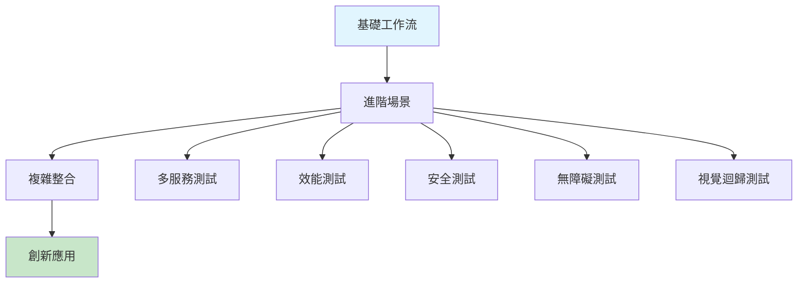

# 第七章：變奏曲 - 擴展 AI 工作流到複雜場景

## 學習目標

完成本章後，你將能夠：

1. **擴展應用**：將 AI 工作流應用到多服務整合、效能測試等複雜場景
2. **模式識別**：識別並應用進階 AI 編排模式
3. **優化策略**：優化提示詞和工作流以處理大型專案
4. **創新思維**：探索 AI 測試的創新應用領域

## 本章概覽



## 章節結構

### 7.1 多服務整合測試
學習如何讓 AI 協調複雜的微服務測試場景

### 7.2 AI 驅動的效能測試
使用 AI 識別效能瓶頸並生成壓力測試腳本

### 7.3 自動化安全測試
讓 AI 成為你的安全顧問，自動發現潛在漏洞

### 7.4 無障礙測試自動化
確保你的應用對所有使用者都友善

### 7.5 視覺迴歸測試
使用 AI 檢測視覺變化和 UI 一致性

## 技能檢查點

開始本章前，請確認你已經：

- ✅ 掌握基本的 AI 提示詞設計
- ✅ 能夠編排完整的測試循環
- ✅ 理解自我修復工作流
- ✅ 準備好挑戰更複雜的場景

## 學習路徑

```
初級路徑（2-3小時）
├── 7.1 多服務整合測試基礎
└── 選擇一個進階場景深入練習

進階路徑（4-5小時）
├── 完成所有五個進階場景
├── 實作至少兩個案例研究
└── 創建自己的測試模式

專家路徑（6+小時）
├── 所有內容
├── 設計新的 AI 測試模式
└── 貢獻到社群模式庫
```

## 本章工具箱

### 新增工具和技術
- **K6**：效能測試
- **OWASP ZAP**：安全測試
- **Axe**：無障礙測試
- **Percy**：視覺測試
- **Docker Compose**：多服務編排

### AI 工具進階應用
- 多模型協作（Claude + Gemini）
- 鏈式提示詞（Chain-of-Thought）
- 少樣本學習（Few-shot Learning）
- 自適應提示詞優化

## 實作專案預覽

### 專案 1：電商平台完整測試
```
系統架構：
- 前端：React SPA
- API Gateway
- 訂單服務
- 庫存服務
- 支付服務
- 通知服務

測試範圍：
- 端到端購物流程
- 服務間整合
- 負載測試
- 安全掃描
- 無障礙合規
```

### 專案 2：社交媒體應用測試套件
```
測試焦點：
- 即時通訊功能
- 媒體上傳處理
- 隱私設定驗證
- 效能基準測試
- 視覺一致性檢查
```

## 學習資源

### 必讀材料
- [進階 Playwright 技巧](/workshop/chapter-07/resources/advanced-playwright.md)
- [AI 測試模式目錄](/workshop/chapter-07/patterns/README.md)
- [複雜系統測試策略](/workshop/chapter-07/resources/complex-systems.md)

### 參考案例
- [Netflix 的混沌工程實踐](/workshop/chapter-07/case-studies/netflix-chaos.md)
- [Amazon 的自動化測試策略](/workshop/chapter-07/case-studies/amazon-testing.md)
- [Google 的無障礙測試框架](/workshop/chapter-07/case-studies/google-a11y.md)

## 開始探索

準備好將你的 AI 測試技能提升到新高度了嗎？讓我們從第一個進階場景開始：

### [→ 進入 7.1 多服務整合測試](./advanced/multi-service-testing.md)

---

## 討論與支援

遇到挑戰？有創新想法？歡迎參與討論：

- 💬 [GitHub Discussions - 第七章討論區](https://github.com/[your-repo]/discussions/categories/chapter-7)
- 🎯 [提交你的測試模式](https://github.com/[your-repo]/issues/new?template=pattern-submission.md)
- 🏆 [查看社群最佳實踐](./showcase/README.md)

## 章節導航

⬅️ [第六章：終章 - 自我修復循環](../chapter-06/README.md)
➡️ [第八章：總譜 - 獨立專案挑戰](../chapter-08/README.md)
🏠 [回到工作坊首頁](../../README.md)