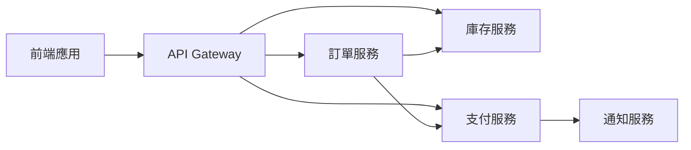

# 7.1 多服務整合測試

## 學習目標

- 設計跨服務的測試場景
- 使用 AI 生成服務間通訊測試
- 實作服務隔離和模擬策略
- 處理分散式系統的測試挑戰

## 概念介紹

在微服務架構中，測試的複雜度呈指數級增長。每個服務可能有自己的資料庫、API 和依賴關係。AI 可以幫助我們：

1. **理解服務拓撲**：分析系統架構圖和 API 文檔
2. **生成整合測試**：自動產生服務間的測試案例
3. **處理非同步流程**：設計適當的等待和重試機制
4. **模擬服務故障**：測試系統的容錯能力

## 實戰演練

### 場景設定

我們將測試一個簡化的電商系統：



### 步驟 1：讓 AI 分析系統架構

創建架構描述文件 `system-architecture.md`：

```markdown
# 電商系統架構

## 服務列表
1. API Gateway (port 3000)
2. 訂單服務 (port 3001)
3. 庫存服務 (port 3002)
4. 支付服務 (port 3003)
5. 通知服務 (port 3004)

## 主要流程
1. 用戶下單
2. 檢查庫存
3. 創建訂單
4. 處理支付
5. 發送通知
```

### 步驟 2：生成 Docker Compose 配置

**提示詞範例**：

```
你是一位微服務架構專家。基於以下系統架構，生成一個 Docker Compose 配置文件來運行所有服務：

[貼上架構描述]

要求：
1. 每個服務使用獨立的容器
2. 設定適當的網路連接
3. 包含健康檢查
4. 添加環境變數配置
5. 考慮服務啟動順序
```

### 步驟 3：設計整合測試策略

**進階提示詞**：

```
作為測試架構師，為這個微服務系統設計完整的整合測試策略：

系統描述：[貼上架構]

請包含：
1. 關鍵業務流程的 E2E 測試
2. 服務間 API 契約測試
3. 故障注入測試（Chaos Testing）
4. 資料一致性驗證
5. 效能基準測試

對每個測試類型，提供：
- 測試目標
- 具體測試案例
- 預期結果
- 失敗處理策略
```

### 步驟 4：生成 Playwright 測試腳本

**鏈式提示詞範例**：

```
第一步 - 生成測試骨架：
基於以下測試策略，生成 Playwright 測試的基本結構...

第二步 - 添加服務互動：
擴展測試以包含服務間的互動驗證...

第三步 - 加入錯誤處理：
添加重試機制和錯誤恢復邏輯...

第四步 - 優化等待策略：
實作智能等待以處理非同步操作...
```

## 實作範例

### 完整的訂單流程測試

```javascript
// tests/e2e/order-flow.spec.js
import { test, expect } from '@playwright/test';
import { ApiHelper } from '../helpers/api-helper';
import { ServiceMonitor } from '../helpers/service-monitor';

test.describe('完整訂單流程', () => {
  let apiHelper;
  let monitor;
  
  test.beforeAll(async () => {
    apiHelper = new ApiHelper();
    monitor = new ServiceMonitor();
    
    // 確認所有服務都在運行
    await monitor.waitForAllServices({
      services: ['gateway', 'orders', 'inventory', 'payment', 'notification'],
      timeout: 30000
    });
  });
  
  test('應該成功完成訂單從下單到通知', async ({ page }) => {
    // 1. 準備測試資料
    const product = await apiHelper.createTestProduct({
      name: '測試商品',
      price: 999,
      stock: 10
    });
    
    // 2. 監控服務呼叫
    const serviceTrace = monitor.startTrace();
    
    // 3. 執行訂單流程
    await page.goto('http://localhost:3000');
    await page.click(`[data-product-id="${product.id}"]`);
    await page.click('button:has-text("加入購物車")');
    await page.click('button:has-text("結帳")');
    
    // 4. 填寫支付資訊
    await page.fill('#card-number', '4242424242424242');
    await page.fill('#card-expiry', '12/25');
    await page.fill('#card-cvc', '123');
    await page.click('button:has-text("確認支付")');
    
    // 5. 驗證訂單創建
    await expect(page.locator('.order-success')).toBeVisible();
    const orderId = await page.locator('.order-id').textContent();
    
    // 6. 驗證服務間通訊
    const trace = await serviceTrace.stop();
    expect(trace.calls).toContainEqual(
      expect.objectContaining({
        from: 'orders',
        to: 'inventory',
        method: 'POST',
        path: '/reserve'
      })
    );
    
    // 7. 驗證最終狀態
    const order = await apiHelper.getOrder(orderId);
    expect(order.status).toBe('completed');
    
    const inventory = await apiHelper.getInventory(product.id);
    expect(inventory.available).toBe(9);
    
    const notification = await apiHelper.getLatestNotification();
    expect(notification.type).toBe('order_completed');
  });
  
  test('應該優雅處理支付失敗', async ({ page }) => {
    // 模擬支付服務故障
    await monitor.simulateServiceFailure('payment', {
      errorRate: 1.0,
      duration: 5000
    });
    
    // ... 測試支付失敗的處理邏輯
  });
});
```

## 進階技巧

### 1. 服務虛擬化

使用 AI 生成服務模擬：

```
為以下服務生成 Mock Server：
- 服務名稱：支付服務
- API 端點：[列出端點]
- 回應格式：JSON
- 包含成功和失敗場景
- 支援延遲模擬
```

### 2. 契約測試

讓 AI 生成 Pact 測試：

```
基於以下 OpenAPI 規範，生成消費者驅動的契約測試：
[貼上 OpenAPI 文檔]

使用 Pact 框架，確保：
1. 覆蓋所有端點
2. 包含邊界案例
3. 驗證回應格式
```

### 3. 混沌工程測試

```javascript
// chaos-tests/network-failure.spec.js
test('系統應該容忍網路分區', async () => {
  const chaos = new ChaosMonkey();
  
  // 在訂單和支付服務間製造網路延遲
  await chaos.injectLatency({
    from: 'orders',
    to: 'payment',
    latency: 5000,
    jitter: 1000
  });
  
  // 執行訂單流程並驗證容錯機制
  // ...
});
```

## 實作練習

### 練習 1：設計服務依賴矩陣

創建一個服務依賴矩陣，識別關鍵依賴路徑：

```
任務：分析你的系統並創建依賴矩陣
目標：識別單點故障和關鍵路徑
交付物：dependency-matrix.md
```

### 練習 2：實作斷路器測試

```
任務：測試斷路器模式的實作
場景：當支付服務失敗率超過 50% 時
預期：系統切換到降級模式
```

### 練習 3：分散式追蹤驗證

```
任務：實作分散式追蹤的測試驗證
工具：使用 OpenTelemetry
目標：確保請求在所有服務中都有正確的追蹤 ID
```

## 常見陷阱與解決方案

### 陷阱 1：測試環境不一致

**問題**：不同環境的服務版本不同步

**解決方案**：
```yaml
# 使用版本鎖定的 Docker Compose
services:
  orders:
    image: myapp/orders:${VERSION:-latest}
    environment:
      - ENV=${ENVIRONMENT:-test}
```

### 陷阱 2：非同步操作的時序問題

**問題**：訊息佇列的非同步處理導致測試不穩定

**解決方案**：
```javascript
// 使用智能等待和輪詢
async function waitForAsyncOperation(condition, timeout = 10000) {
  const startTime = Date.now();
  while (Date.now() - startTime < timeout) {
    if (await condition()) return true;
    await new Promise(resolve => setTimeout(resolve, 500));
  }
  throw new Error('Async operation timeout');
}
```

## 延伸閱讀

- [Martin Fowler - 微服務測試策略](https://martinfowler.com/articles/microservice-testing/)
- [Google - 分散式系統測試最佳實踐](https://sre.google/sre-book/testing-reliability/)
- [Netflix - 混沌工程原則](https://principlesofchaos.org/)

## 下一步

恭喜！你已經掌握了多服務整合測試的核心概念。接下來，讓我們探索如何使用 AI 進行效能測試：

### [→ 7.2 AI 驅動的效能測試](./performance-testing.md)

---

[← 返回第七章主頁](../README.md) | [查看所有進階場景 →](./README.md)