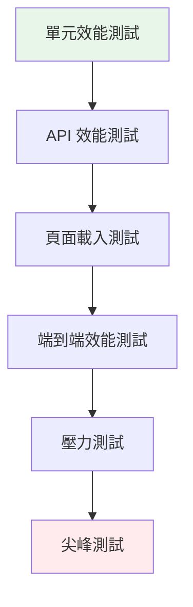

# 7.2 AI 驅動的效能測試

## 學習目標

- 使用 AI 識別效能瓶頸
- 生成智能負載測試腳本
- 分析效能測試結果
- 優化應用效能

## 核心概念

### 效能測試金字塔



## 實戰指南

### 步驟 1：效能需求分析

**AI 提示詞**：

```
分析以下應用並建議效能測試策略：

應用類型：電商網站
預期用戶數：10,000 日活躍用戶
尖峰時段：每日 20:00-22:00
關鍵業務指標：
- 頁面載入時間 < 3秒
- API 回應時間 < 500ms
- 併發用戶數 > 1000

請提供：
1. 效能測試場景設計
2. 關鍵效能指標 (KPI)
3. 測試工具建議
4. 負載模型設計
```

### 步驟 2：生成 K6 測試腳本

**進階提示詞**：

```
基於以下 API 規範，生成 K6 效能測試腳本：

API 端點：
- POST /api/login
- GET /api/products
- POST /api/cart/add
- POST /api/checkout

測試要求：
1. 模擬真實用戶行為流程
2. 逐步增加負載（ramp-up）
3. 包含思考時間（think time）
4. 收集詳細的效能指標
5. 設定效能閾值

負載模式：
- 階段 1：10 用戶，2 分鐘
- 階段 2：50 用戶，5 分鐘  
- 階段 3：100 用戶，10 分鐘
- 階段 4：降至 10 用戶，2 分鐘
```

### 生成的 K6 腳本範例

```javascript
// performance-tests/load-test.js
import http from 'k6/http';
import { check, sleep } from 'k6';
import { Rate, Trend } from 'k6/metrics';

// 自定義指標
const loginErrorRate = new Rate('login_errors');
const checkoutDuration = new Trend('checkout_duration');

// 測試配置
export const options = {
  stages: [
    { duration: '2m', target: 10 },   // 預熱階段
    { duration: '5m', target: 50 },   // 負載上升
    { duration: '10m', target: 100 }, // 峰值負載
    { duration: '2m', target: 10 },   // 降溫階段
  ],
  thresholds: {
    http_req_duration: ['p(95)<500'],  // 95% 請求小於 500ms
    http_req_failed: ['rate<0.1'],     // 錯誤率小於 10%
    login_errors: ['rate<0.05'],       // 登入錯誤率小於 5%
  },
};

export default function () {
  const BASE_URL = __ENV.BASE_URL || 'http://localhost:3000';
  
  // 1. 登入流程
  const loginRes = http.post(`${BASE_URL}/api/login`, {
    username: `user_${__VU}@test.com`,
    password: 'password123',
  });
  
  check(loginRes, {
    'login successful': (r) => r.status === 200,
    'auth token received': (r) => r.json('token') !== '',
  });
  
  loginErrorRate.add(loginRes.status !== 200);
  
  if (loginRes.status !== 200) return;
  
  const authHeaders = {
    headers: {
      Authorization: `Bearer ${loginRes.json('token')}`,
    },
  };
  
  sleep(Math.random() * 3 + 1); // 思考時間 1-4 秒
  
  // 2. 瀏覽產品
  const productsRes = http.get(`${BASE_URL}/api/products`, authHeaders);
  check(productsRes, {
    'products loaded': (r) => r.status === 200,
    'products array not empty': (r) => r.json('products').length > 0,
  });
  
  sleep(Math.random() * 5 + 2); // 瀏覽時間 2-7 秒
  
  // 3. 加入購物車
  const products = productsRes.json('products');
  if (products && products.length > 0) {
    const randomProduct = products[Math.floor(Math.random() * products.length)];
    
    const addToCartRes = http.post(
      `${BASE_URL}/api/cart/add`,
      JSON.stringify({
        productId: randomProduct.id,
        quantity: Math.floor(Math.random() * 3) + 1,
      }),
      authHeaders
    );
    
    check(addToCartRes, {
      'item added to cart': (r) => r.status === 200,
    });
  }
  
  sleep(Math.random() * 2 + 1); // 決策時間 1-3 秒
  
  // 4. 結帳流程
  const checkoutStart = Date.now();
  const checkoutRes = http.post(
    `${BASE_URL}/api/checkout`,
    JSON.stringify({
      paymentMethod: 'credit_card',
      shippingAddress: '123 Test St',
    }),
    authHeaders
  );
  
  checkoutDuration.add(Date.now() - checkoutStart);
  
  check(checkoutRes, {
    'checkout successful': (r) => r.status === 200,
    'order ID received': (r) => r.json('orderId') !== '',
  });
  
  sleep(1); // 完成後短暫停留
}
```

### 步驟 3：使用 Playwright 進行前端效能測試

**AI 提示詞**：

```
生成 Playwright 測試來測量前端效能指標：

測量指標：
1. First Contentful Paint (FCP)
2. Largest Contentful Paint (LCP)
3. Time to Interactive (TTI)
4. Cumulative Layout Shift (CLS)
5. Total Blocking Time (TBT)

測試場景：
- 首頁載入
- 產品列表頁
- 產品詳情頁
- 購物車頁面
- 結帳流程

包含網路節流和 CPU 節流模擬
```

### 生成的 Playwright 效能測試

```javascript
// performance-tests/frontend-performance.spec.js
import { test, expect } from '@playwright/test';

test.describe('前端效能測試', () => {
  test.use({
    // 模擬 3G 網路
    offline: false,
    downloadThroughput: (1.6 * 1024 * 1024) / 8,
    uploadThroughput: (750 * 1024) / 8,
    latency: 150,
  });
  
  test('首頁載入效能', async ({ page, browser }) => {
    // 啟用 CPU 節流
    const context = await browser.newContext();
    const cdpSession = await context.newCDPSession(page);
    await cdpSession.send('Emulation.setCPUThrottlingRate', { rate: 4 });
    
    // 收集效能指標
    const metrics = [];
    
    page.on('domcontentloaded', () => {
      metrics.push({ event: 'DOMContentLoaded', time: Date.now() });
    });
    
    page.on('load', () => {
      metrics.push({ event: 'Load', time: Date.now() });
    });
    
    const startTime = Date.now();
    await page.goto('http://localhost:3000', { waitUntil: 'networkidle' });
    
    // 取得 Web Vitals
    const webVitals = await page.evaluate(() => {
      return new Promise((resolve) => {
        new PerformanceObserver((list) => {
          const entries = list.getEntries();
          const vitals = {};
          
          entries.forEach((entry) => {
            if (entry.entryType === 'paint') {
              if (entry.name === 'first-contentful-paint') {
                vitals.FCP = entry.startTime;
              }
            } else if (entry.entryType === 'largest-contentful-paint') {
              vitals.LCP = entry.startTime;
            }
          });
          
          resolve(vitals);
        }).observe({ entryTypes: ['paint', 'largest-contentful-paint'] });
        
        // 觸發 LCP 計算
        setTimeout(() => {}, 100);
      });
    });
    
    // 計算 TTI
    const tti = await page.evaluate(() => {
      return new Promise((resolve) => {
        if ('PerformanceLongTaskTiming' in window) {
          const observer = new PerformanceObserver((list) => {
            const entries = list.getEntries();
            const lastLongTask = entries[entries.length - 1];
            if (lastLongTask) {
              resolve(lastLongTask.startTime + lastLongTask.duration);
            }
          });
          observer.observe({ entryTypes: ['longtask'] });
          
          // 等待足夠時間以捕獲所有長任務
          setTimeout(() => resolve(performance.now()), 5000);
        } else {
          resolve(performance.now());
        }
      });
    });
    
    // 測量 CLS
    const cls = await page.evaluate(() => {
      return new Promise((resolve) => {
        let clsScore = 0;
        const observer = new PerformanceObserver((list) => {
          for (const entry of list.getEntries()) {
            if (!entry.hadRecentInput) {
              clsScore += entry.value;
            }
          }
        });
        observer.observe({ entryTypes: ['layout-shift'] });
        
        setTimeout(() => resolve(clsScore), 5000);
      });
    });
    
    // 驗證效能閾值
    expect(webVitals.FCP).toBeLessThan(1800); // FCP < 1.8s
    expect(webVitals.LCP).toBeLessThan(2500); // LCP < 2.5s
    expect(tti).toBeLessThan(3800);           // TTI < 3.8s
    expect(cls).toBeLessThan(0.1);            // CLS < 0.1
    
    // 生成效能報告
    console.log('效能測試結果：', {
      FCP: `${webVitals.FCP}ms`,
      LCP: `${webVitals.LCP}ms`,
      TTI: `${tti}ms`,
      CLS: cls,
      totalLoadTime: `${Date.now() - startTime}ms`,
    });
  });
  
  test('測量資源載入效能', async ({ page }) => {
    await page.goto('http://localhost:3000');
    
    const resourceTimings = await page.evaluate(() => {
      const resources = performance.getEntriesByType('resource');
      return resources.map(r => ({
        name: r.name,
        type: r.initiatorType,
        duration: r.duration,
        size: r.transferSize,
      }));
    });
    
    // 分析資源載入
    const jsResources = resourceTimings.filter(r => r.type === 'script');
    const cssResources = resourceTimings.filter(r => r.type === 'link');
    const imgResources = resourceTimings.filter(r => r.type === 'img');
    
    console.log('資源載入分析：', {
      JavaScript: {
        count: jsResources.length,
        totalSize: jsResources.reduce((sum, r) => sum + r.size, 0),
        totalDuration: jsResources.reduce((sum, r) => sum + r.duration, 0),
      },
      CSS: {
        count: cssResources.length,
        totalSize: cssResources.reduce((sum, r) => sum + r.size, 0),
        totalDuration: cssResources.reduce((sum, r) => sum + r.duration, 0),
      },
      Images: {
        count: imgResources.length,
        totalSize: imgResources.reduce((sum, r) => sum + r.size, 0),
        totalDuration: imgResources.reduce((sum, r) => sum + r.duration, 0),
      },
    });
    
    // 檢查是否有過大的資源
    const largeResources = resourceTimings.filter(r => r.size > 500000); // > 500KB
    expect(largeResources.length).toBe(0);
  });
});
```

## AI 分析效能結果

### 提示詞：分析測試結果

```
分析以下 K6 效能測試結果並提供優化建議：

測試摘要：
- 虛擬用戶數：100
- 測試時長：19 分鐘
- 總請求數：45,230
- 失敗請求：423

回應時間統計：
- 平均：320ms
- 中位數：250ms
- P95：780ms
- P99：1,250ms

錯誤分析：
- 500 錯誤：123 次
- 超時錯誤：300 次
- 連接錯誤：0 次

請提供：
1. 效能瓶頸分析
2. 優化建議（按優先級排序）
3. 架構改進方案
4. 快取策略建議
```

## 進階技巧

### 1. 自動效能回歸測試

```javascript
// CI/CD 整合腳本
const performanceBaseline = {
  FCP: 1500,
  LCP: 2000,
  TTI: 3000,
  CLS: 0.05,
};

function compareWithBaseline(currentMetrics) {
  const regressions = [];
  
  for (const [metric, baseline] of Object.entries(performanceBaseline)) {
    const current = currentMetrics[metric];
    const degradation = ((current - baseline) / baseline) * 100;
    
    if (degradation > 10) {
      regressions.push({
        metric,
        baseline,
        current,
        degradation: `${degradation.toFixed(1)}%`,
      });
    }
  }
  
  return regressions;
}
```

### 2. AI 驅動的效能預測

```
基於歷史效能資料，預測未來負載下的系統表現：

歷史資料：
- 10 用戶：回應時間 100ms
- 50 用戶：回應時間 250ms
- 100 用戶：回應時間 450ms

預測：
- 200 用戶的預期回應時間？
- 系統的最大承載能力？
- 何時需要擴容？
```

## 實作練習

### 練習 1：設計綜合效能測試

```
任務：為你的應用設計完整的效能測試套件
包含：
- 負載測試
- 壓力測試
- 尖峰測試
- 浸泡測試
交付物：performance-test-suite.js
```

### 練習 2：實作效能監控儀表板

```
任務：創建實時效能監控儀表板
工具：Grafana + InfluxDB
指標：回應時間、吞吐量、錯誤率、CPU/記憶體使用率
```

## 下一步

準備好探索 AI 在安全測試中的應用了嗎？

### [→ 7.3 自動化安全測試](./security-testing.md)

---

[← 返回 7.1 多服務整合測試](./multi-service-testing.md) | [查看所有進階場景 →](./README.md)