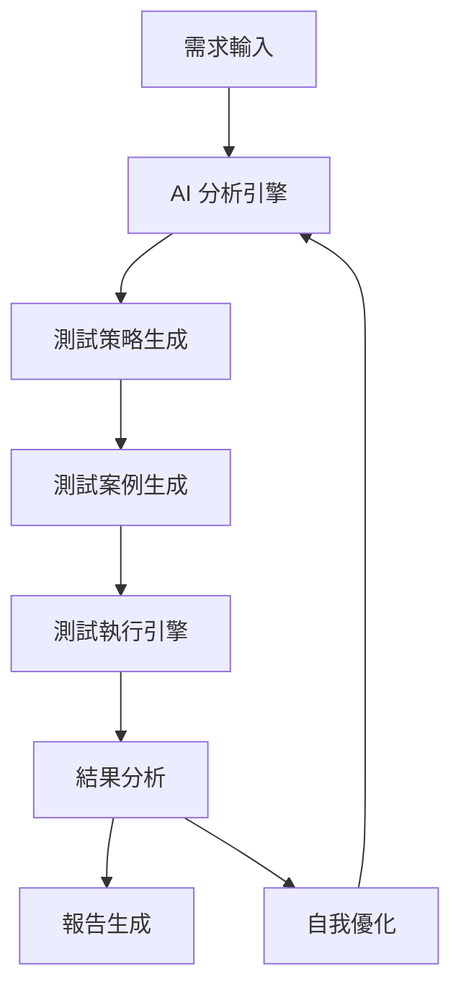

# 第七章：進階練習集

## 練習總覽

這些練習旨在鞏固和擴展你的 AI 測試編排能力，每個練習都模擬真實世界的挑戰。

## 練習難度分級

- 🟢 **基礎**：30-45 分鐘，單一技能焦點
- 🟡 **中級**：45-60 分鐘，多技能整合
- 🔴 **進階**：60+ 分鐘，綜合挑戰

---

## 練習 1：微服務斷路器測試 🟡

### 目標
實作和測試微服務間的斷路器模式

### 背景
你的電商平台在黑色星期五遇到了支付服務故障，導致整個系統癱瘓。現在需要實作斷路器模式並徹底測試。

### 任務
1. 使用 AI 生成斷路器實作
2. 設計故障注入測試
3. 驗證降級策略
4. 測試恢復機制

### 起始程式碼
```javascript
// circuit-breaker/starter.js
class CircuitBreaker {
  constructor(service, options = {}) {
    this.service = service;
    this.failureThreshold = options.failureThreshold || 5;
    this.timeout = options.timeout || 60000;
    this.state = 'CLOSED'; // CLOSED, OPEN, HALF_OPEN
    // TODO: 實作斷路器邏輯
  }
  
  async call(...args) {
    // TODO: 實作呼叫邏輯
  }
}

// 你的任務：
// 1. 完成斷路器實作
// 2. 創建測試場景
// 3. 驗證各種狀態轉換
```

### 評估標準
- 斷路器正確實作
- 完整的狀態機測試
- 故障恢復測試
- 效能影響評估

### 提示
```markdown
使用以下 AI 提示詞開始：
"幫我實作一個完整的斷路器模式，包含：
1. 三種狀態的管理
2. 失敗計數和閾值檢查
3. 自動恢復機制
4. 完整的單元測試"
```

---

## 練習 2：智能負載測試 🟡

### 目標
使用 AI 設計自適應的負載測試策略

### 場景
你的社交媒體應用需要處理突發的病毒式傳播流量。設計一個智能負載測試，能夠模擬真實的流量模式。

### 任務
1. 分析真實流量模式
2. 生成動態負載腳本
3. 實作自適應測試策略
4. 生成詳細效能報告

### 資料範例
```json
{
  "trafficPatterns": {
    "normal": {
      "users": 1000,
      "requestsPerUser": 10,
      "distribution": "gaussian"
    },
    "viral": {
      "users": 50000,
      "requestsPerUser": 50,
      "distribution": "exponential",
      "duration": "5 minutes"
    },
    "decline": {
      "users": 5000,
      "requestsPerUser": 5,
      "distribution": "linear_decay"
    }
  }
}
```

### 期望輸出
- K6 負載測試腳本
- Grafana 儀表板配置
- 效能瓶頸分析報告
- 擴容建議

---

## 練習 3：視覺迴歸測試自動化 🟢

### 目標
建立自動化的視覺迴歸測試流程

### 需求
你的設計團隊經常更新 UI，需要確保沒有意外的視覺變化。

### 任務
1. 設定視覺測試基準
2. 實作截圖比對
3. 處理動態內容
4. 生成視覺差異報告

### 起始設定
```javascript
// visual-regression/config.js
export const visualTestConfig = {
  baseUrl: 'http://localhost:3000',
  viewports: [
    { width: 1920, height: 1080, name: 'desktop' },
    { width: 768, height: 1024, name: 'tablet' },
    { width: 375, height: 667, name: 'mobile' }
  ],
  pages: [
    { path: '/', name: 'homepage' },
    { path: '/products', name: 'products' },
    { path: '/checkout', name: 'checkout' }
  ],
  threshold: 0.1, // 10% 差異容忍度
  ignoreRegions: ['.timestamp', '.ad-banner']
};
```

---

## 練習 4：安全測試整合 🔴

### 目標
整合自動化安全測試到 CI/CD 流程

### 挑戰
實作 OWASP Top 10 的自動化測試，包含 SQL 注入、XSS、CSRF 等。

### 任務清單
```markdown
- [ ] 設定 OWASP ZAP 代理
- [ ] 生成安全測試案例
- [ ] 實作認證繞過測試
- [ ] 測試敏感資料洩露
- [ ] 產生安全報告
- [ ] 整合到 CI/CD
```

### 安全測試模板
```javascript
// security-tests/owasp-top-10.spec.js
describe('OWASP Top 10 Security Tests', () => {
  test('SQL Injection Prevention', async () => {
    // TODO: 實作 SQL 注入測試
  });
  
  test('XSS Protection', async () => {
    // TODO: 實作 XSS 測試
  });
  
  test('Authentication Security', async () => {
    // TODO: 測試認證機制
  });
  
  test('Sensitive Data Exposure', async () => {
    // TODO: 檢查敏感資料保護
  });
});
```

---

## 練習 5：無障礙測試套件 🟡

### 目標
建立完整的無障礙測試套件，確保 WCAG 2.1 AA 合規

### 要求
1. 自動化無障礙檢查
2. 鍵盤導航測試
3. 螢幕閱讀器相容性
4. 色彩對比驗證

### 測試框架
```javascript
// a11y-tests/wcag-compliance.spec.js
import { test, expect } from '@playwright/test';
import { injectAxe, checkA11y } from 'axe-playwright';

test.describe('WCAG 2.1 AA Compliance', () => {
  test('Homepage accessibility', async ({ page }) => {
    await page.goto('/');
    await injectAxe(page);
    
    // TODO: 實作完整的無障礙測試
    const violations = await checkA11y(page, null, {
      detailedReport: true,
      detailedReportOptions: {
        html: true
      }
    });
    
    expect(violations).toHaveLength(0);
  });
  
  test('Keyboard navigation', async ({ page }) => {
    // TODO: 測試純鍵盤操作
  });
  
  test('Screen reader compatibility', async ({ page }) => {
    // TODO: 驗證 ARIA 標籤
  });
});
```

---

## 練習 6：多瀏覽器相容性測試 🟢

### 目標
自動化跨瀏覽器測試流程

### 支援瀏覽器
- Chrome (最新版)
- Firefox (最新版)
- Safari (最新版)
- Edge (最新版)

### 任務
1. 配置多瀏覽器環境
2. 執行平行測試
3. 收集相容性問題
4. 生成瀏覽器矩陣報告

---

## 練習 7：效能預算監控 🟡

### 目標
實作自動化的效能預算監控系統

### 效能預算
```json
{
  "performanceBudget": {
    "FCP": 1800,
    "LCP": 2500,
    "TTI": 3800,
    "CLS": 0.1,
    "bundleSize": {
      "javascript": 500000,
      "css": 100000,
      "images": 2000000
    },
    "requestCount": {
      "total": 50,
      "thirdParty": 10
    }
  }
}
```

### 期望功能
- 自動效能測試
- 預算違規警報
- 趨勢分析圖表
- 優化建議生成

---

## 練習 8：API 契約測試 🟡

### 目標
使用消費者驅動的契約測試確保 API 相容性

### 場景
你的團隊管理 5 個微服務，需要確保 API 變更不會破壞相依服務。

### 實作需求
1. 定義服務契約
2. 生成 Pact 測試
3. 設定契約驗證
4. 整合到部署流程

---

## 練習 9：混沌工程實驗 🔴

### 目標
實施混沌工程測試系統韌性

### 混沌實驗清單
```markdown
## 實驗場景

### 基礎設施層
- [ ] 隨機終止容器
- [ ] 網路延遲注入
- [ ] CPU/記憶體壓力
- [ ] 磁碟空間耗盡

### 應用層
- [ ] API 錯誤注入
- [ ] 資料庫連接中斷
- [ ] 快取失效
- [ ] 訊息佇列延遲

### 業務層
- [ ] 支付服務中斷
- [ ] 庫存不一致
- [ ] 訂單重複
- [ ] 用戶激增
```

### 評估標準
- 系統恢復時間
- 資料一致性
- 用戶影響範圍
- 警報有效性

---

## 練習 10：AI 測試助理開發 🔴

### 終極挑戰
開發一個 AI 測試助理，能夠：

1. **自動分析需求**
   - 解析用戶故事
   - 識別測試需求
   - 建議測試策略

2. **生成測試案例**
   - 根據程式碼生成測試
   - 優化測試覆蓋率
   - 處理邊界案例

3. **執行和分析**
   - 自動執行測試
   - 分析失敗原因
   - 提供修復建議

4. **持續優化**
   - 學習測試模式
   - 優化測試效率
   - 減少誤報

### 架構設計


---

## 提交你的解答

完成練習後，請遵循以下步驟提交：

1. **Fork 專案倉庫**
2. **創建分支**：`git checkout -b exercise-[number]-[your-name]`
3. **提交程式碼**：放在 `/exercises/solutions/` 目錄
4. **撰寫說明**：包含方法說明和學習心得
5. **提交 PR**：詳細描述你的解決方案

## 評分標準

每個練習將根據以下標準評分：

- **功能完整性** (40%)：是否完成所有要求
- **程式碼品質** (30%)：可讀性、可維護性
- **AI 使用** (20%)：有效利用 AI 工具
- **創新性** (10%)：創意解決方案

## 獲得幫助

遇到困難？使用以下資源：

- 📖 [練習提示和指導](./hints/README.md)
- 💬 [討論區](https://github.com/[your-repo]/discussions)
- 🎥 [練習講解影片](./videos/README.md)
- 📧 [導師協助](mailto:help@example.com)

---

記住：這些練習的目的不只是完成任務，更重要的是學習如何有效地運用 AI 來解決複雜的測試挑戰。享受探索的過程！

[← 返回第七章主頁](../README.md) | [查看解答範例 →](./solutions/README.md)