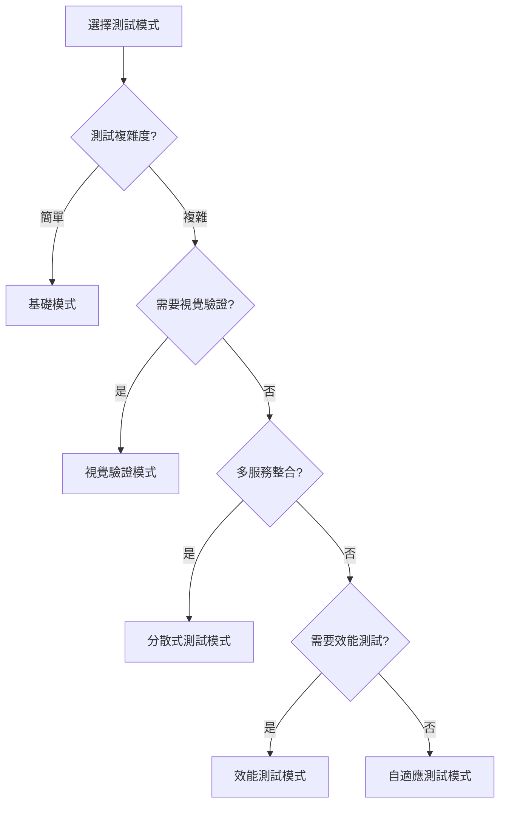

# AI 測試設計模式目錄

## 模式分類

### 1. 提示詞模式

#### 鏈式思考模式 (Chain-of-Thought)
```
模式名稱：鏈式思考測試設計
適用場景：複雜邏輯測試
優點：提高測試覆蓋率，減少遺漏

範例：
"讓我們一步步分析這個購物車功能：
1. 首先，識別所有可能的用戶操作...
2. 接著，考慮每個操作的邊界條件...
3. 然後，設計測試案例覆蓋這些場景...
4. 最後，組織成完整的測試套件..."
```

#### 少樣本學習模式 (Few-Shot Learning)
```
模式名稱：範例驅動測試生成
適用場景：特定格式的測試腳本生成
優點：確保輸出格式一致性

範例：
"基於以下範例生成類似的測試：

範例 1：
test('應該正確計算折扣', async () => {
  const result = calculateDiscount(100, 0.2);
  expect(result).toBe(80);
});

範例 2：
test('應該處理負數金額', async () => {
  const result = calculateDiscount(-100, 0.2);
  expect(result).toBe(0);
});

現在為以下功能生成測試：[新功能描述]"
```

### 2. 測試架構模式

#### 頁面物件模式增強版
```javascript
// AI 生成的智能頁面物件
class SmartLoginPage {
  constructor(page, ai) {
    this.page = page;
    this.ai = ai;
  }
  
  async login(username, password) {
    // AI 自動識別元素
    const elements = await this.ai.identifyElements({
      context: 'login form',
      expected: ['username input', 'password input', 'submit button']
    });
    
    await this.page.fill(elements.username, username);
    await this.page.fill(elements.password, password);
    await this.page.click(elements.submit);
  }
  
  async handleDynamicElements() {
    // AI 處理動態元素
    const strategy = await this.ai.suggestStrategy({
      problem: 'dynamic element IDs',
      context: await this.page.content()
    });
    
    return this.executeStrategy(strategy);
  }
}
```

#### 自適應測試模式
```javascript
class AdaptiveTest {
  async execute() {
    let testStrategy = this.initialStrategy;
    
    while (!this.isComplete()) {
      const result = await this.runTest(testStrategy);
      
      if (result.failed) {
        // 讓 AI 分析失敗並調整策略
        testStrategy = await this.ai.analyzeAndAdapt({
          failure: result.error,
          context: result.context,
          previousStrategy: testStrategy
        });
      }
      
      this.recordProgress(result);
    }
  }
}
```

### 3. 資料驅動模式

#### AI 測試資料生成器
```javascript
class AITestDataGenerator {
  async generateTestData(schema) {
    const prompt = `
      生成測試資料符合以下 schema：
      ${JSON.stringify(schema)}
      
      包含：
      1. 正常資料 (5個)
      2. 邊界資料 (3個)
      3. 異常資料 (2個)
    `;
    
    return await this.ai.generate(prompt);
  }
  
  async generatePersona(type) {
    // 生成不同類型的用戶測試資料
    const personas = {
      'power-user': { 
        behavior: 'fast navigation, keyboard shortcuts',
        data: await this.generatePowerUserData()
      },
      'new-user': {
        behavior: 'slow, exploratory, needs guidance',
        data: await this.generateNewUserData()
      },
      'mobile-user': {
        behavior: 'touch interactions, limited screen',
        data: await this.generateMobileUserData()
      }
    };
    
    return personas[type];
  }
}
```

### 4. 錯誤恢復模式

#### 智能重試模式
```javascript
class SmartRetry {
  constructor(ai) {
    this.ai = ai;
    this.maxRetries = 3;
  }
  
  async executeWithRetry(testFn, context) {
    let lastError;
    
    for (let i = 0; i < this.maxRetries; i++) {
      try {
        return await testFn();
      } catch (error) {
        lastError = error;
        
        // AI 分析錯誤並決定是否重試
        const analysis = await this.ai.analyzeError({
          error: error.message,
          stackTrace: error.stack,
          attemptNumber: i + 1,
          context
        });
        
        if (analysis.shouldRetry) {
          await this.applyFix(analysis.suggestedFix);
          await this.wait(analysis.waitTime);
        } else {
          throw error;
        }
      }
    }
    
    throw lastError;
  }
}
```

### 5. 驗證模式

#### 視覺驗證模式
```javascript
class VisualValidation {
  async validateLayout(page, description) {
    const screenshot = await page.screenshot();
    
    const validation = await this.ai.validateVisual({
      image: screenshot,
      expectedDescription: description,
      checkPoints: [
        'layout alignment',
        'color consistency',
        'text readability',
        'responsive design'
      ]
    });
    
    return validation;
  }
  
  async detectVisualRegression(before, after) {
    return await this.ai.compareImages({
      before,
      after,
      tolerance: 0.1,
      ignoreRegions: ['.timestamp', '.dynamic-content']
    });
  }
}
```

### 6. 報告生成模式

#### AI 增強測試報告
```javascript
class AITestReporter {
  async generateReport(testResults) {
    const analysis = await this.ai.analyze({
      results: testResults,
      metrics: ['pass rate', 'duration', 'flakiness'],
      trends: this.getHistoricalData()
    });
    
    return {
      summary: analysis.executiveSummary,
      insights: analysis.keyInsights,
      recommendations: analysis.recommendations,
      riskAssessment: analysis.risks,
      visualizations: await this.generateCharts(analysis)
    };
  }
  
  async explainFailure(testFailure) {
    return await this.ai.explain({
      error: testFailure.error,
      context: testFailure.context,
      previousRuns: testFailure.history,
      codeChanges: await this.getRecentChanges()
    });
  }
}
```

## 模式組合範例

### 完整測試流程整合
```javascript
class AITestOrchestrator {
  async runComprehensiveTest(feature) {
    // 1. 生成測試策略
    const strategy = await this.aiStrategyGenerator.create(feature);
    
    // 2. 生成測試資料
    const testData = await this.aiDataGenerator.generate(strategy.dataNeeds);
    
    // 3. 執行測試with智能重試
    const results = await this.smartRetry.executeWithRetry(
      () => this.runTests(strategy, testData)
    );
    
    // 4. 視覺驗證
    const visualResults = await this.visualValidator.validate(results.screenshots);
    
    // 5. 生成報告
    const report = await this.aiReporter.generateReport({
      ...results,
      visual: visualResults
    });
    
    // 6. 自我修復
    if (results.failures.length > 0) {
      const fixes = await this.aiHealer.proposeFixes(results.failures);
      await this.applyFixes(fixes);
    }
    
    return report;
  }
}
```

## 反模式警告

### 1. 過度依賴 AI
```
❌ 錯誤：完全依賴 AI 生成所有測試
✅ 正確：使用 AI 輔助，人類驗證關鍵邏輯
```

### 2. 忽略上下文
```
❌ 錯誤：使用通用提示詞
✅ 正確：提供充分的業務和技術上下文
```

### 3. 不驗證 AI 輸出
```
❌ 錯誤：直接執行 AI 生成的程式碼
✅ 正確：審查、測試、逐步整合
```

## 模式選擇指南



## 貢獻新模式

發現了新的 AI 測試模式？歡迎貢獻！

1. Fork 本專案
2. 在 `/patterns` 目錄新增你的模式
3. 包含：描述、範例程式碼、使用場景
4. 提交 Pull Request

---

[← 返回第七章主頁](../README.md) | [查看案例研究 →](../case-studies/README.md)