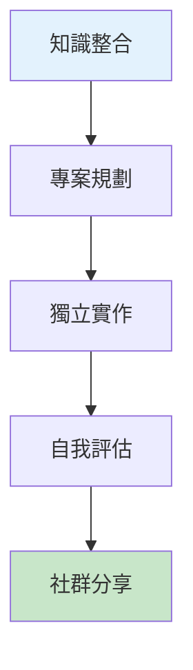
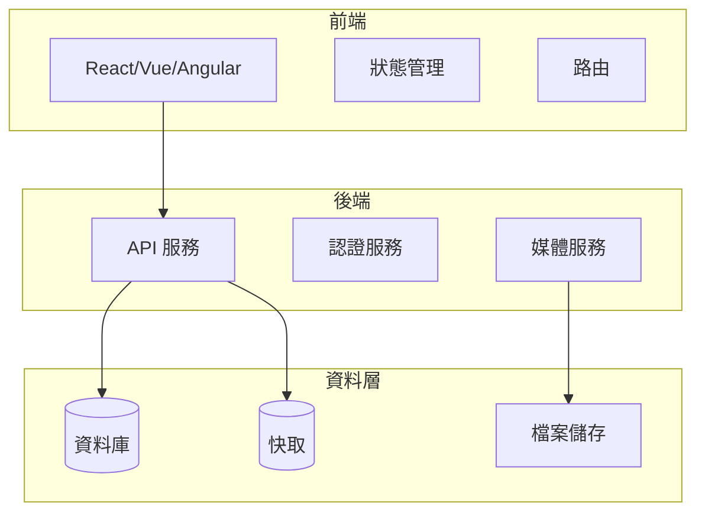

# 第八章：總譜 - 獨立端到端 AI 編排挑戰

## 學習目標

完成本章後，你將能夠：

1. **獨立編排**：獨立設計和執行完整的 AI 驅動開發流程
2. **綜合應用**：整合所有學到的技能和模式
3. **創新思維**：發展自己的 AI 工作流程和最佳實踐
4. **專業評估**：評估和優化 AI 輔助開發的效率

## 章節概覽



## 專案挑戰總覽

### 🎯 核心挑戰：線上學習平台

你將獨立使用 AI 工具，從零開始構建一個完整的線上學習平台，包含：

**功能需求**：
- 用戶註冊和登入系統
- 課程瀏覽和搜尋
- 影片播放和進度追蹤
- 測驗和作業提交
- 討論區和即時聊天
- 個人學習儀表板

**技術要求**：
- 前端：現代 JavaScript 框架
- 後端：RESTful API 或 GraphQL
- 資料庫：關聯式或 NoSQL
- 測試：>80% 覆蓋率
- 部署：容器化部署方案

## 評估標準

### 技術實作 (40%)

```markdown
## 評分項目

### 應用完整性 (10%)
- [ ] 所有核心功能正常運作
- [ ] 良好的錯誤處理
- [ ] 資料驗證完整

### 程式碼品質 (10%)
- [ ] 清晰的程式碼結構
- [ ] 遵循最佳實踐
- [ ] 適當的註釋和文檔

### 測試覆蓋 (10%)
- [ ] 單元測試覆蓋率 >80%
- [ ] E2E 測試覆蓋關鍵流程
- [ ] 效能測試基準

### 技術創新 (10%)
- [ ] 使用進階技術特性
- [ ] 優雅的問題解決方案
- [ ] 效能優化實作
```

### AI 編排能力 (40%)

```markdown
## 評分項目

### 提示詞設計 (15%)
- [ ] 清晰、具體的提示詞
- [ ] 有效的上下文提供
- [ ] 迭代優化證據

### 工具整合 (10%)
- [ ] 多個 AI 工具的協同使用
- [ ] 工具選擇的合理性
- [ ] 工作流程的流暢性

### 問題解決 (10%)
- [ ] 獨立診斷和解決問題
- [ ] AI 輔助的除錯過程
- [ ] 自我修復循環實作

### 效率提升 (5%)
- [ ] 開發時間的縮短
- [ ] 減少手動編碼量
- [ ] 提高程式碼品質
```

### 學習展示 (20%)

```markdown
## 評分項目

### 過程文檔 (10%)
- [ ] 清晰的開發日誌
- [ ] 決策過程記錄
- [ ] 學習心得總結

### 創新應用 (5%)
- [ ] 發現新的 AI 使用模式
- [ ] 創造性問題解決
- [ ] 超出預期的功能

### 知識分享 (5%)
- [ ] 高品質的專案展示
- [ ] 對社群的貢獻
- [ ] 幫助他人學習
```

## 專案執行指南

### 第一階段：規劃與設計（建議 2 小時）

#### 1.1 需求分析

```markdown
## AI 輔助需求分析模板

**提示詞範例**：
"我要建立一個線上學習平台，目標用戶是程式設計初學者。
請幫我：
1. 細化功能需求
2. 設計用戶故事
3. 建議技術架構
4. 識別潛在挑戰"
```

#### 1.2 架構設計



### 第二階段：核心開發（建議 4 小時）

#### 2.1 基礎設施搭建

**任務清單**：
```markdown
- [ ] 初始化專案結構
- [ ] 設定開發環境
- [ ] 配置版本控制
- [ ] 建立 CI/CD 管線
```

#### 2.2 功能實作順序

```markdown
1. **用戶系統** (1小時)
   - 註冊/登入 API
   - JWT 認證
   - 用戶資料管理

2. **課程管理** (1.5小時)
   - 課程 CRUD
   - 分類和標籤
   - 搜尋功能

3. **學習功能** (1小時)
   - 影片播放器整合
   - 進度追蹤
   - 筆記功能

4. **互動功能** (30分鐘)
   - 討論區基礎
   - 評論系統
```

### 第三階段：測試完善（建議 2 小時）

#### 3.1 測試策略

```javascript
// test-strategy.js
const testPlan = {
  unit: {
    coverage: 80,
    focus: ['業務邏輯', '資料驗證', '工具函數']
  },
  integration: {
    coverage: 60,
    focus: ['API 端點', '資料庫操作', '第三方整合']
  },
  e2e: {
    coverage: 'critical paths',
    scenarios: [
      '用戶註冊和登入流程',
      '完整的課程學習流程',
      '作業提交和評分流程'
    ]
  },
  performance: {
    targets: {
      pageLoad: '<3s',
      apiResponse: '<500ms',
      concurrentUsers: 100
    }
  }
};
```

#### 3.2 AI 輔助測試

**提示詞模板**：
```
分析以下程式碼並生成完整的測試套件：
[貼上程式碼]

要求：
1. 覆蓋所有公開方法
2. 包含正常和異常案例
3. 測試邊界條件
4. Mock 外部依賴
```

### 第四階段：優化部署（建議 1 小時）

#### 4.1 效能優化

```markdown
## 優化檢查清單

### 前端優化
- [ ] 程式碼分割和懶載入
- [ ] 圖片和資源優化
- [ ] 快取策略實作
- [ ] CDN 配置

### 後端優化
- [ ] 資料庫查詢優化
- [ ] API 回應快取
- [ ] 負載均衡配置
- [ ] 非同步處理

### 部署優化
- [ ] Docker 映像優化
- [ ] 環境變數管理
- [ ] 監控和日誌設定
- [ ] 自動擴展配置
```

### 第五階段：文檔展示（建議 1 小時）

#### 5.1 專案文檔模板

```markdown
# 線上學習平台 - AI 驅動開發專案

## 專案概述
[簡短描述專案目標和成果]

## 技術架構
[架構圖和技術選型說明]

## AI 工具使用
### 使用的 AI 工具
- Claude：程式碼生成和問題解決
- GitHub Copilot：即時程式碼建議
- [其他工具]

### 關鍵提示詞和技巧
[分享最有效的提示詞範例]

## 開發過程
### 時間線
- 規劃：X 小時
- 開發：X 小時
- 測試：X 小時
- 優化：X 小時

### 挑戰與解決
[記錄遇到的問題和解決方法]

## 成果展示
### 功能演示
[截圖或影片連結]

### 測試結果
- 測試覆蓋率：X%
- 效能指標：[列出關鍵指標]

## 學習心得
[反思 AI 輔助開發的優缺點]

## 未來改進
[列出可能的改進方向]
```

## 自我評估工具

### 評估矩陣

```typescript
interface ProjectEvaluation {
  technical: {
    functionality: number;    // 0-10
    codeQuality: number;      // 0-10
    testing: number;          // 0-10
    performance: number;      // 0-10
  };
  aiOrchestration: {
    promptEngineering: number; // 0-10
    toolIntegration: number;   // 0-10
    problemSolving: number;    // 0-10
    efficiency: number;        // 0-10
  };
  learning: {
    documentation: number;     // 0-10
    innovation: number;        // 0-10
    sharing: number;          // 0-10
  };
  
  calculateTotal(): number;
  generateReport(): string;
  identifyStrengths(): string[];
  suggestImprovements(): string[];
}
```

### 自我檢核表

```markdown
## 專案完成度檢核

### 必要功能 ✅
- [ ] 用戶認證系統運作正常
- [ ] 課程瀏覽和搜尋功能完整
- [ ] 影片播放和進度追蹤實作
- [ ] 基本的測驗功能
- [ ] 簡單的討論區

### 進階功能 🚀
- [ ] 即時聊天功能
- [ ] 個人化推薦系統
- [ ] 數據分析儀表板
- [ ] 行動裝置優化
- [ ] 多語言支援

### AI 應用 🤖
- [ ] 使用至少 3 個不同的 AI 工具
- [ ] 展示提示詞迭代優化過程
- [ ] 實作自我修復循環
- [ ] 創新的 AI 應用場景

### 品質指標 📊
- [ ] 程式碼測試覆蓋率 >80%
- [ ] 頁面載入時間 <3 秒
- [ ] 零關鍵錯誤
- [ ] 良好的使用者體驗
```

## 優秀專案範例

### 🏆 範例專案 1：智能學習助手

**特色**：
- 使用 AI 生成個人化學習路徑
- 自動化的程式碼評審系統
- 智能問答機器人

**創新點**：
- 整合多個 AI 模型協同工作
- 自適應的難度調整
- 即時的學習分析

[查看完整案例 →](./showcase/smart-learning-assistant.md)

### 🥈 範例專案 2：協作式程式設計平台

**特色**：
- 即時協作編輯器
- AI 輔助的程式碼審查
- 自動化測試和部署

**創新點**：
- WebRTC 即時通訊
- AI 配對程式設計建議
- 智能衝突解決

[查看完整案例 →](./showcase/collaborative-coding-platform.md)

## 進階挑戰（選修）

### 挑戰 1：多租戶架構
將平台擴展為支援多個組織/學校

### 挑戰 2：AI 課程生成
使用 AI 自動生成課程內容和測驗

### 挑戰 3：區塊鏈證書
整合區塊鏈發行課程完成證書

### 挑戰 4：AR/VR 學習體驗
加入沉浸式學習功能

## 社群參與

### 分享你的專案

1. **提交專案**
   - Fork 本倉庫
   - 在 `/showcase` 新增你的專案
   - 提交 Pull Request

2. **獲得回饋**
   - 在 Discussions 發布專案連結
   - 參與每週專案評審會議
   - 獲得導師和同儕回饋

3. **幫助他人**
   - 評審其他人的專案
   - 分享你的經驗和技巧
   - 貢獻到模式庫

### 認證和獎勵

完成專案並通過評審後，你將獲得：

- 🏅 **AI 指揮家認證**：證明你掌握了 AI 驅動開發
- 🌟 **社群貢獻者徽章**：表彰你的知識分享
- 📚 **進階資源存取**：獲得高級教程和工具

## 資源和支援

### 技術資源
- [API 文檔模板](./resources/api-docs-template.md)
- [部署指南](./resources/deployment-guide.md)
- [效能優化清單](./resources/performance-checklist.md)

### 學習資源
- [提示詞庫](./resources/prompt-library.md)
- [常見問題解答](./resources/faq.md)
- [疑難排解指南](./resources/troubleshooting.md)

### 社群支援
- 💬 [專案討論區](https://github.com/[your-repo]/discussions/categories/capstone)
- 🎥 [每週線上 Office Hours](https://meet.link/office-hours)
- 📧 [導師信箱](mailto:mentor@example.com)

## 開始你的挑戰

準備好展現你的 AI 指揮才能了嗎？

### [→ 開始專案規劃](./project/planning-guide.md)

記住：這不只是一個程式設計專案，而是展現你如何優雅地指揮 AI 完成複雜任務的機會。相信自己，你已經準備好了！

---

## 章節導航

⬅️ [第七章：變奏曲 - 擴展工作流](../chapter-07/README.md)
🏠 [回到工作坊首頁](../../README.md)

## 完成工作坊

🎉 **恭喜你！** 完成第八章意味著你已經掌握了 AI 驅動開發的完整流程。你現在是一位合格的 AI 指揮家了！

### 下一步建議

1. **持續實踐**：在實際專案中應用所學
2. **探索創新**：嘗試新的 AI 工具和技術
3. **知識分享**：將你的經驗分享給社群
4. **保持學習**：AI 技術日新月異，持續關注最新發展

感謝你參與這個學習之旅。期待看到你創造的精彩作品！

---

*"The best way to predict the future is to invent it." - Alan Kay*

*在 AI 時代，最好的創造方式是學會指揮 AI。*