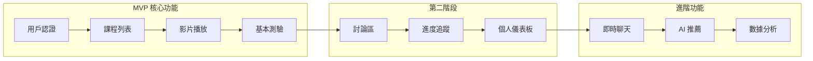
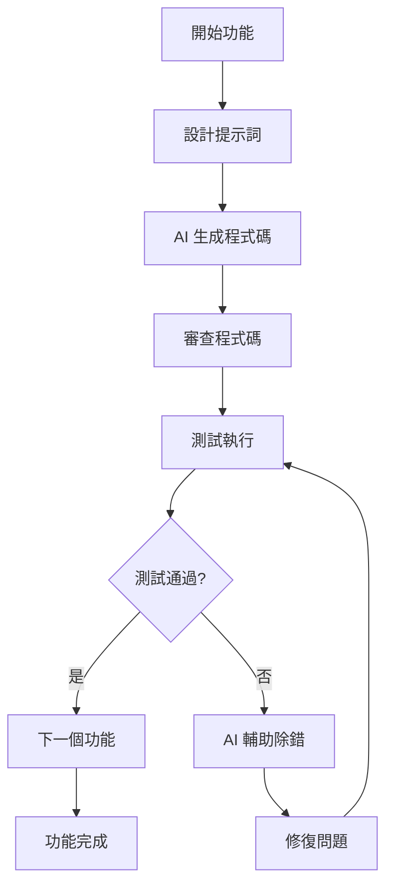

# 專案規劃指南

## 開始前的準備

### 心態設定

```markdown
## AI 指揮家的思維模式

不是：我要寫所有程式碼
而是：我要指揮 AI 完成開發

不是：AI 會自動完成一切
而是：我要優雅地編排 AI 工具

不是：遇到問題就手動解決
而是：讓 AI 幫助診斷和修復
```

### 工具準備清單

```markdown
## 必要工具
- [ ] Claude (主要程式碼生成)
- [ ] 程式碼編輯器 (VS Code/Cursor)
- [ ] Git 版本控制
- [ ] Node.js 和 npm/yarn
- [ ] Docker (選用)

## 建議工具
- [ ] GitHub Copilot (即時輔助)
- [ ] Playwright (測試框架)
- [ ] 其他 AI 工具 (Gemini, ChatGPT 等)
```

## 第一步：需求分析（30分鐘）

### 1.1 理解專案範圍

使用以下提示詞模板開始：

```markdown
## 初始分析提示詞

我要建立一個線上學習平台，核心功能包括：
1. 用戶註冊和登入
2. 課程瀏覽和搜尋
3. 影片播放和進度追蹤
4. 測驗和作業提交
5. 討論區
6. 個人學習儀表板

請幫我：
1. 細化每個功能的具體需求
2. 識別必要的資料模型
3. 建議適合的技術架構
4. 列出潛在的技術挑戰
5. 提供開發優先順序建議
```

### 1.2 用戶故事設計

```markdown
## 用戶故事模板

作為 [用戶角色]
我想要 [功能/行為]
以便於 [價值/目的]

範例：
- 作為學生，我想要追蹤學習進度，以便於了解自己的學習狀況
- 作為講師，我想要上傳課程影片，以便於分享知識
- 作為管理員，我想要查看平台數據，以便於優化服務
```

### 1.3 MVP 範圍定義



## 第二步：架構設計（30分鐘）

### 2.1 系統架構提示詞

```markdown
基於以下需求，設計詳細的系統架構：

需求：[貼上需求分析結果]

請提供：
1. 前端架構（組件結構、狀態管理、路由設計）
2. 後端架構（API 設計、服務劃分、中間件）
3. 資料庫設計（表結構、關聯、索引策略）
4. 部署架構（容器化、負載均衡、快取策略）
5. 安全考量（認證、授權、資料保護）

輸出格式：
- 架構圖（mermaid 格式）
- 技術選型理由
- 關鍵設計決策
```

### 2.2 資料模型設計

```javascript
// 範例資料模型
const dataModels = {
  User: {
    id: 'UUID',
    email: 'string',
    password: 'hashed',
    profile: {
      name: 'string',
      avatar: 'url',
      bio: 'text'
    },
    role: 'enum[student, instructor, admin]',
    createdAt: 'timestamp',
    updatedAt: 'timestamp'
  },
  
  Course: {
    id: 'UUID',
    title: 'string',
    description: 'text',
    instructor: 'User.id',
    category: 'string',
    level: 'enum[beginner, intermediate, advanced]',
    price: 'decimal',
    modules: '[Module]',
    enrollments: '[Enrollment]'
  },
  
  Module: {
    id: 'UUID',
    courseId: 'Course.id',
    title: 'string',
    order: 'integer',
    lessons: '[Lesson]'
  },
  
  // ... 更多模型
};
```

### 2.3 API 設計

```yaml
# API 設計範例
endpoints:
  auth:
    - POST /api/auth/register
    - POST /api/auth/login
    - POST /api/auth/refresh
    - POST /api/auth/logout
    
  courses:
    - GET /api/courses (list, search, filter)
    - GET /api/courses/:id
    - POST /api/courses (instructor only)
    - PUT /api/courses/:id
    - DELETE /api/courses/:id
    
  enrollment:
    - POST /api/enrollments
    - GET /api/enrollments/my
    - PUT /api/enrollments/:id/progress
    
  # ... 更多端點
```

## 第三步：開發計畫（30分鐘）

### 3.1 時間分配策略

```markdown
## 8小時開發計畫

### 小時 1-2：基礎設施
- 專案初始化
- 環境設定
- 基本架構搭建
- 資料庫設定

### 小時 3-4：核心後端
- 用戶認證 API
- 課程管理 API
- 資料模型實作

### 小時 5-6：前端開發
- UI 框架設定
- 核心頁面實作
- API 整合

### 小時 7：測試
- 單元測試
- E2E 測試
- 錯誤修復

### 小時 8：優化和文檔
- 效能優化
- 部署準備
- 文檔撰寫
```

### 3.2 任務分解模板

```markdown
## 任務分解範例：用戶認證系統

### 主任務：實作用戶認證
時間預估：60 分鐘

#### 子任務清單：
1. **資料庫設計** (10分鐘)
   - AI 提示：生成 User 表結構
   - 驗證：檢查欄位完整性

2. **API 端點實作** (20分鐘)
   - AI 提示：生成註冊/登入 API
   - 包含：輸入驗證、錯誤處理

3. **JWT 整合** (15分鐘)
   - AI 提示：實作 JWT 生成和驗證
   - 包含：token 刷新機制

4. **前端整合** (10分鐘)
   - AI 提示：生成登入/註冊表單
   - 包含：表單驗證、錯誤顯示

5. **測試** (5分鐘)
   - AI 提示：生成測試案例
   - 執行：自動化測試
```

### 3.3 風險管理

```markdown
## 潛在風險和緩解策略

### 風險 1：時間不足
- 機率：中
- 影響：高
- 緩解：優先實作 MVP 功能，延後進階功能

### 風險 2：技術難題
- 機率：中
- 影響：中
- 緩解：準備備選技術方案，善用 AI 解決問題

### 風險 3：測試不充分
- 機率：低
- 影響：高
- 緩解：採用 TDD，讓 AI 同步生成測試

### 風險 4：整合問題
- 機率：中
- 影響：中
- 緩解：及早整合，持續測試
```

## 第四步：執行策略

### 4.1 AI 協作模式

```markdown
## 高效 AI 協作流程

1. **需求 → AI → 程式碼**
   輸入：清晰的功能需求
   輸出：初始程式碼實作

2. **程式碼 → AI → 測試**
   輸入：實作的程式碼
   輸出：完整測試套件

3. **錯誤 → AI → 修復**
   輸入：錯誤訊息和上下文
   輸出：修復方案和程式碼

4. **效能 → AI → 優化**
   輸入：效能瓶頸描述
   輸出：優化建議和實作
```

### 4.2 迭代開發流程



### 4.3 品質保證策略

```javascript
// 品質檢查清單
const qualityChecklist = {
  code: {
    readable: '程式碼易讀性',
    maintainable: '可維護性',
    documented: '註釋完整性',
    consistent: '風格一致性'
  },
  
  functionality: {
    complete: '功能完整性',
    correct: '邏輯正確性',
    robust: '錯誤處理',
    secure: '安全性考量'
  },
  
  testing: {
    coverage: '測試覆蓋率 >80%',
    passing: '所有測試通過',
    e2e: 'E2E 測試完整',
    performance: '效能測試達標'
  },
  
  deployment: {
    containerized: 'Docker 化',
    configured: '環境配置',
    documented: '部署文檔',
    monitored: '監控設定'
  }
};
```

## 第五步：持續優化

### 5.1 效能優化提示詞

```markdown
分析以下應用並提供優化建議：

[貼上應用描述和效能指標]

請提供：
1. 前端優化
   - 載入時間優化
   - 渲染效能提升
   - 資源優化

2. 後端優化
   - API 回應時間
   - 資料庫查詢優化
   - 快取策略

3. 基礎設施優化
   - 擴展性改進
   - 成本優化
   - 安全加固
```

### 5.2 回顧和改進

```markdown
## 專案回顧模板

### 成功之處
- 哪些 AI 提示詞特別有效？
- 哪些工作流程運作順暢？
- 超出預期的成果？

### 改進空間
- 遇到哪些未預期的挑戰？
- 哪些地方耗時超出預期？
- 可以優化的流程？

### 學習收穫
- 新學到的技術/模式？
- AI 使用的新技巧？
- 未來可應用的經驗？

### 下次改進
- 具體的改進措施
- 新的工具或方法
- 流程優化建議
```

## 快速參考卡

### 常用提示詞模板

```markdown
## 程式碼生成
"基於 [需求]，使用 [技術] 生成 [功能]，包含錯誤處理和註釋"

## 測試生成
"為以下程式碼生成完整測試，覆蓋正常、邊界和異常案例"

## 除錯協助
"分析錯誤：[錯誤訊息]，上下文：[程式碼]，提供修復方案"

## 優化建議
"優化以下 [程式碼/查詢/配置] 的效能，目標是 [具體指標]"

## 文檔生成
"為 [專案/API/組件] 生成詳細文檔，包含使用範例"
```

### 時間管理技巧

```markdown
## Pomodoro 技術應用

25分鐘專注期：
- 單一任務焦點
- AI 輔助開發
- 避免分心

5分鐘休息：
- 回顧進度
- 計畫下一步
- 快速筆記

每4個循環：
- 長休息15分鐘
- 整體進度評估
- 策略調整
```

## 開始執行

準備好了嗎？讓我們開始你的 AI 指揮之旅！

1. **設定計時器**：追蹤你的時間使用
2. **開啟開發日誌**：記錄關鍵決策和學習
3. **準備 AI 工具**：開啟 Claude 和其他工具
4. **深呼吸**：保持冷靜和專注

### [→ 開始第一個任務：專案初始化](./tasks/01-project-setup.md)

---

記住：你不是獨自在戰鬥，AI 是你的得力助手。相信自己的指揮能力，創造出色的作品！

[← 返回第八章主頁](../README.md) | [查看評估標準 →](./evaluation-rubric.md)